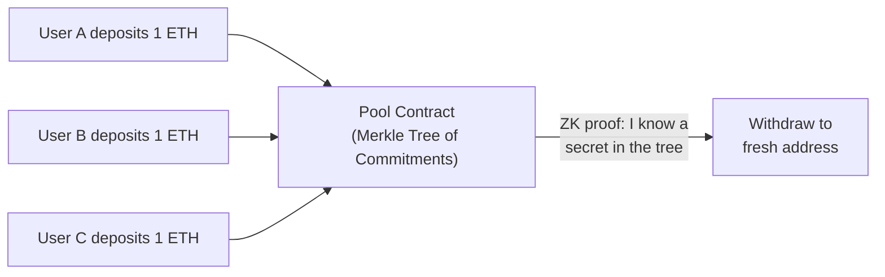
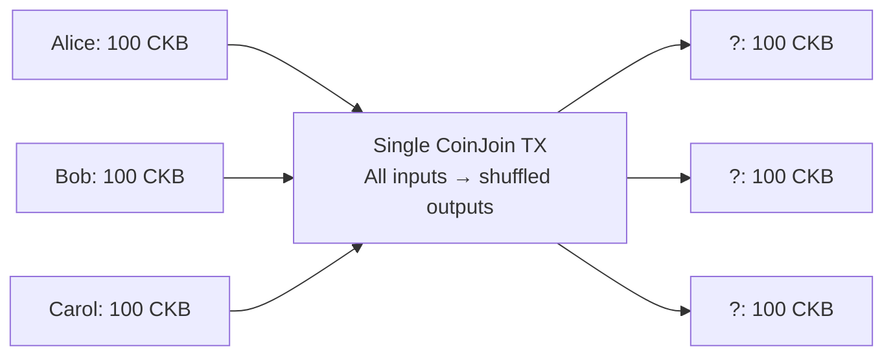

# CKB Privacy Mixer — Architecture & Production Comparison

> Analysis date: May 31, 2026  
> Scope: How mixers work, real-world comparisons, codebase review, issues, and missing implementation

---

## 1. How a Privacy Mixer Works

A privacy mixer (also called a tumbler or coin mixer) breaks the on-chain link between a depositor and a withdrawer. There are two major architectural families:

### 1A. The Tornado Cash Model (Deposit/Withdraw Pool)

This is the **gold standard** of privacy mixing, used by Tornado Cash on Ethereum:



**Core flow:**

1. **Deposit**: User generates a random secret (`secret`) and a random nullifier (`nullifier`). Computes `commitment = H(secret, nullifier)`. Sends fixed denomination + commitment to the contract. The contract inserts the commitment as a leaf in a Merkle tree.

2. **Wait**: The more deposits accumulate, the larger the **anonymity set** (the crowd you hide in).

3. **Withdraw**: User generates a **zero-knowledge proof** proving:
   - "I know `(secret, nullifier)` such that `H(secret, nullifier)` is a leaf in the tree with root `R`"
   - "The nullifier hash is `N`" (to prevent double-spending)
   - Without revealing which leaf is theirs

4. **Nullifier Registry**: The contract records the nullifier `N`. If someone tries to use the same nullifier again, the contract rejects it → **double-spend prevention**.

**Key cryptographic primitives:**

| Primitive | Role |
|-----------|------|
| **Commitment scheme** (Poseidon/Pedersen hash) | Hide the deposit secret while binding to it |
| **Merkle tree** | Efficiently store and prove membership of commitments |
| **Zero-knowledge proof** (Groth16/PLONK) | Prove membership + correct nullifier without revealing which leaf |
| **Nullifier** | One-time token derived from the secret; prevents double withdrawal |

### 1B. CoinJoin Model

Multiple users jointly construct a single transaction where inputs and outputs are shuffled. Used by Wasabi Wallet (Bitcoin) and your project:



**Advantages**: Atomic, self-custodial, no funds locked in a contract  
**Disadvantages**: Participants must be online simultaneously, smaller anonymity sets

---

## 2. Real-World Privacy Mixer Projects

### Tornado Cash (Ethereum)
- **Architecture**: Deposit/withdraw pool with fixed denominations (0.1, 1, 10, 100 ETH)
- **ZK System**: Groth16 on BN254 with Poseidon hash, Circom circuits
- **Commitment**: `commitment = Poseidon(nullifier, secret)` — note: **two independent random values**
- **Nullifier**: `nullifierHash = Poseidon(nullifier)` — derived from only the nullifier, not the secret
- **Merkle tree**: 20 levels, ~1M capacity
- **On-chain verifier**: Solidity Groth16 verifier with hardcoded VK
- **Relayer system**: Relayers submit withdrawal TXs so users don't need ETH in their fresh wallet
- **Trusted setup**: Phase-2 MPC ceremony with 1,114 participants
- **Compliance**: Tornado Cash Nova added optional compliance proofs

### Railgun (Ethereum/Multi-chain)
- **Architecture**: Full private transaction system (not just mixing), uses UTXO model internally
- **ZK System**: Groth16, supports shielded transfers of arbitrary amounts
- **Privacy**: Persistent private balance (not just deposit/withdraw)

### Cyclone Protocol (Multi-chain)
- **Architecture**: Similar to Tornado Cash, pool-based with Groth16
- **Multi-chain**: Deployed on BSC, Polygon, IoTeX
- **Addition**: Governance token and yield farming on deposits

### Key takeaway for comparison
> Your project is a **CoinJoin-style** mixer rather than a **Tornado Cash-style pool**. However, you've bolted on a Tornado-style ZK withdrawal layer (Groth16 + Merkle tree + nullifiers) onto a CoinJoin deposit model. This is a **hybrid** that needs careful analysis.

---

## 3. Codebase Review — What Is Done Well

### ✅ Smart Contracts (Rust, CKB RISC-V)

| Contract | Purpose | Status |
|----------|---------|--------|
| `mixer-pool-type` | Validates CoinJoin TX denomination & structure | Complete |
| `nullifier-type` | Append-only nullifier registry | Complete |
| `zk-membership-type` | Groth16 BN254 proof verification | Complete |

**Good decisions:**
- Pedersen commitment verification for denomination enforcement (mixer-pool-type)
- Append-only registry with duplicate detection (nullifier-type)
- On-chain Groth16 verification using `ark-groth16` (zk-membership-type)
- Proper subgroup/curve point validation (`is_on_curve()` checks)

### ✅ ZK Circuit (Circom)

The `mixer.circom` circuit correctly implements:
- Poseidon-based leaf commitment: `leaf = Poseidon(blindingFactor, sessionId)`
- Poseidon-based nullifier: `nullifierHash = Poseidon(blindingFactor, sessionId, 1)`
- 8-level Merkle tree membership proof with binary path constraints

### ✅ SDK & Backend Architecture

- Clean separation: contracts → SDK → backend → frontend
- Coordinator-backed deposit pool with lifecycle states
- Relayer server for privacy-preserving withdrawal submission
- Proof serialization and packing aligned between SDK and on-chain verifier

---

## 4. Critical Issues Found

### 🔴 CRITICAL: Commitment Scheme Design Flaw

**Your design:**
```
commitment = Poseidon(blindingFactor, sessionId)
nullifier = Poseidon(blindingFactor, sessionId, 1)
```

**Tornado Cash design:**
```
commitment = Poseidon(nullifier, secret)   ← two independent random values
nullifierHash = Poseidon(nullifier)         ← derived from only one value
```

**Problems with your design:**

1. **`sessionId` is shared across all participants in a round.** Every participant in the same CoinJoin round has the same `sessionId`. This means the only entropy differentiating commitments between participants in the same round is the `blindingFactor`. If a `blindingFactor` leaks or is guessed, both the commitment AND nullifier are compromised.
2. **Nullifier is derivable from the commitment inputs.** In Tornado Cash, knowing the commitment doesn't let you derive the nullifier (they use different preimage structures). In your design, if someone learns `(blindingFactor, sessionId)`, they can immediately compute the nullifier and front-run a withdrawal.

### 🔴 CRITICAL: Stealth Address is Placeholder Only

The stealth address implementation explicitly states:
> *"For now, we generate cryptographically random 53-byte args that satisfy the lock's length check. This provides the correct structural format while full ECDH derivation is still separate work."*

**Impact**: There is **no actual stealth address derivation**. The current implementation generates random bytes that look like stealth addresses but provide no cryptographic linkage to the recipient. A real stealth address system requires ECDH so the recipient can scan the chain and recognize outputs addressed to them.

### 🔴 CRITICAL: No Recipient Lock Verification in the Circuit

The Circom circuit's public inputs are:
```circom
component main {public [root, nullifierHash]} = Mixer(8);
```

**Missing**: The recipient's withdrawal address is NOT constrained by the ZK proof. In Tornado Cash, the recipient address is included as a public input to the proof, which prevents front-running:

```
// Tornado Cash approach:
public inputs: [root, nullifierHash, recipient, relayer, fee, refund]
```

Without binding the recipient to the proof, an attacker who sees a withdrawal transaction in the mempool can extract the ZK proof, replace the recipient address with their own, and submit a competing transaction.

### 🟡 HIGH: Nullifier Registry Scalability Problem

The nullifier contract stores nullifiers as a flat append-only list. Checks duplicate by linear scan.
**Problems:** Linear-time duplicate detection: O(n) per withdrawal. At 1000 nullifiers, each withdrawal scans 32KB. CKB cell size limits. Single cell = contention.
**Tornado Cash solution**: Uses a Merkle tree for the nullifier set (O(log n) lookups, constant cell size).

### 🟡 HIGH: Merkle Tree Depth is Too Small

The circuit uses **8 levels** (max 256 leaves). Tornado Cash uses **20 levels** (~1M leaves). With only 256 possible deposits, the anonymity set is severely limited.

### 🟡 HIGH: No On-Chain Merkle Tree

The Merkle tree currently exists **only off-chain** in the SDK/coordinator.
**Impact**: Users must trust the coordinator to provide the correct Merkle tree. If the coordinator lies about which commitments are in the tree, it can prevent valid withdrawals or create invalid ones.

### 🟡 MEDIUM: `blindingFactor` Stored on Server

The blinding factor is the user's **private secret** needed for withdrawal. It's currently stored in the coordinator's pool state. If the coordinator is compromised, all pending deposits' blinding factors are leaked, allowing an attacker to compute nullifiers and front-run withdrawals.

---

## 5. What Is Missing for a Production Privacy Mixer

### Must-Have (Required for security)

| # | Feature | Status | Priority |
|---|---------|--------|----------|
| 1 | **Bind recipient to ZK proof** (prevent front-running) | ❌ Missing | 🔴 Critical |
| 2 | **Separate commitment preimage from nullifier preimage** | ❌ Flawed | 🔴 Critical |
| 3 | **Real stealth address ECDH** | ❌ Placeholder | 🔴 Critical |
| 4 | **On-chain Merkle root storage** | ❌ Missing | 🔴 Critical |
| 5 | **Don't store blinding factors on server** | ❌ Leaked to coordinator | 🔴 Critical |
| 6 | **Production trusted setup ceremony** | ❌ Dev params | 🔴 Critical |
| 7 | **Security audit** (contracts + circuits) | ❌ Not done | 🔴 Critical |

### Should-Have (Required for usability/scalability)

| # | Feature | Status | Priority |
|---|---------|--------|----------|
| 8 | **Larger Merkle tree** (16-20 levels) | ⚠️ Only 8 levels | 🟡 High |
| 9 | **Scalable nullifier registry** (SMT/sharded) | ⚠️ Flat list | 🟡 High |
| 10 | **Relayer fee mechanism** (pay relayer from withdrawal) | ⚠️ Partial | 🟡 High |
| 11 | **Time-delayed withdrawal** (increase anonymity set) | ❌ Missing | 🟡 High |
| 12 | **Multiple denomination pools** | ⚠️ Only 100 CT | 🟡 High |
| 13 | **Note encryption/backup** | ❌ Missing | 🟡 High |

---

## 6. Comparison: Your Mixer vs. Tornado Cash

| Aspect | Tornado Cash | Your CKB Mixer |
|--------|-------------|-----------------|
| **Architecture** | Deposit/withdraw pool | CoinJoin + ZK withdrawal hybrid |
| **Commitment** | `Poseidon(nullifier, secret)` | `Poseidon(blindingFactor, sessionId)` |
| **Nullifier** | `Poseidon(nullifier)` | `Poseidon(bf, sid, 1)` |
| **Merkle tree** | On-chain, 20 levels | Off-chain only, 8 levels |
| **On-chain root** | Stored in contract | ❌ Not stored |
| **Recipient binding** | Included in ZK proof public inputs | ❌ Not in proof |
| **Nullifier storage** | On-chain mapping (O(1) lookup) | Flat list (O(n) scan) |
| **Stealth addresses** | Not needed (uses fresh EOA) | Placeholder (no real ECDH) |
| **Relayer** | Full relayer with fee deduction from withdrawal | Basic relay endpoint |
| **Trusted setup** | 1,114-participant MPC ceremony | Development pot12/pot13 |
| **Audit** | Multiple professional audits | Not audited |
