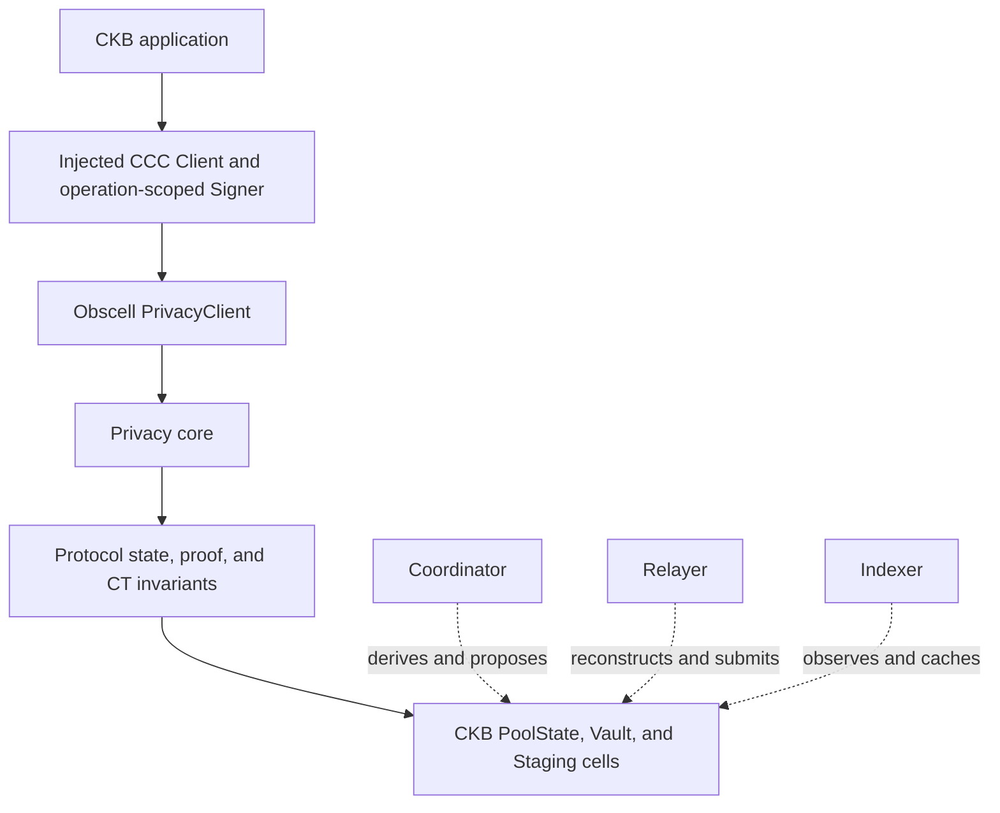
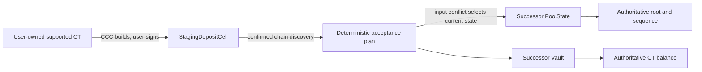
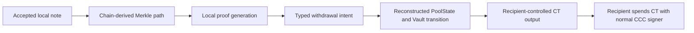
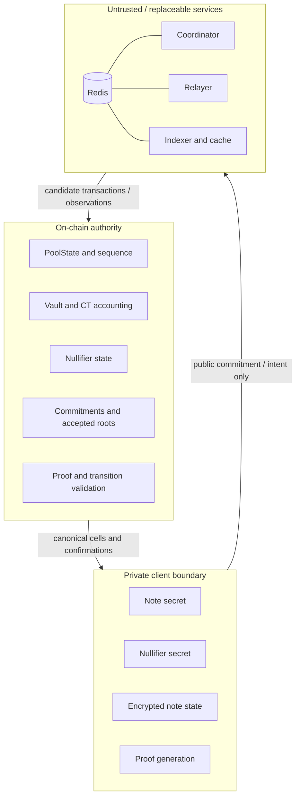
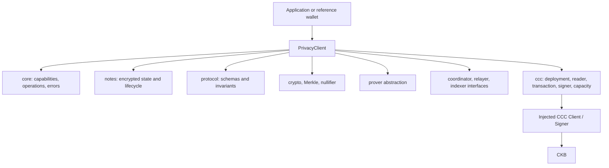

# Architecture

## System

The dashed services are replaceable operators. They do not define roots, nullifiers, commitments, balances, or accepted state. A CKB application can remove Obscell and continue using the same CCC connection and signer.

## Deposit

The staging output commits to pool identity, asset, denomination, leaf, refund lock, and timeout. Acceptance consumes the live PoolState/Vault pair and confirmed staging cells atomically. A coordinator may build the transaction, but CKB validation decides whether it is accepted.

## Withdrawal

The proof binds pool, asset, denomination/value, accepted root, nullifier, recipient, action, and authorization tag. The Pool script must recompute protected fields from actual transaction data before accepting the transition.

## Trust Boundary

Client secrets never belong in coordinator, relayer, indexer, Redis, logs, telemetry, or transaction witnesses. Wiping Redis may lose queues or cached progress, but must not change protocol truth.

## SDK

The SDK does not own React, JoyID, wallet selection, deployment keys, relayer hot keys, Redis, analytics, or product UI. Wallet connectors remain application concerns. A signer is supplied only to the operation that needs user approval.

## State Ownership

| Data | Authority | Cached/derived copies |
|---|---|---|
| Pool identity and configuration | Pool Type-ID / genesis PoolState | Deployment manifest, SDK cache |
| Current sequence and root | Live PoolStateCell | Client and indexer cache |
| Commitments | Accepted PoolState transition / chain history | Merkle index |
| Vault value and CT asset | Live VaultCell plus CT script | Client and service cache |
| Nullifier spent state | Live PoolState nullifier commitment | Indexer cache |
| Note secrets | User-controlled encrypted state | No service copy |
| Operation queue and idempotency | Operational only | Redis or local store |
| Transaction confirmation | CKB canonical chain | Service/client observations |

## Identity And Versioning

Corrected V1 uses fresh script code hashes, Type-IDs, pool IDs, circuit artifact hashes, and a versioned deployment manifest. Legacy registry cells and coordinator sessions are never V1 genesis inputs. Network, genesis hash, code hashes, outpoints, script args, circuit hashes, tree depth, denomination, and CT identity must all match before `getCapabilities()` may report settlement as available.
