# 1. Title

## [DIS] Obscell - Reusable Privacy Infrastructure for CKB Applications

I am proposing Obscell as an opt-in privacy layer for applications that already use CKB's Common Chains Connector (CCC). The primary deliverable is a reusable Privacy SDK and a corrected, fixed-denomination CKB protocol, not a standalone privacy-wallet interface.

# 2. Summary

I am requesting **$15,000 USD equivalent** from the CKB Community Fund DAO to complete and validate Obscell V1 over **four months**. The repository already contains a historical mixer prototype, an honest interactive simulation, a corrected circuit and fail-closed contract/SDK/service foundation, local cross-layer tests, and a separate in-repository fixture consumer. The grant will fund the remaining protocol, cryptographic, CKB script, CT conservation, CCC integration, recovery, independent-review, and Pudge testnet work needed to turn that foundation into a reusable privacy primitive. The decisive result will be a real flow from a user-owned 100 CT cell, through shield and accepted private state, to a recipient-controlled 100 CT output that the recipient subsequently spends through CCC.

| Required item | Proposal |
|---|---|
| **Grant Amount Requested** | **$15,000 USD equivalent** |
| **ETA to Completion** | **4 months (16 weeks) from grant start** |
| **CKB Wallet or Funding Address** | **[TO BE PROVIDED BEFORE SUBMISSION]** |
| **Development and validation network** | CKB Pudge testnet |
| **Primary reusable artifact** | Obscell Privacy SDK with an injected CCC Client and operation-scoped Signer |
| **Primary acceptance outcome** | Real 100 CT staging, acceptance, proof, withdrawal, recipient CT, and recipient subsequent spend on Pudge |

The application keeps ownership of its CCC Client, wallet connector, signer, transaction submission infrastructure, and UI. The completed target boundary assigns privacy-specific notes, proofs, protocol validation, chain-state synchronization, and privacy transaction planning to Obscell. An application must explicitly opt into Obscell; installing CCC alone does not make an application private.

```text
Existing CKB Application
        |
        | existing CCC Client + operation-scoped Signer
        v
Obscell Privacy SDK
        |
        v
Corrected fixed-denomination V1
        |
        v
CKB Pudge testnet
```

# 3. Project Introduction

## 3.1 The problem I am solving

CKB applications can already use CCC for chain connectivity, transaction construction, wallet connection, and signing. Privacy adds a separate set of difficult responsibilities: local secret and note management, canonical cryptographic encoding, commitment and Merkle state, nullifier replay protection, proof generation and verification, CKB state transitions, asset conservation, recovery, relaying, and reorganization handling. Requiring each application to design these pieces independently raises both integration cost and security risk.

I am building Obscell so an existing CCC application can add a narrow, explicit privacy capability through one reusable boundary. Each V1 pool supports exactly **one configured CT asset and one fixed denomination**. This grant's Pudge acceptance deployment contains one pool configured for a 100 CT display amount; additional asset/denomination pools and all cross-asset operations are outside the funded scope. This keeps the first deployment reviewable while serving realistic payment, wallet, merchant, DeFi-interface, and sensitive-balance use cases.

Obscell does not automatically make an existing application private. Privacy requires new local state, proving, note recovery, and protocol-specific transactions, so the host application must opt in deliberately and communicate the remaining metadata and trust assumptions to users.

## 3.2 Why CKB

CKB's Cell model is a direct fit for this design. I can represent a pool as a uniquely identified state cell, bind it to a sibling Vault cell, consume both in one transaction, and require scripts to validate the complete successor transition. This makes the chain, rather than a coordinator database, authoritative for the accepted root, nullifier state, asset identity, and Vault accounting. CKB input conflicts also provide a natural stale-state and competing-coordinator boundary around a singleton PoolState/Vault pair.

The corrected design uses:

- a Type-ID-backed `PoolStateCell` for immutable pool configuration, sequence, Merkle state/root history, nullifier state commitment, and accounting;
- a sibling `VaultCell` for the exact supported CT asset and value-conservation relationship;
- a user-funded `StagingDepositCell` with an acceptance path and a time-locked refund path;
- a withdrawal proof bound to pool, asset, denomination/value, root, nullifier, recipient, protected action, and authorization context; and
- CCC-native client, signer, transaction, and capacity boundaries so applications retain their existing wallet infrastructure.

## 3.3 Product fit and realistic demand

Potential consumers include payment applications, wallets, merchant checkouts, CKB DeFi interfaces, and applications that expose sensitive balances. I am not promising to implement every consumer under this grant. The grant will demonstrate reuse with two bounded applications: the Obscell reference application and a separate payment example that imports the public SDK boundary without importing the reference app.

The value is developer leverage. A consuming application should not have to reimplement Merkle paths, nullifiers, proof serialization, pool state validation, or privacy-specific transaction rules. It should be able to retain CCC and explicitly add `PrivacyClient` where privacy is needed.

## 3.4 Why now

I have already invested in the original Obscell prototype and then performed an internal design review of its weaknesses. The prototype demonstrated useful mechanics, but its coordinator-held commitment set was not an authoritative on-chain root, its proof was not fully bound to the actual CT payout, and its registry, Vault, and payout did not form one atomic transition. The current repository now contains a versioned corrected-V1 foundation that fails closed where those consensus rules are unfinished. This makes the remaining work identifiable, testable, and suitable for a bounded four-month grant.

# 4. Team & Roles

| Name / handle | Role | Relevant background and responsibility |
|---|---|---|
| **Williams Oluwagbemi Akinwamide / `willy264`** | Lead developer and project owner | Computer Engineering undergraduate and software/frontend engineer with React, TypeScript, Rust/CKB experimentation, Web3 development, prior Obscell implementation work, and CCC integration research. I am responsible for architecture, protocol and SDK implementation, CKB integration, testing, evidence, documentation, and release coordination. |

- GitHub: [willy264](https://github.com/willy264)
- Repository: [willy264/ckb-privacy-mixer](https://github.com/willy264/ckb-privacy-mixer)

I am building on CKB because its stateful Cell transitions let the protocol make PoolState, Vault custody, and one-time withdrawal enforcement independently inspectable on chain. This proposal does not claim prior DAO funding or a prior independent audit.

### Reviewer procurement status

No external reviewer has been selected and no quote has been obtained as of this draft. The **$2,500 review allocation is a budget cap, not a quoted price**. I will solicit a qualified independent reviewer in Month 1, disclose the selected reviewer, agreed scope, price, conflicts, expected report, and severity scale before engagement, and keep implementation responsibility separate from review. The review target is the frozen V1 circuit, encodings, CT boundary, scripts, and critical state transitions. Every finding will receive a published disposition; unresolved critical or high-severity findings block the Pudge release claim.

# 5. Current Status

## 5.1 Evidence boundary

I use four evidence labels throughout this proposal:

| Label | Meaning |
|---|---|
| **HISTORICAL** | Preserved earlier implementation that demonstrates prior work but is not authoritative corrected V1 |
| **SIMULATION** | Deterministic UI or fixture behavior that demonstrates product/integration boundaries without chain settlement |
| **LOCAL TEST** | Source behavior exercised locally; it does not establish deployment or external review |
| **TESTNET EVIDENCE** | Real CKB execution with transactions, cells, decoded transitions, confirmations, and reproducible commands |

No corrected-V1 testnet evidence exists today. Figure 5 is deliberately absent until the Pudge runbook passes.

## 5.2 Current implementation matrix

| Area | Current state | Evidence today | Grant-funded completion |
|---|---|---|---|
| Legacy prototype (historically described as V1) | **Existing / historical** | [`legacy-demo`](../legacy-demo/README.md), original circuit/contracts/services, Figure 1 | Preserve for comparison; do not migrate its state or identities |
| Corrected withdrawal circuit | **Foundation / partial** | Nine-signal Circom source, witness/vector/mutation tests, one disposable 19,220-constraint sizing run | Reviewed statement, complete cross-language vectors, secure reproducible artifacts, on-chain verifier integration |
| PoolState | **Fail-closed structural foundation** | Strict codec and transaction-shape tests; initialization and transitions deliberately reject | Poseidon frontier/root history, nullifier transition, proof/action binding, complete genesis/accept/withdraw logic |
| Vault | **Fail-closed structural foundation** | Sibling/provenance, identity, sequence, shape, and arithmetic checks | Exact CT conservation and successful acceptance/withdrawal transitions |
| Staging and refund | **Structural foundation** | Metadata/covenant checks; refund test uses a placeholder asset type | Real CT validation, CCC builder, maturity/positive/negative Pudge evidence |
| CT remediation | **Planned** | Conservation model and known findings are documented | Issuance identity, transfer/preserve witness rules, canonical commitments, range/conservation checks, verifier/RNG hardening |
| Nullifier SMT | **Interface/design only** | Typed interfaces/assertions, opaque proof bytes, and target model | Canonical codec plus proven absent-to-spent SMT transition in PoolState |
| CCC adapter | **Foundation / partial** | `deployment`, `reader`, `transaction`, `signer`, and `capacity` modules; signer/client tests | Non-fixture, Pudge-capable chain reader, complete builders/inspectors, resolved fee-input and capacity validation |
| `PrivacyClient` | **Foundation / partial** | Public API, capability gating, sync requiring an injected state verifier, store CAS, note metadata, typed errors; 24 local tests | Live shield/refund/unshield/proving flows and durable encrypted store integration |
| Coordinator | **Foundation / partial** | Chain-reader interface, strict staging validation, deterministic order/cap; local tests | Non-fixture, Pudge-capable scanner, checkpoints, confirmation/reorg/rebuild behavior, transaction construction |
| Relayer | **Foundation / partial** | Typed intent orchestration requiring protected-field derivation/reconstruction, fee ceiling, lifecycle, and uncertain-broadcast lock tests | Non-fixture, Pudge-capable reader, builder, byte inspector, hasher, submitter, and reconciliation worker |
| Encrypted notes | **Historical implementation plus V1 abstraction** | Legacy AES-GCM work; V1 secret-bearing model and storage envelope/CAS interfaces | Authenticated durable store, recovery/corruption/restart tests, secret-leak checks |
| Corrected-V1 Pudge deployment | **Planned / not run** | Acceptance runbook only | Versioned deployment manifest and complete real E2E evidence |
| Recipient subsequent spend | **Planned / not run** | Required by runbook | Recipient spends the withdrawn 100 CT output through an independently controlled CCC signer |
| Second SDK consumer | **Deterministic fixture** | `examples/payment-app`, unit/browser verification, Figure 6, zero submissions | Replace fixtures with app-owned Pudge adapters and exercise the same public API |
| Security review | **Internal preparation only** | Threat model, trust model, assumptions, invariants, attack surface, negative tests | Scoped independent review, published findings and dispositions |

The detailed evidence-based status is maintained in [`docs/status.md`](status.md), with the source reconciliation in the [implementation report](implementation-report.md) and exact current commands/results in the [test report](test-report.md).

## 5.3 Visual evidence

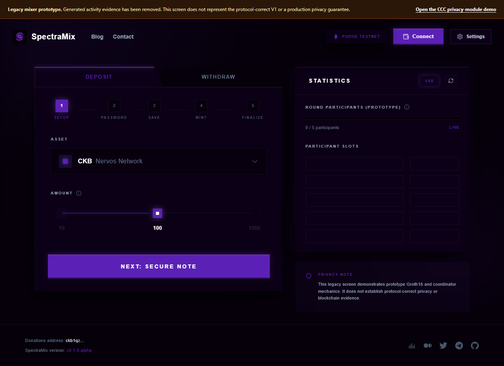

*Figure 1 - Previous Obscell V1 prototype. This demonstrates the project's starting point and reusable technical groundwork. The interface is retained as historical/reference evidence and is not presented as the corrected protocol.*

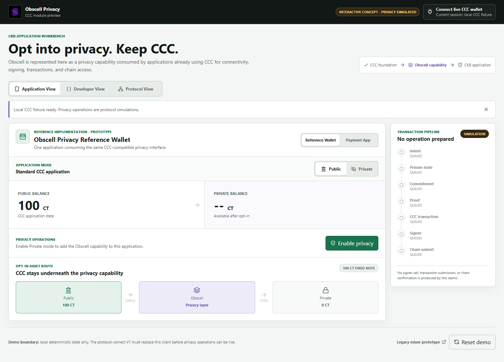

*Figure 2 - Current Obscell application-facing demo. This demonstrates the intended privacy opt-in, application integration boundary, and persistent simulation warning. Privacy operations shown here are prototype simulations until corrected V1 reaches Pudge E2E validation.*

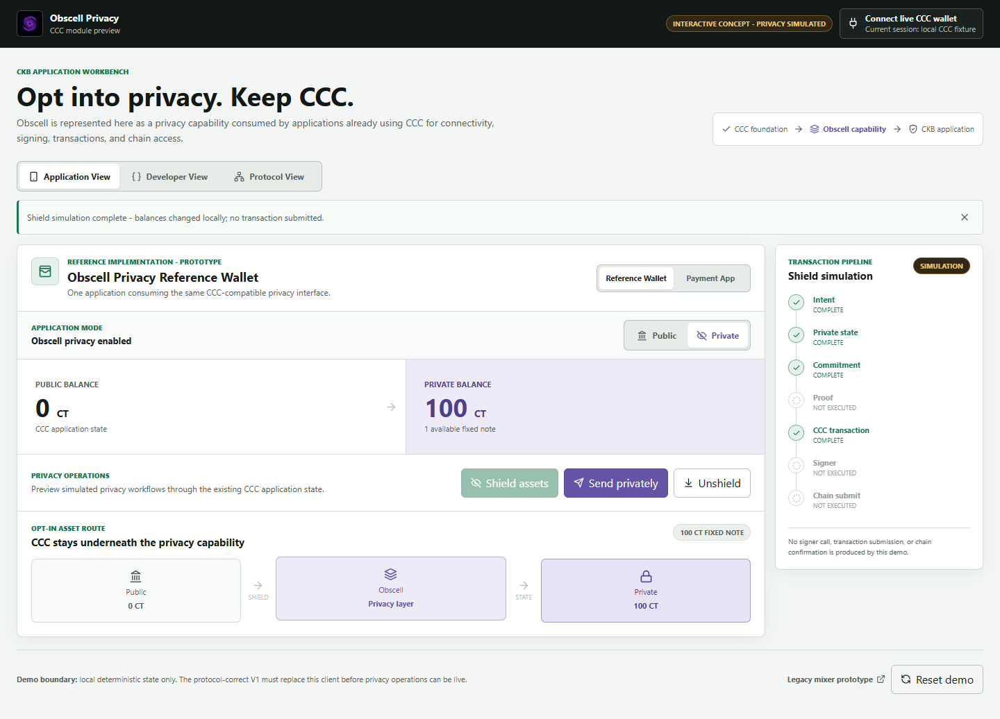

*Figure 3 - Current shield/private-balance visualization. The balance change is deterministic local state; the screen explicitly records that no proof, signer call, transaction submission, or chain confirmation occurred.*

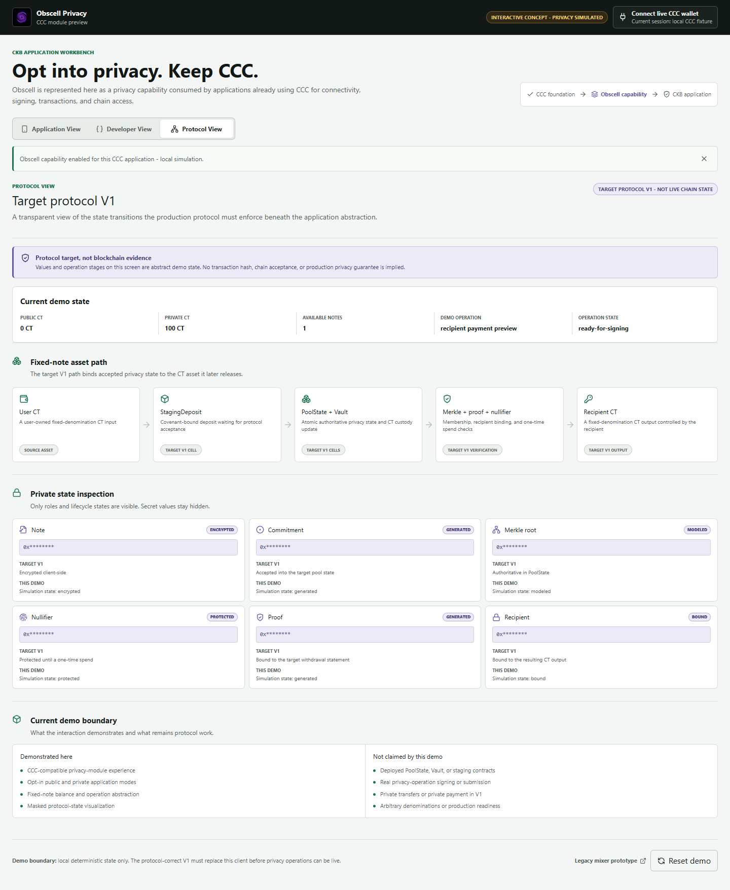

*Figure 4 - Application-facing view of the target user CT -> staging -> PoolState/Vault -> proof/nullifier -> recipient CT architecture. It is a protocol visualization, not live chain state.*

> **Figure 5 - Corrected-V1 Pudge E2E: intentionally absent.** I will add it only after the real staging, acceptance, withdrawal, recipient output, and subsequent recipient spend pass the checked-in runbook. A mock screen or transaction hash alone will not replace that evidence.

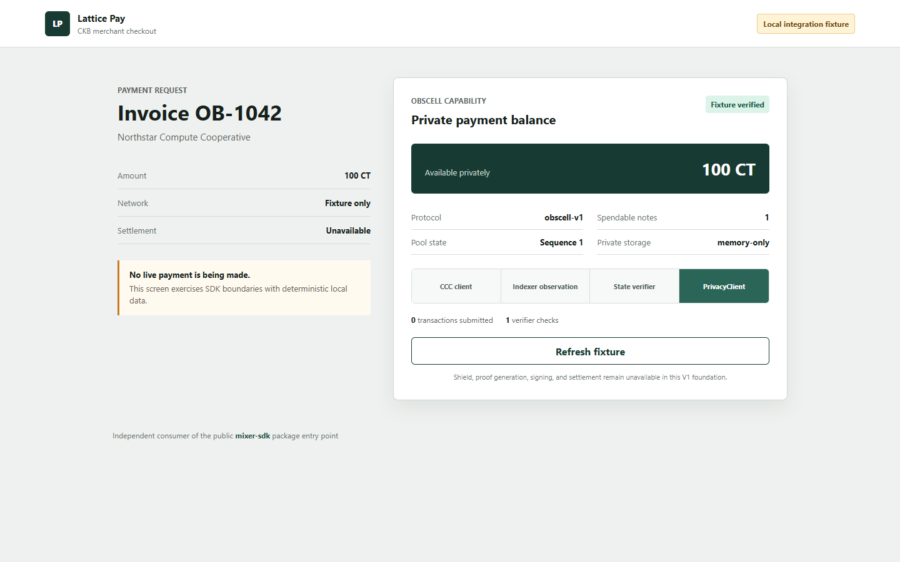

*Figure 6 - Separate applicant-authored payment example importing the public `mixer-sdk` entry point and injecting its own deterministic CCC-shaped client, state store, indexer, and verifier. It demonstrates package separation with zero fetch/XHR data requests and zero transaction submissions; it does not demonstrate live settlement or third-party adoption.*

# 6. Application Design

## 6.1 Functional Overview

### Target user and transaction flow

The completed V1 user flow will be deliberately narrow:

1. The host application initializes Obscell with its existing CCC Client and verified deployment manifest.
2. The user selects the one supported V1 pool, CT asset, and fixed 100 CT denomination.
3. The SDK creates the user's local note material and constructs a staging transaction.
4. The user's operation-scoped CCC Signer authorizes the staging transaction that consumes a pre-existing user-owned 100 CT cell.
5. After confirmation, a coordinator discovers the staging cell from chain data and proposes deterministic acceptance against the live PoolState/Vault pair.
6. CKB scripts decide whether the exact commitment and CT value enter the successor PoolState and Vault atomically.
7. Only after canonical acceptance does the local note become `accepted` and count toward private balance.
8. The SDK obtains a chain-derived Merkle path and generates a corrected-V1 proof locally.
9. The user submits directly with CCC or sends a typed, recipient-bound intent to an optional fee-only relayer.
10. Scripts validate proof, root, nullifier, state/vault provenance, exact value, asset, recipient output, action context, and atomic successor state.
11. The recipient receives one controlled 100 CT output and proves control by subsequently spending it through CCC.

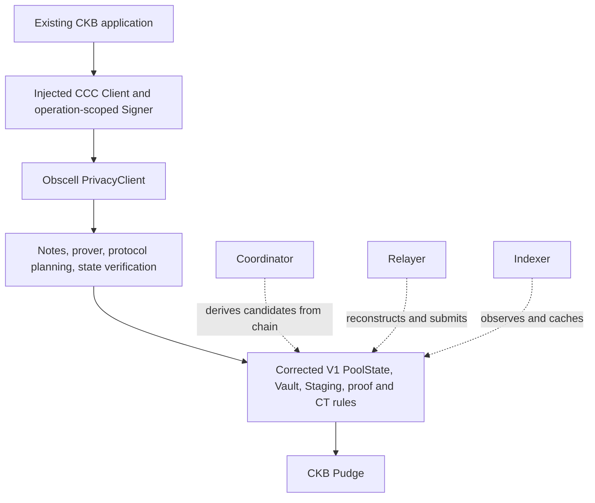

The solid path is the application-to-consensus path. Dashed services are replaceable and non-authoritative.

### Deposit and acceptance

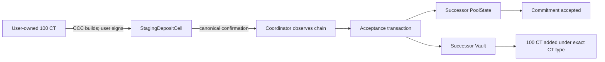

### Withdrawal and recipient spend

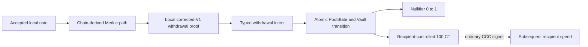

### On-chain and off-chain responsibilities

| Boundary | Responsibilities |
|---|---|
| **On-chain authority** | Pool identity/configuration, current sequence/root, accepted roots, nullifier commitment/update, PoolState/Vault provenance, exact CT asset/value conservation, proof verification, refund covenant, recipient output, settlement |
| **User-controlled local boundary** | Note and nullifier secrets, encrypted note storage, recipient selection, proof generation, wallet approval/signing |
| **Application/CCC boundary** | Client/network selection, wallet connector, operation-scoped signer, fee/capacity completion, submission UX, explorer links |
| **Operational services** | Chain scanning, indexing, deterministic acceptance planning, optional fee-only relaying, queue/cache/locks, HTTP polling |

Under corrected V1, Redis, the coordinator, relayer, indexer, HTTP API, and browser UI must never become the source of truth for roots, nullifiers, balances, ownership, or settlement.

## 6.2 Architecture & Design

### Protocol components

In the completed V1 design, the components will have these responsibilities:

- **Pool Type-ID and PoolState:** will uniquely identify the pool and bind immutable asset/denomination/configuration to sequence, Merkle frontier/root history, nullifier state commitment, and accounting.
- **Vault:** will hold the exact supported CT asset and be valid only as the sibling of the expected PoolState transition.
- **StagingDepositCell:** will bind the user-funded CT, pool, asset, denomination, commitment, refund owner, timeout, and capacity reserve before acceptance.
- **Circuit and verifier:** will enforce the frozen membership/nullifier/recipient/action authorization statement and reject non-canonical or invalid proof material.
- **CT layer:** will distinguish legitimate issuance from transfer/preserve operations and enforce commitment/range/conservation rules independently of the privacy proof.
- **Atomic transitions:** will initialize, accept, refund, and withdraw through explicit transaction shapes; current corrected contracts remain fail-closed until all critical rules are connected.

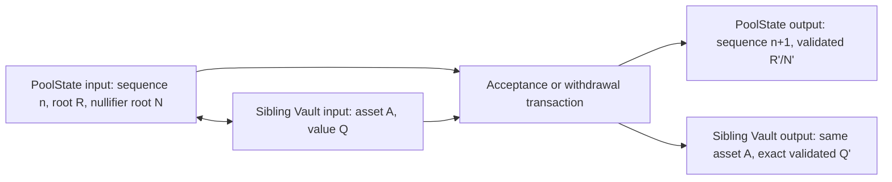

PoolState and Vault are separate cells but one provenance/accounting relationship. A lookalike Vault or a state transition without its exact sibling must fail.

### Integration with existing CCC applications

```text
Application
|-- existing CCC Client
|-- existing CCC wallet / operation-scoped Signer
|-- existing public application transactions
`-- optional Obscell PrivacyClient
    |-- verified privacy state
    |-- encrypted notes
    |-- local proving
    |-- shield / refund / unshield planning
    `-- privacy-specific transaction materialization
```

The conceptual public boundary is:

```ts
const privacy = createPrivacyClient({
  client,
  deployment,
  prover,
  stateStore,
  services,
});

await privacy.getCapabilities();
await privacy.sync({ poolId });
await privacy.listNotes({ poolId, state: "accepted" });
await privacy.getPrivateBalance({ poolId });
await privacy.shield({ poolId, signer });
await privacy.refund({ operationId, signer });
await privacy.unshield({ noteId, recipient, submission });
await privacy.getOperation(operationId);
```

Today, unavailable settlement methods return a typed `UNSUPPORTED_OPERATION`; they do not invent balances or transaction hashes. The grant completes the non-fixture, Pudge-capable adapters and capability gates required to make those methods live on Pudge.

The implemented module boundaries are:

```text
mixer-sdk/src/
|-- core/          PrivacyClient, capabilities, operations, errors
|-- protocol/      pool/state/action schemas and invariants
|-- crypto/        domains, canonical fields, Poseidon, commitments
|-- merkle/        frontier, roots, paths
|-- nullifier/     nullifier derivation and update boundary
|-- notes/         secret-bearing model, lifecycle, storage abstraction
|-- prover/        statement, proof ABI, prover interface
|-- ccc/           deployment, reader, transaction, signer, capacity
|-- services/      indexer, coordinator, relayer interfaces
`-- validation/    pool, asset, recipient, fee, stale-state rules
```

The application continues to own connector choice, signer selection, application UI, analytics, and normal CCC transactions. The corrected-V1 public SDK never accepts a user private-key string, silently constructs a hidden client, or requires the application to replace CCC. Operator and deployment keys remain outside that public SDK boundary.

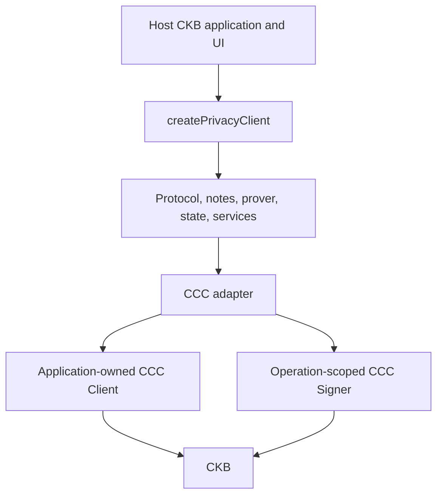

*SDK integration diagram - the application retains CCC and wallet ownership while Obscell supplies the optional privacy-specific layer.*

### Trust boundary

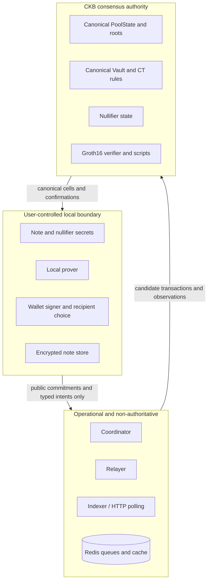

### Dependencies, CT provenance, and open-source commitment

The target implementation will use CKB/CKB-VM tooling, CCC, Rust, TypeScript, Circom/snarkjs, Arkworks-compatible proof encoding, and a selected or remediated CT implementation. Groth16 is the **provisional V1 baseline**, not a completed deployment claim. M1 must validate corrected-circuit proof generation and CKB-VM verification feasibility, freeze the artifact/setup procedure, and publish proof size, verifier binary size, memory, timing, and cycle measurements. A switch away from Groth16 would require a published rationale, updated acceptance evidence, and DAO review rather than a silent scope change.

The present CT research reference is the gitignored checkout of [`quake/obscell` at commit `82437e9a8f4a141145a5a1b3454d348e464ee23f`](https://github.com/quake/obscell/tree/82437e9a8f4a141145a5a1b3454d348e464ee23f), including `ct-token-type` package version `0.1.0`. Its documented design uses a unique CT-info identity and a lock-script-controlled issuer cell for mint authority; ordinary CT transfers preserve commitment sums. It is **not vendored, deployed, or release evidence**, the local research checkout contains modifications, and no license file was found in that checkout. Grant implementation will therefore reuse none of that source unless compatible licensing is obtained and documented; otherwise I will implement or replace the required CT path in the licensed grant repository. M1 freezes the exact asset type identity, code outpoints and hashes, CT-info/issuer and mint-authority rules, token decimals, and raw integer denomination. Until then, "100 CT" is a human-readable reference amount, not a claim that decimals or its raw on-chain integer have already been fixed.

This repository does not currently assert a repository-wide license. Before grant implementation begins, I will select and publish explicit repository-wide open-source terms and record third-party license compatibility. Release versions and artifact hashes will be pinned. The protocol scripts, SDK, integration examples, schemas, vectors, runbooks, security documentation, and scoped review report will be published with their applicable licenses and unresolved findings disclosed.

## 6.3 Design Rationale

I chose one fixed denomination and CT asset for the funded Pudge pool because arbitrary amounts, shielded change, multiple private assets, and join-split proofs multiply both circuit and accounting risk. I chose authoritative PoolState/Vault cells because a coordinator-owned commitment list cannot safely define spendable private state. I chose a staging cell because a user must retain a refund path if acceptance does not happen. I chose a typed relayer intent because accepting arbitrary client-prepared transactions would let a relayer boundary blur protected payout fields and fee funding.

The main trade-offs are explicit:

- One fixed 100 CT acceptance pool has less flexibility but narrows the accounting and review surface and avoids change linkage.
- A singleton PoolState/Vault pair serializes transitions but creates a clear, deterministic consensus authority; batching and later protocol revisions can address throughput after correctness is established.
- Local proving protects secrets from services but adds browser/desktop performance and artifact-distribution requirements.
- A bounded retained-root window supports practical withdrawal after confirmations but requires clients to refresh Merkle paths before roots expire.
- Optional relaying can reduce direct sender linkage, but it does not provide IP-layer anonymity or eliminate timing analysis.

This aligns with CKB's philosophy by expressing state and asset invariants through inspectable Cell transitions while leaving wallet ownership and signatures with users.

## 6.4 Fee Model and Sustainability

I am not introducing a token or mandatory protocol fee under this grant. Direct users pay normal CKB transaction fees through their existing CCC signer. In the V1 typed relayer intent, `maxFee` is only a ceiling on the **CKB network-fee capacity** a relayer may add; it is not relayer compensation. V1 defines no protocol mechanism for paying a relayer, and the relayer may not supply, redirect, or receive the private CT payout. Any later hosted-service compensation model remains off-protocol and outside this grant unless separately specified and reviewed.

Longer-term maintenance can be supported by optional hosted indexing/relaying, paid integration support, and ecosystem deployments. Protocol correctness does not depend on one operator or one commercial service. Any future protocol-fee design would require separate technical and community review.

# 7. Key Benefits for CKB

The concrete benefit is a reusable CKB-native privacy primitive rather than a one-off mixer interface.

- **Developer leverage:** after completion, applications will be able to consume a stable Privacy SDK instead of independently implementing commitments, proofs, nullifiers, note recovery, and CKB transaction invariants.
- **CCC compatibility:** developers keep their current CCC Client, wallet connector, signer, network selection, and ordinary transaction infrastructure.
- **CKB-native enforcement:** completed PoolState, Vault, staging, refund, and recipient CT rules will use the Cell model instead of treating an off-chain database as settlement authority.
- **Open technical infrastructure:** the grant produces scripts, schemas, vectors, SDK APIs, a threat model, integration examples, and reproducible runbooks.
- **Independently verifiable activity:** the Pudge milestone requires real cells and transactions, decoded state changes, adversarial failures, and a recipient subsequent spend.
- **Reusable consumer proof:** the reference application and a separate payment application must use the same public SDK boundary.
- **Better privacy engineering practice:** explicit limitations, simulation labels, trust boundaries, and review status reduce the chance that a prototype is mistaken for secure deployment.

The realistic future vision is that wallets, payments, merchants, and CKB interfaces can offer opt-in fixed-note privacy without becoming protocol teams themselves. V1 is a narrow base for that future, not a claim that all CKB activity becomes anonymous.

# 8. Detailed Deliverables & Milestones

## 8.1 Current foundation versus grant-funded completion

I am not requesting payment for the foundation already present. The grant pays for review and finalization of existing specifications plus the unresolved path from reviewable, internally tested source foundations to a reproducible, Pudge-validated primitive. M1 does not bill for recreating the existing circuit/schema/action-hash source; it funds independent recomputation, complete mutation coverage, frozen release ABIs, artifact procedures, and measured CKB-VM feasibility.

```text
Historical V1 + corrected fail-closed foundation + local tests
                              +
                  grant-funded completion
                              |
                              v
         reviewable and reproducible Pudge V1
```

## 8.2 Four-month milestone schedule

| Milestone | Timeframe | Grant-funded engineering and deliverables | Independent verification and expected evidence | Budget |
|---|---|---|---|---:|
| **M1 - Protocol and cryptography freeze** | Weeks 1-4 | Freeze generated/round-trip Molecule schemas, domains/action hash, proof ABI, raw CT denomination and issuer/asset identity; independently recompute Rust vectors and complete cross-language mutation coverage; finalize CT remediation design; validate the provisional Groth16 path on CKB-VM; define secure reproducible artifact/setup procedure; select and scope reviewer | Frozen ABI/schema and deployment-input specification published; Rust/TypeScript/Circom values match independently; every enumerated encoding/public-order/witness mutation rejects; corrected proof verifies in measured CKB-VM test execution; hashes and benchmark record published | **$3,750 (25%)** |
| **M2 - CKB protocol and CT transitions** | Weeks 5-8 | Complete licensed CT path and PoolState/Vault/Staging initialization, acceptance, refund, withdrawal, Poseidon frontier/root history, nullifier SMT, proof verification, conservation, and adversarial ckb-testtool suite | Every specified valid transition passes; every enumerated wrong root/asset/value/recipient/action/state/vault/nullifier/proof mutation rejects; reproducible binaries and hashes published | **$4,500 (30%)** |
| **M3 - SDK, CCC, services, recovery, and review freeze** | Weeks 9-12 | Complete live `PrivacyClient` operations, non-fixture Pudge-capable CCC readers/builders/signers/capacity, durable encrypted note store, scanner, deterministic coordinator, typed relayer, reconciliation, reorg/rebuild, second consumer adapter; freeze review candidate late in Month 3 and begin independent review | SDK and service suites pass; app-owned CCC injection is demonstrated; fee-ceiling and transaction-mutation tests reject violations; Redis wipe/restart and checkpoint rollback rebuild chain-derived truth; no secret fields cross service boundaries; reviewer receives frozen artifacts | **$3,000 (20%)** |
| **M4 - Pudge validation, review closure, and release** | Weeks 13-16 | Versioned Pudge deployment, complete 100 CT E2E, recipient spend, negative runs, external-review completion and remediation, reference-app live adapter, release docs/evidence, and Chinese final milestone update | Reviewer reproduces the runbook from a clean checkout; explorer-verifiable transactions/cells and decoded deltas published; Figure 5 added only now; every review finding has a public disposition and no critical or high-severity finding remains unresolved | **$3,750 (25%)** |
| **Total** | **16 weeks** |  |  | **$15,000 (100%)** |

Each milestone follows the same release rule:

```text
Code merged -> tests pass -> artifacts hashed -> deployment/behavior reproduced
            -> evidence catalog updated -> reviewer can independently inspect
```

Screenshots or self-reported status alone do not satisfy a milestone.

## 8.3 Decisive Pudge acceptance flow

```text
Existing user-owned 100 CT
        -> CCC-signed staging transaction
        -> canonical staging confirmation
        -> authoritative PoolState/Vault acceptance
        -> accepted encrypted local note
        -> local corrected-V1 proof
        -> withdrawal and nullifier absent-to-spent update
        -> exact Vault decrement
        -> recipient-controlled 100 CT output
        -> recipient spends that CT through CCC
```

The same release must record rejection or safe recovery for replay, wrong recipient, wrong asset, wrong value, stale state, malformed/non-canonical proof, invalid proof point, excessive fee, relayer mutation, competing coordinator, Redis wipe/rebuild, service restart, and relevant chain reorganization behavior.

## 8.4 How a reviewer can verify the grant

| Area | Reviewer-visible acceptance evidence |
|---|---|
| Protocol | Deployed Type-ID/script identities, decoded PoolState/Vault/Staging cells, witnesses, exact input/output transitions, artifact hashes |
| Cryptography | Circuit source, public statement/order, proving/verifying artifacts, setup/reproducibility record, shared vectors, mutation tests, proof-point validation |
| CT | Exact type identity, mint/transfer/preserve witness rules, conservation/range checks, Vault delta, recipient CT output, recipient subsequent spend |
| SDK and CCC | Public API, injected application CCC Client/Signer, deployment checks, direct/relayed construction, reference app, current fixture consumer, and final separate consumer using application-owned Pudge adapters |
| Runtime | Canonical scanner checkpoints, competing coordinator result, relayer reconstruction/fee ceiling, uncertain-broadcast reconciliation, Redis wipe/rebuild, restart/reorg behavior |
| Pudge | Real transaction hashes/outpoints, block hashes/heights, confirmations, decoded roots/nullifier/accounting deltas, timings, and Figure 5 |
| Security | Threat model, adversarial tests, independent review scope/report, finding dispositions, remaining limitations |

# 9. Budget Breakdown

## 9.1 What $15,000 buys

| Workstream | Deliverable | Outcome | Amount |
|---|---|---|---:|
| CKB protocol/core engineering | Complete PoolState, Vault, Staging/refund, nullifier, and atomic transitions | On-chain authority rather than coordinator-held truth | **$4,500** |
| Cryptography, circuit, prover, and verifier | Corrected circuit, canonical vectors/encoding, artifacts, proof-point checks, verifier integration | Verifiable fixed-note membership and recipient-bound authorization | **$2,500** |
| Privacy SDK and CCC integration | Live `PrivacyClient`, CCC adapters, encrypted state/recovery, second consumer | Reusable integration without replacing application wallet infrastructure | **$2,500** |
| Independent review and adversarial testing | Scoped external review plus contract/circuit/service mutation coverage and remediation | Public findings and stronger evidence around critical failure modes | **$2,500** |
| Pudge deployment, infrastructure, and evidence | Versioned deployment, scanner/relayer operation during validation, full runbook artifacts | Real CKB testnet validation through recipient subsequent spend | **$1,000** |
| Research, documentation, diagrams, integration, and release | Protocol/security/architecture/SDK docs, examples, evidence catalog, English and Chinese release material | Third-party review and adoption path | **$2,000** |
| **Total** |  |  | **$15,000** |

## 9.2 Cost rationale

The majority of the budget is allocated to consensus, cryptography, CKB scripts, SDK/CCC integration, and adversarial verification. The UI is a reference consumer and evidence surface, not the reason for the request. The $2,500 review allocation purchases a bounded independent review; it is not represented as the cost of a comprehensive production audit. Hosting is limited to the Pudge validation window. Project coordination is included within engineering work, and no separate salary, token issuance, broad marketing campaign, or mainnet operating budget is requested.

The workstream table and milestone releases are two views of the same $15,000. This crosswalk removes double-counting and assigns each cost to a milestone acceptance gate:

| Workstream | M1 | M2 | M3 | M4 | Total |
|---|---:|---:|---:|---:|---:|
| CKB protocol/core engineering | $500 | $3,500 | $500 | $0 | **$4,500** |
| Cryptography, circuit, prover, and verifier | $1,500 | $1,000 | $0 | $0 | **$2,500** |
| Privacy SDK and CCC integration | $0 | $0 | $2,500 | $0 | **$2,500** |
| Independent review and adversarial testing | $250 | $0 | $0 | $2,250 | **$2,500** |
| Pudge deployment, infrastructure, and evidence | $0 | $0 | $0 | $1,000 | **$1,000** |
| Research, documentation, diagrams, integration, and release | $1,500 | $0 | $0 | $500 | **$2,000** |
| **Milestone total** | **$3,750** | **$4,500** | **$3,000** | **$3,750** | **$15,000** |

The M1 review allocation covers solicitation, conflict checks, and scope agreement; review execution begins against the late-M3 freeze, while its report and remediation are accepted and paid under M4. I will publish each milestone's acceptance evidence before representing it as complete.

# 10. Out-of-Scope / Future Funding Needs

V1 intentionally excludes:

- arbitrary denominations or arbitrary-value notes;
- additional asset/denomination pools in the funded Pudge deployment or cross-asset operations;
- private-to-private transfer, join-split, shielded change, and multi-output proofs;
- advanced stealth addressing and IP/network-layer anonymity;
- generalized private smart-contract calls;
- mobile-specific proving/storage work;
- governance, a protocol token, or a broad relayer economy;
- production mainnet deployment or a claim of production anonymity/security; and
- large-scale integrations beyond the reference app and one separate applicant-authored consumer.

Long-term maintenance, mainnet operations, a comprehensive external audit, additional assets/denominations, decentralized service discovery, and V2 privacy features may require later work or a separate proposal. None is used to inflate this request or required to accept this grant's bounded Pudge result.

# 11. Risk & Mitigation

## 11.1 Delivery risks

| Risk | Why it matters | Mitigation and acceptance boundary |
|---|---|---|
| Protocol/script complexity | A valid proof can still accompany an invalid asset or state transition | Freeze the statement and schemas; enforce complete atomic transitions; use positive and adversarial ckb-testtool tests before deployment |
| CT implementation weakness | Mint spoofing, bad randomness, or missing conservation can invalidate the entire privacy pool | Complete CT remediation before Vault deployment; test issuance identity, witness modes, canonical commitments, range and conservation rules |
| Proof-system performance | Browser proving or CKB-VM verification may exceed usable limits | Benchmark the corrected workload early; record proof size, memory, time, binary size, and CKB cycles; keep the SDK prover boundary replaceable |
| Encoding drift | Rust, TypeScript, Circom, and Molecule disagreement can create consensus bugs | Canonical fixed-width encodings, generated codecs where possible, independently recomputed shared vectors, no modulo reduction of malformed fields |
| Pudge/tooling dependency | RPC, indexer, CCC, or CKB tool changes can delay E2E | Pin versions and manifests, run preflight in CI, use reproducible scripts, reserve Month 4 for deployment/evidence |
| Reorg and service failure | Notes or operations can be shown as accepted/committed incorrectly | Block-hash checkpoints, confirmation policy, rollback/replay, chain rebuild after Redis loss, explicit lifecycle states |
| Independent reviewer availability | Review may be delayed or narrower than desired | Engage during Month 1, freeze a bounded scope, publish reviewer identity/scope/findings; never relabel internal tests as an audit |
| Single-developer schedule | Cross-layer work can create bottlenecks | Four gated milestones, scope discipline, fail-closed implementation, weekly public evidence, no unrelated V2 work |
| Adoption | A correct primitive may still be difficult to integrate | Stable public API, CCC dependency injection, clear guide, reference app, second applicant-authored consumer, feedback during testnet release |

## 11.2 Threat-to-control map

These are target controls and current status, not claims that every control is already deployed.

| Threat / failure | Required rejecting or recovery layer | Current status |
|---|---|---|
| Replayed withdrawal / nullifier reuse | Circuit nullifier binding plus atomic PoolState SMT absent-to-spent update | Circuit foundation; SMT/script grant work |
| Wrong or unaccepted root | Pool script compares the proof root with current/retained canonical PoolState roots | Script grant work |
| Wrong asset | Immutable pool configuration, exact CT type identity, Vault/staging/recipient checks | Structural checks exist; CT completion required |
| Wrong denomination or value | Circuit enforces `value = denomination`; scripts derive exact configured value and Vault/output delta | Circuit foundation; script/CT completion required |
| Recipient substitution | Circuit authorization tag and action bind recipient; script recomputes from actual output | Circuit/SDK foundation; script completion required |
| Action-hash or typed-intent mutation | Canonical action derivation, transaction reconstruction, proof binding, byte inspection | SDK/service foundation; non-fixture Pudge inspector/script required |
| Malformed proof or public encoding | Exact ABI length/order and canonical Fr/Fq decoding | SDK/Rust parsing tests; on-chain verifier completion required |
| Invalid, infinity, or wrong-subgroup proof point | Verifier rejects non-canonical coordinates, infinity, off-curve, and wrong subgroup points | Legacy hardening tests; corrected verifier grant work |
| Stale state | Exact PoolState/Vault outpoints and sequence, CKB input conflict, store CAS | SDK/service foundation; live transition/reorg proof required |
| State/Vault mismatch | Scripts require the exact sibling pair and synchronized successor accounting | Structural foundation; successful transitions pending |
| Vault lookalike | Pinned PoolState type/script identity, pool ID, asset ID, and unique sibling shape | Structural foundation; deployment evidence pending |
| Fake CT mint or identity | Versioned mint authority and exact CT type rules | CT remediation grant work |
| CT conservation failure | CT range/conservation verification plus exact Vault decrement/recipient output | Grant work; not currently proven |
| Unauthorized staging acceptance | Confirmed staging covenant data and PoolState acceptance validation on chain | Structural/service foundation; full script pending |
| Relayer network-fee manipulation or typed asset input | User network-fee ceiling, reconstructed transaction, untyped capacity-only fee inputs/change | Local service tests; non-fixture Pudge inspector pending |
| Coordinator race | Deterministic ordering plus singleton input conflict; loser re-resolves | Planning foundation; live competing-worker test pending |
| Redis loss | Redis remains queue/cache only; rebuild from canonical chain | Interface/design only; clean rebuild test pending |
| Service restart or uncertain broadcast | Typed lifecycle, a locally derived canonical hash supplied by the required non-fixture adapter, retained locks, and reconciliation from chain | Local relayer lifecycle tests with injected adapters; Pudge-capable hasher/worker pending |
| Chain reorganization | Checkpoint block hashes, rollback to common ancestor, replay canonical events, note/operation demotion | Grant work |
| Encrypted note corruption or loss | Authenticated encryption, versioned backups/recovery, corruption tests, no service copy | Legacy encryption and V1 interface exist; durable store pending |
| Wallet/browser compromise | User security guidance, CSP/reproducible build, least-secret APIs; no claim against a malicious signer/origin | Least-secret corrected-V1 API and honest labels exist; CSP and clean-release reproducibility remain pending, and a malicious signer/origin is outside full protocol protection |
| Recipient output cannot be spent | Exact output construction followed by mandatory independent CCC subsequent-spend test | Pudge acceptance gate |
| Timing, network, or anonymity-set leakage | Fixed notes, optional relayer, documented confirmation guidance and privacy limitations | Residual risk; no absolute anonymity claim |

## 11.3 Honest limitations today

> **The current browser demo is a product/integration prototype. Its privacy operations are simulations and do not constitute proof of live protocol settlement.**

The corrected-V1 foundation is not deployable today. The principal blockers are complete cryptographic contract transitions, CT remediation, nullifier SMT integration, secure reproducible proving artifacts, full cross-language drift protection, non-fixture chain scanning and encrypted storage, Pudge E2E execution, recipient subsequent spend, and independent security review. The current local suites are engineering evidence, not an audit. I will keep these limitations visible until each corresponding acceptance gate has real evidence.

# 12. Closing / Call to Action

I am asking the CKB community to fund the bounded step from substantial, reviewable groundwork to a real Pudge-validated privacy primitive. The proposal focuses on the difficult relationships that make privacy infrastructure credible: authoritative Cell state, exact CT conservation, recipient- and action-bound proofs, one-time nullifiers, recoverable services, and a CCC-compatible SDK that a second application can consume.

I welcome technical review of the protocol statement, Cell transitions, CT assumptions, SDK boundary, milestones, and evidence requirements. I will incorporate actionable feedback, publish milestone evidence before claiming completion, disclose independent-review findings and unresolved limitations, and provide the required Chinese version after the initial discussion post. I appreciate the community's consideration.

# 13. Supporting Links

- [GitHub repository](https://github.com/willy264/ckb-privacy-mixer)
- [Documentation index](README.md)
- [Evidence-based implementation status](status.md)
- [Implementation report](implementation-report.md)
- [Research and corrected-architecture rationale](research.md)
- [System, flow, trust-boundary, and SDK diagrams](architecture.md)
- [Corrected V1 protocol specification](protocol-v1.md)
- [Threat model](threat-model.md)
- [Security assumptions](security/security-assumptions.md)
- [Protocol invariants](security/protocol-invariants.md)
- [SDK boundary](sdk.md)
- [CCC integration guide](integration-guide.md)
- [Current verification report](test-report.md)
- [Pudge acceptance runbook](pudge-runbook.md)
- [Known limitations](known-limitations.md)
- [Screenshot and evidence catalog](evidence/README.md)
- [Separate payment consumer](../examples/payment-app/README.md)
- [Legacy prototype boundary and artifact inventory](../legacy-demo/README.md)

There is no public corrected-V1 deployment address, live protocol demo, Figure 5, or Pudge transaction link to provide yet. Those are Month 4 acceptance artifacts, not current evidence.
