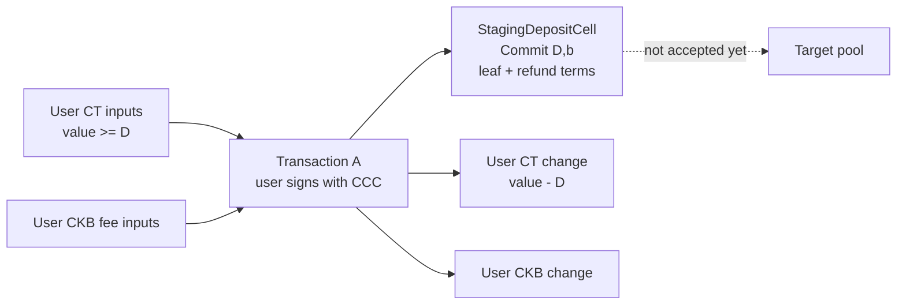
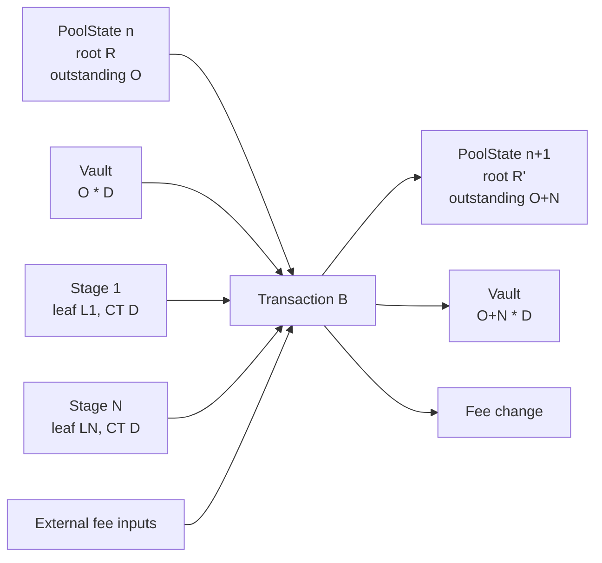
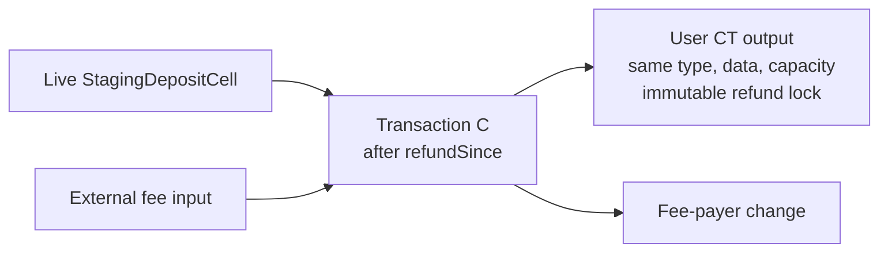
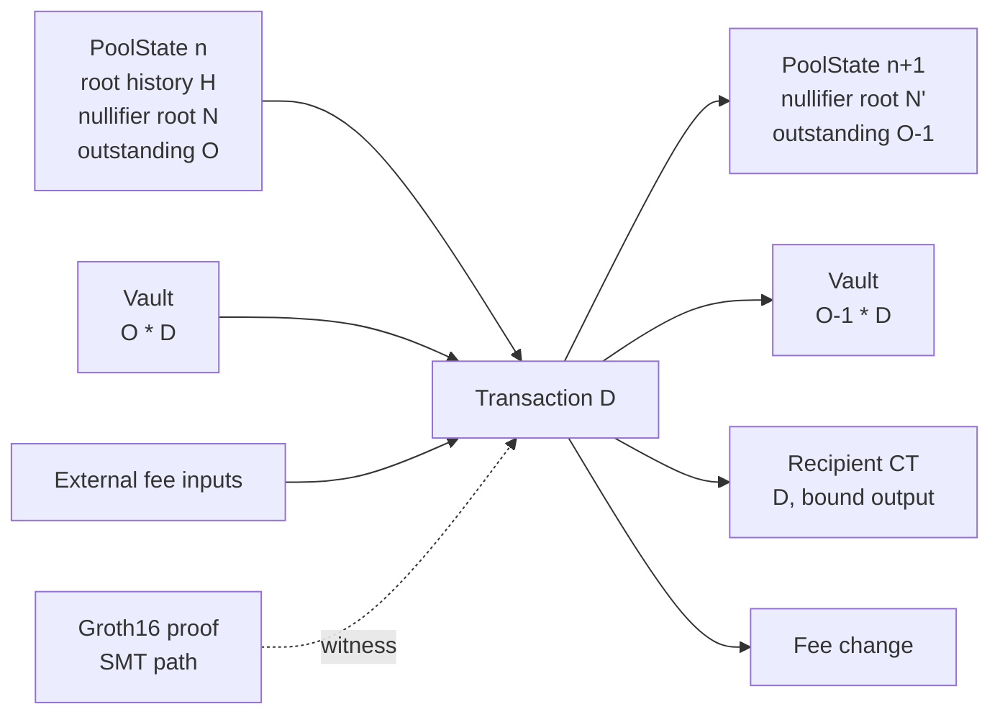
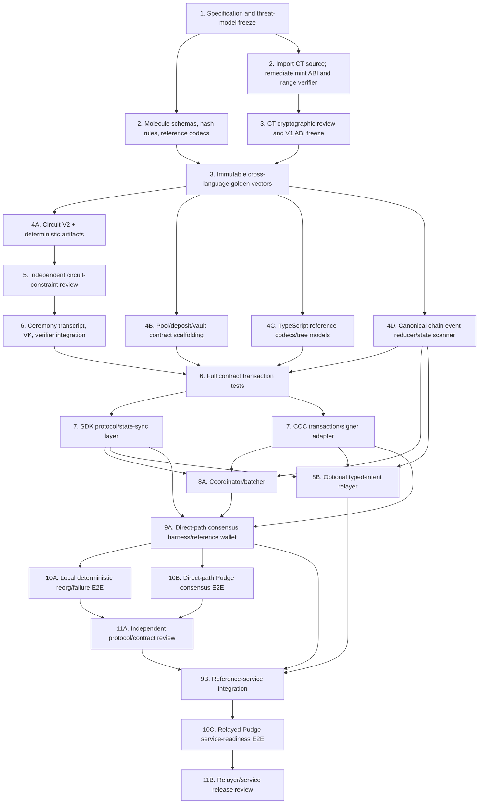

# Obscell August Week 2: Protocol-Correct V1 Implementation Specification

- **Status:** Draft for protocol review
- **Date:** 2026-08-21
- **Scope:** Formal implementation specification only; no implementation is authorized by this document
- **Supersedes:** Any conflicting protocol assumptions in the Week 1 research report
- **Target network for first validation:** CKB Pudge Testnet

## 0. Purpose and Normative Language

This document turns the accepted protocol-correctness direction into an incrementally implementable specification. It defines the smallest Obscell V1 in which a user-owned confidential-token (CT) cell becomes an accepted privacy commitment and can later authorize the release of the same asset from protocol custody.

The key security equivalences are:

```text
accepted privacy commitment
  <=> a valid PoolStateCell transition appended the commitment
  <=> the same transaction increased the CT vault by one denomination

valid withdrawal
  <=> a proof demonstrates ownership of an accepted commitment
  && the proof is bound to the actual pool, asset, root, value, and recipient output
  && the note nullifier changes from absent to spent
  && the same transaction decreases the CT vault by one denomination
```

The words **MUST**, **MUST NOT**, **SHOULD**, **SHOULD NOT**, and **MAY** are normative. A property marked MUST or MUST NOT is a protocol requirement, not an application preference.

### 0.1 Normative V1 choices

V1 deliberately chooses correctness over feature breadth:

- One pool instance represents exactly one `(network, CT asset, denomination, circuit version)` tuple.
- The denomination and aggregate vault balance are public.
- CT Pedersen openings at staging, vault, and recipient boundaries are public protocol data. CT conservation and range proofs are retained, but V1 does not claim confidential pool amounts.
- A pool uses one Type-ID `PoolStateCell` and one aggregate `VaultCell`.
- A depth-20 incremental Poseidon tree stores privacy commitments.
- A 256-bit Blake2b sparse Merkle tree (SMT) stores spent nullifiers.
- A staging deposit pre-authorizes either permissionless pool acceptance or a timed refund. The user does not return for a second acceptance signature.
- A withdrawal spends one complete fixed-denomination note and creates one standard-lock recipient CT cell.
- Transaction fees are supplied by external capacity inputs. Pool state, vault reserve, and claim capacity MUST NOT fund network fees.
- V1 has no private transfer, private change, arbitrary denomination, advanced stealth address, multi-output join-split, native CKB redemption, or pool destruction.

### 0.2 Trust boundary

CKB consensus and scripts are authoritative. The coordinator, relayer, indexer, SDK, and frontend are untrusted convenience components. They may build, cache, simulate, and reject transactions defensively; they cannot make a commitment accepted, make a root authoritative, or mark a nullifier spent.

### 0.3 Protocol identities and constants

The implementation MUST freeze these values before generating V2 circuit artifacts:

| Name | V1 value or rule |
|---|---|
| `PROTOCOL_VERSION` | `1` encoded as `u16` |
| `STATE_SCHEMA_VERSION` | `1` encoded as `u16` |
| `CIRCUIT_VERSION` | `2` encoded as `u16` |
| `TREE_DEPTH` | `20` |
| `ROOT_HISTORY_SIZE` | `32` |
| `MAX_BATCH_SIZE` | Deployment configuration, `1..64` |
| `MAX_LEAVES` | `2^20` |
| Maximum outstanding notes | `min(2^20, floor((2^32 - 1) / denomination))` |
| CT range width | `32` bits in remediated `ct-token-type-v1` |
| CT outputs per V1 transfer/mint | `1` or `2`; generator party capacity is fixed at `2` |
| Blake2b output | 32 bytes |
| Blake2b personalization | ASCII `ckb-default-hash` (exactly 16 bytes) |
| BN254 scalar encoding | canonical 32-byte little-endian |
| CKB integer encoding | unsigned little-endian |

No deployment may proceed until `MAX_BATCH_SIZE`, capacity constants, code hashes, `CIRCUIT_ID`, and generated empty-tree constants are recorded in a versioned deployment manifest.

### 0.4 End-to-end authority trace

| Question | V1 answer | Consensus authority |
|---|---|---|
| 1. How does actual CT enter? | A user-signed CT transfer creates one fixed-capacity StagingDepositCell under the pool deposit covenant. It is CT deposited for possible acceptance, but not yet a privacy note. | User input locks and `ct-token-type-v1` conservation/range checks |
| 2. What makes a commitment accepted? | A confirmed Transaction B consumes that live stage, verifies its `Commit(D,b)` opening, transfers the same CT into the vault, and appends its exact leaf. | `privacy-deposit-lock-v1`, pool type, vault lock, and CT type in one transaction |
| 3. Where is the authoritative root? | `PoolStateCell.currentRoot`, with a bounded ring of prior accepted roots and the canonical frontier. | Unique Type-ID state lineage |
| 4. How is root legitimacy known? | The pool type verifies the append transition and, on withdrawal, accepts only the consumed state's nonempty current root or populated history. Groth16 verification is integrated into that same pool transition. | `privacy-pool-type-v1`, not coordinator state |
| 5. How is the CT asset tied? | Pool config pins the full CT type-script hash; the leaf contains its asset domain; stage, vault, and recipient must use that exact type; CT conservation is atomic. | Pool and CT type scripts |
| 6. How are denomination/value encoded? | Both are nonzero 32-bit public Circuit V2 signals, bound into the leaf/action, fixed equal in-circuit, compared with config, and checked against Pedersen openings and vault delta. | Circuit plus pool and CT type scripts |
| 7. How is the recipient bound? | `recipientDomain` hashes the actual output-2 capacity, full lock, full type, commitment, and payload; `actionHash` binds it in the proof and the pool script recomputes it. | Circuit proof plus pool type |
| 8. How is the privacy-held asset consumed? | Transaction D consumes the one live aggregate VaultCell and creates its exact successor plus the designated recipient CT output. | Vault covenant, pool type, and CT conservation |
| 9. How is change handled? | Staging may create ordinary user CT change. Withdrawal consumes exactly one full denomination and has no private/protocol CT change; fee-payer CKB change remains external. | Canonical transaction shape and CT type |
| 10. How does the recipient recover/spend? | Output data publishes the fixed amount/blinding; the recipient verifies the opening and later signs a normal CT transfer with its standard CCC lock. | Recipient lock plus `ct-token-type-v1` |
| 11. What does the nullifier prevent? | It makes one accepted `(pool, leafIndex, nullifierSecret)` note instance withdrawable at most once through an insert-only SMT. It does not undo refunds, prevent pre-confirmation races, or protect stolen secrets. | Circuit derivation plus pool SMT transition |
| 12. What must scripts enforce? | State/root authority, pool/asset/config identity, stage branch, exact CT/value/capacity deltas, proof context, recipient, nullifier uniqueness, and fee isolation. TypeScript may only reconstruct and reject defensively. | CKB lock/type scripts and consensus |

## 1. Protocol State Model

### 1.1 State relationship

```text
PoolStateCell (singleton Type ID)
  |-- identifies one network/asset/denomination/circuit pool
  |-- commits to accepted-note Merkle state
  |-- commits to spent-nullifier SMT state
  |-- records outstanding note units and the public vault opening
  |
  `-- authorizes exactly one matching VaultCell
        |-- locked by privacy-vault-lock-v1(poolTypeHash)
        |-- typed by the configured ct-token-type-v1
        `-- contains Commit(outstandingNotes * denomination, vaultBlinding)

StagingDepositCell
  |-- locked by privacy-deposit-lock-v1(poolTypeHash, refundLockScript, refundSince)
  |-- typed by the same configured ct-token-type-v1
  |-- contains Commit(denomination, depositBlinding)
  `-- carries the privacy commitment to append
```

A CKB cell has only one type-script slot. Therefore PoolState uses the privacy pool type, while Vault and Staging retain the exact CT asset type and use covenant locks to require the matching PoolState transition. No design step may assume a cell simultaneously carries a CT type and a privacy-pool type.

The authoritative state/vault pair is also bound by sibling provenance. If the live state outpoint is `(txHash, 0)`, the only authoritative vault is `(txHash, 1)` from that same creating transaction. Initialization and every update create the successor state at output `0` and successor vault at output `1`; the next update requires both input outpoints to share the same previous transaction hash and have indices `0` and `1`. Anyone may manufacture a byte-identical cell under the public vault lock, but such a lookalike is not the state cell's sibling and can never satisfy a valid pool transition.

### 1.2 PoolStateCell

#### Identity

| Property | Specification |
|---|---|
| Lock | `privacy-state-lock-v1` with the full pool type-script hash in args. It is permissionless and grants no administrative authority. It succeeds only for a recognized pool action whose type group is present. |
| Type | `privacy-pool-type-v1` with 32-byte Type ID args. Creation MUST pass the standard CKB Type ID uniqueness check. |
| Data | Canonical `PoolStateDataV1` Molecule value defined in Section 5. |
| Cardinality | Exactly one live cell for the Type ID. Every update has one group input and one group output. |

At creation, with PoolState fixed at output index `0`, the 32-byte args are the standard Type ID value:

```text
typeId = CKB_HASH(Molecule(transaction.inputs[0]) || U64LE(0))
```

The pool type embeds `ckb_std::type_id::check_type_id(0, 32)` semantics for creation/continuity, then adds the stricter V1 rule that a one-input/zero-output type group is forbidden even though the generic Type ID helper permits destruction.

#### Immutable fields

- Protocol and schema versions.
- Network genesis hash.
- CT asset type-script hash.
- Denomination.
- Tree depth and maximum leaf count.
- Root-history size.
- Circuit ID and verification-key ID.
- Maximum acceptance batch size.
- Claim capacity, state capacity, and vault base capacity.
- State-lock, deposit-lock, vault-lock, CT-type, and allowed standard recipient-lock code identities. The statically linked verifier/VK identity is represented by `circuitId`, `verificationKeyId`, and the pool-type code hash.
- Empty commitment-tree root and empty nullifier-SMT root.

Any change to an immutable field requires a new pool Type ID and is a new pool, not an update.

#### Stateful fields

| Field | Meaning | Valid transition |
|---|---|---|
| `sequence: u64` | Monotonic state version | Increments by exactly one for every acceptance or withdrawal |
| `nextLeafIndex: u32` | Number of accepted commitments | Increases by accepted batch size; never decreases |
| `outstandingNotes: u32` | Accepted units not yet withdrawn | Increases by batch size or decreases by exactly one |
| `currentRoot: Fr32` | Root after all accepted leaves | Changes only during acceptance |
| `frontier[20]: Fr32` | Incremental tree frontier | Changes only through the canonical append algorithm |
| `rootHistory[32]` | Bounded prior accepted-root checkpoints | On acceptance, records the predecessor `currentRoot` only when its leaf count is nonzero; withdrawal preserves it byte-for-byte |
| `rootHistoryHead/Length` | Ring-buffer metadata | Canonical update during acceptance only |
| `nullifierSmtRoot: Byte32` | Root of spent-nullifier SMT | Changes only during withdrawal |
| `vaultBlinding: Scalar32` | Public canonical Ristretto scalar opening the vault commitment | Adds accepted stage blindings or subtracts recipient blinding |
| `vaultCommitment: Ristretto32` | Cached copy of the matching VaultCell commitment | MUST equal the first 32 bytes of VaultCell data |

`ctVaultBalance` is a logical state value, not an independent mutable number:

```text
ctVaultBalance = outstandingNotes * denomination
vaultCommitment = PedersenCommit(ctVaultBalance, vaultBlinding)
```

The script MUST reject arithmetic overflow and MUST enforce `ctVaultBalance < 2^32`, matching the CT range-proof width. Acceptance MUST also reject an `outstandingNotes` result above `floor((2^32 - 1) / denomination)`.

#### Creation

The cell may be created only by Pool Initialization (Transaction E). Its Type ID must be unique; all state counters must be zero; the root/frontier/history and SMT root must equal generated empty constants; and the accompanying VaultCell must be a zero-value vault with zero blinding. The script validates config structure, supported versions, self-consistency, code identities, arithmetic bounds, and generated constants. Wallets additionally require an independently verified deployment-manifest allowlist; permissionless Type ID creation does not make an arbitrary attacker's pool an endorsed Obscell pool.

#### Update

The only valid V1 updates are:

- Deposit Acceptance/Batch (Transaction B).
- Withdrawal (Transaction D).

The state lock cannot authorize any update that the type script rejects.

On creation and every update, the pool type MUST require the PoolStateCell lock's code hash/hash type to equal immutable config and its args to equal the full hash of the concrete pool type script. Input and output state locks must be byte-identical on updates.

#### Destruction

Destruction is forbidden in V1. A type group with one input and zero outputs MUST fail. Pool closure requires a future protocol version and new reviewed rules.

### 1.3 VaultCell

| Property | Specification |
|---|---|
| Lock | `privacy-vault-lock-v1`, args = full pool type-script hash |
| Type | Exact configured `ct-token-type-v1` script; full script hash MUST equal `assetTypeHash` in PoolStateCell |
| Data | Exactly `ctCommitment[32]`; trailing payload bytes are forbidden |
| Authority/cardinality | Exactly one authoritative sibling of the live PoolStateCell: output index `1` of the same transaction whose output index `0` is that state. Every update consumes that exact pair and creates one successor pair at output indices `0/1`. |

The pool identity is carried by the vault lock args, while sibling provenance prevents an independently created lookalike from becoming authoritative. The public vault blinding and cached commitment are stored in PoolStateCell. Keeping vault data to exactly 32 bytes preserves the CT commitment-prefix ABI while removing duplicated state.

#### Creation

Created only with PoolStateCell initialization. It MUST contain:

```text
value = 0
vaultBlinding = 0
ctCommitment = PedersenCommit(0, 0)  // compressed Ristretto identity
capacity = vaultBaseCapacity
```

The CT script MUST validate a 32-bit Bulletproof for the zero output.

#### Update

- Acceptance increases capacity by exactly `batchSize * claimCapacity`, increases value by `batchSize * denomination`, and adds all canonical staging blindings.
- Withdrawal decreases capacity by exactly `claimCapacity`, decreases value by exactly `denomination`, and subtracts the recipient output blinding.
- Lock, type, pool identity, and base-capacity reserve are immutable.

The vault lock permits spending only when the transaction also consumes and recreates the matching PoolStateCell with the corresponding action. The pool type script validates the exact vault delta. The CT type script independently validates Pedersen conservation and output range proofs.

#### Destruction

Forbidden in V1, including when `outstandingNotes == 0`. A zero vault remains live with `vaultBaseCapacity`.

### 1.4 StagingDepositCell

| Property | Specification |
|---|---|
| Lock | `privacy-deposit-lock-v1` with `DepositLockArgsV1` |
| Type | Exact CT asset type configured by the target pool |
| Data | `ctCommitment[32]` followed by `StagingPayloadV1` |
| Capacity | Exactly the pool's immutable `claimCapacity` |

The lock args contain `poolTypeHash`, the complete canonical `refundLockScript`, and an exact relative-block `refundSince`. Its script hash is derived, never supplied separately. The payload contains the claimed denomination, canonical privacy leaf, and canonical CT blinding. The CT commitment MUST open as `PedersenCommit(denomination, depositBlinding)` and the claimed denomination MUST equal pool config before the cell is eligible for acceptance.

#### Creation

Created by User Staging Deposit (Transaction A). The user's normal input locks authorize the asset transfer. Because output lock scripts do not run at cell creation, creation alone does not make the cell accepted. The CT type script enforces conservation and output range proofs; the pool script validates denomination when the staging cell is later consumed.

#### Update and destruction

A staging cell is never recreated. It is destroyed by exactly one of:

1. **Accept branch:** permissionless consumption in a valid matching Deposit Acceptance transaction.
2. **Refund branch:** permissionless consumption after the input's exact relative-block `since` reaches `refundSince`, recreating the exact input type, data, and claim capacity under the immutable full refund lock script.

CKB input uniqueness makes acceptance and refund mutually exclusive on-chain. A transaction containing neither valid branch MUST fail.

### 1.5 Privacy commitment

A privacy commitment is the canonical BN254 field element `leaf` defined in Section 5. It commits to:

- Protocol note domain.
- Pool domain.
- Asset domain.
- Fixed denomination.
- User-generated `secret`.
- User-generated `nullifierSecret`.

Lifecycle:

```text
draft -> staged -> accepted/confirmed -> spent
             `-> refunded
```

- **Draft:** exists only in encrypted client state.
- **Staged:** appears in a live StagingDepositCell but is not spendable as a privacy note.
- **Accepted:** included by a confirmed PoolStateCell transition. The acceptance transaction hash, block hash, leaf index, and root checkpoint form the public receipt.
- **Spent:** its derived nullifier is present in the authoritative nullifier SMT after a confirmed withdrawal.
- **Refunded:** staging CT returned without appending the leaf; it can never become a valid privacy note from that staging outpoint.

A duplicate leaf is not globally rejected because each accepted staging cell has transferred a real denomination into the vault. Duplicate leaves remain independently spendable: the circuit derives the nullifier from the accepted leaf index as well as `nullifierSecret` and the pool domain. Copying another user's public leaf only donates the copier's staged CT to whoever knows that leaf's secrets; it does not create value or strand the vault. The SDK still MUST prevent local secret reuse as a key-hygiene rule.

The core scanner MUST represent every accepted occurrence as a distinct `(poolTypeHash, leafIndex)` note instance and associate all occurrences matching a locally owned leaf. It cannot collapse records by leaf value or secrets alone.

The acceptance script can validate canonical field encoding and reject `leaf == zero[0]`, but it cannot see the private preimage. A canonical leaf with no satisfying V2 preimage can therefore be accepted only alongside a real CT denomination and becomes an intentional or accidental burn by that depositor. It cannot authorize an invalid withdrawal. The honest SDK MUST recompute its own leaf from retained secrets before staging and again before acceptance status is presented.

### 1.6 Merkle root, frontier, and history

- The commitment tree has exactly 20 levels and at most `2^20` leaves.
- Leaves are appended in ascending absolute transaction input index of accepted StagingDepositCells.
- One batch creates one final current root; intermediate batch roots are not accepted roots.
- `frontier` enables scripts and clients to recompute an append without storing all leaves.
- `rootHistory` is a fixed ring of 32 prior checkpoints. Before an acceptance changes `currentRoot`, the predecessor root, leaf count, and state sequence are pushed once if the predecessor has at least one accepted leaf. The initial empty root is never inserted.
- A withdrawal proof root MUST equal either a nonempty `currentRoot` or a populated history entry in the consumed PoolStateCell.
- The current root and all history records are authoritative only because the Type-ID state lineage and append transition are script-validated.
- Clients reconstruct leaves from confirmed acceptance transactions and MUST recompute the root. Coordinator/indexer paths are accelerators, never authority.

The exact append algorithm and empty constants are defined in Section 5.

### 1.7 Nullifier SMT

The nullifier SMT is independent of the Poseidon commitment tree:

- Key space: 256-bit.
- Key: domain-separated Blake2b digest of pool identity and canonical nullifier field bytes.
- Empty leaf: the domain-separated `NullifierSmtEmpty` hash from Section 5.
- Present leaf: a domain-separated nonzero digest of the same key.
- Root: stored in PoolStateCell.
- Update: one absent-to-spent transition per withdrawal.
- Proof: exactly 256 canonical sibling hashes carried in `WithdrawalActionV1`.

The pool script computes the old root from the canonical empty leaf and the new root from `PresentLeaf(key)` using the same 256 siblings. Both MUST match the input and output state roots respectively. Setting a spent key back to empty is not a V1 action.

The circuit nullifier identifies one accepted note instance:

```text
nullifierHash = Poseidon4(NULLIFIER_TAG, poolDomain, nullifierSecret, leafIndex)
```

`leafIndex` is constrained to the 20 Merkle path-direction bits. The nullifier prevents a second successful withdrawal of that accepted leaf index in that pool. It does not prevent staging refunds, failed/racing transactions before one commits, deliberate reuse of secrets at another index, or theft by a party that has obtained the note secrets.

### 1.8 Outstanding-note count and CT vault balance

`outstandingNotes` is the number of accepted fixed-denomination claims that have not completed withdrawal. It is increased only when the same transaction transfers corresponding CT value into the vault and decreased only when the same transaction transfers corresponding CT value to a bound recipient output.

The following invariant MUST hold for every live state/vault pair:

```text
nextLeafIndex >= outstandingNotes
spentNoteCount = nextLeafIndex - outstandingNotes
ctVaultBalance = outstandingNotes * denomination
VaultCell.commitment = PedersenCommit(ctVaultBalance, vaultBlinding)
VaultCell.capacity = vaultBaseCapacity + outstandingNotes * claimCapacity
```

The nullifier SMT is the authoritative set of spent note identifiers; `spentNoteCount` is only a consistency counter and cannot replace the SMT.

### 1.9 Configured CT asset prerequisite

The MVP requires one tracked Pudge CT asset before a user can stage it. This is not privacy-pool state, but its issuance rules cannot remain implicit because the pool pins the resulting CT type:

| Property | Specification |
|---|---|
| Cell | One `CtInfoCell` with an issuer-authorized standard/multisig lock, `ct-info-type-v1` Type ID, and `CtInfoDataV1` |
| Token identity | `ct-token-type-v1.args` equals the full 32-byte type-script hash of that exact CtInfoCell type script |
| Immutable | CT-info Type ID, issuer lock, nonzero `supplyCap`, schema/version, and the CT-info binary's compile-time pinned `ct-token-type-v1` code hash/hash type |
| Stateful | `totalSupply`, initially zero and increased only by canonical CT Issuance (Transaction G) |
| Cardinality | One Type-ID input and one byte-identity/type-identity successor output on issue; destruction is forbidden |

Each issue is public, issuer-authorized, bounded by `supplyCap`, and creates exactly one CT output to an issuer-selected user lock with a nonzero 32-bit value and zero blinding. The MVP faucet uses the recipient's normal CCC standard lock, which the recipient wallet verifies before treating the cell as owned. The pool never invokes issuance: Transactions B, D, and E reject `Mint`, CT-info inputs, and supply transitions. Compromise of the issuer can inflate the configured asset only up to the cap; it cannot bypass conservation of CT already held by the pool.

CtInfo genesis is a separate deployment transaction: output `0` carries `ct-info-type-v1` with the standard Type ID derived from the transaction's first input and output index `0`, the reviewed issuer lock, `CtInfoDataV1(issuerLockHash = scriptHash(actual output lock), totalSupply = 0, supplyCap > 0)`, and sufficient occupied capacity. Creation has zero CT-info inputs and exactly one group output; the type script validates the Type ID, lock hash, zero supply, nonzero cap, and canonical data. The deployment manifest and wallets independently allowlist that issuer identity. Genesis creates no CT token cell or supply. Every later issue has one CT-info group input/output, preserves its full type, lock bytes, issuer-lock hash, cap, and capacity, and rejects destruction.

## 2. Transaction Specifications

### 2.0 Common transaction rules

All protocol transactions use canonical input/output order. Builders MUST NOT reorder protocol cells after proofs or signatures are produced.

| Position | Pool update input | Pool update output |
|---|---|---|
| `0` | PoolStateCell | Successor PoolStateCell |
| `1` | VaultCell | Successor VaultCell |
| `2..` | Action-specific protocol cells, then external fee inputs | Action-specific protocol outputs, then external change |

Common rules:

- `cell_deps` MUST resolve the exact code hashes recorded by the deployment manifest.
- All script hashes are full CKB script hashes, not code hashes alone.
- Protocol capacities are fixed by pool config and are not fee sources.
- Pure capacity/fee inputs and their change outputs MUST have `type = None`. Except for the protocol cells named by each transaction shape, no additional typed cell is permitted.
- External capacity/fee positions MUST use ordinary non-protocol locks. The pool type rejects the configured state-, vault-, or deposit-covenant code identity in any external position.
- On every pool update, input `0.previous_output` MUST be `(T, 0)` and input `1.previous_output` MUST be `(T, 1)` for the same transaction hash `T`. Outputs `0` and `1` are the only successor state/vault sibling pair. Initialization creates the same `0/1` relation without predecessor protocol inputs.
- The SDK, coordinator, and relayer MUST call `dry_run_transaction` before requesting signatures or broadcasting.
- A transaction is final at the application layer only after the configured confirmation depth and independent live-cell/root verification.
- `privacy-pool-type-v1` decodes `PoolActionV1` only from absolute `W0.input_type`. On updates, state and vault locks require `BytesOpt::None` in their own first group-input `lock` fields and read that same absolute action; deposit locks alone decode their own first group-input `lock` branch witness. No script scans arbitrary witness fields for an action marker.
- Every permissionless covenant validates its complete CKB lock group. The state-lock group MUST contain only absolute input `0`, which is the typed PoolStateCell. The vault-lock group MUST contain only absolute input `1`, which is the configured CT VaultCell. On acceptance, every input in a deposit-lock group MUST lie in the half-open staging interval `[2, 2 + batchSize)` and be validated by the pool type; on refund, that group MUST contain only absolute input `0`. A covenant MUST reject merely finding a matching pool action elsewhere in the transaction.

#### 2.0.1 Versioned CT witness rule

V1 requires a remediated `ct-token-type-v1` with a new code hash. It MUST call `load_witness_args(0, Source::Input)` and decode exactly one tagged `CtWitnessV1` from that absolute `W0.output_type`, regardless of which input/output first carries the CT type. It chooses Transfer/Mint/Preserve only from the tagged `CtWitnessV1` action and never infers minting from the mere presence of `input_type`. Transfer and Preserve ignore `W0.input_type`; Mint additionally requires the exact `CtInfoIssueActionV1` in `W0.input_type`. Pool transactions use `PoolActionV1` there and therefore MUST reject Mint.

| Transaction | CT action in `W0.output_type` | CT output order covered by proof |
|---|---|---|
| Stage | `Transfer` | Staging, optional CT change |
| Accept | `Transfer` | Successor vault |
| Refund | `Preserve` | Exactly one output commitment byte-equal to the one input; no new proof |
| Withdraw | `Transfer` | Successor vault, recipient |
| Initialize | `Transfer` | Zero-value vault |
| External CT issue | `Mint` | Exactly one standard-lock CT output |

Each V1 privacy transaction has exactly one configured CT type group. `CtWitnessV1` includes protocol magic/version, explicit action, range width, declared output count, and proof bytes. Pool initialization, acceptance, and withdrawal require `Transfer` and reject CT-info/mint inputs. Minting is a separate tagged CT action authorized by the exact configured CT-info type-script hash and is outside privacy-pool transactions.

`Preserve` is valid only for one CT group input and one CT group output with identical first 32 commitment bytes, `range_bits = 0`, `output_count = 1`, and empty proof bytes. It is sound because the input commitment was range-checked when that live CT cell was created; no new commitment is introduced. The deposit lock additionally requires full input/output type, data, and capacity equality, so the refund branch cannot use `Preserve` to rewrite the staged cell's protocol payload.

This replaces, rather than freezes, the prototype's output-position-dependent witness lookup and implicit `input_type` mint discriminator. Builders MUST finalize `W0.input_type`, `W0.output_type`, and all other non-signature fields before lock signatures.

#### 2.0.2 Canonical `WitnessArgs` carriers

Witness option states are consensus data. V1 defines `ALL_NONE` as the canonical Molecule serialization of:

```text
WitnessArgs {
  lock:        BytesOpt::None,
  input_type:  BytesOpt::None,
  output_type: BytesOpt::None,
}
```

An explicit `ALL_NONE` witness is not interchangeable with raw empty witness bytes, a missing witness slot, or `BytesOpt::Some(Bytes::new())`. Protocol builders MUST emit an explicit witness for every protocol input position. Protocol scripts MUST reject a noncanonical option state or an unexpected field in a carrier they validate. Generated CKB Molecule codecs define the bytes; handwritten encoders are forbidden.

| Transaction | Absolute `W0` | Absolute `W1` | Other protocol input carriers |
|---|---|---|---|
| Stage | `lock = Some(standard signer witness)`, `input_type = None`, `output_type = Some(CtWitnessV1::Transfer)` | Lock-group dependent; every non-carrier field is `None` | The first input of each standard signer lock group carries only that lock's witness; other group inputs use `ALL_NONE` |
| Accept | `lock = None`, `input_type = Some(PoolActionV1::AcceptBatch)`, `output_type = Some(CtWitnessV1::Transfer)` | `ALL_NONE` | First input of each distinct deposit-lock group: `lock = Some(DepositSpendWitnessV1::Accept)` and both type fields `None`; remaining inputs in that group use `ALL_NONE` |
| Refund | `lock = Some(DepositSpendWitnessV1::Refund)`, `input_type = None`, `output_type = Some(CtWitnessV1::Preserve)` | Fee-lock dependent, if present | First input of each fee lock group carries only its standard lock witness; other group inputs use `ALL_NONE` |
| Withdraw | `lock = None`, `input_type = Some(PoolActionV1::Withdraw)`, `output_type = Some(CtWitnessV1::Transfer)` | `ALL_NONE` | First input of each fee lock group carries only its standard lock witness; other group inputs use `ALL_NONE` |
| Initialize | `lock = Some(initializer signer witness)`, `input_type = Some(PoolActionV1::Initialize)`, `output_type = Some(CtWitnessV1::Transfer)` | Lock-group dependent, if present | First input of each initializer lock group carries only its standard lock witness; other group inputs use `ALL_NONE` |
| External CT issue | `lock = Some(issuer signer witness)`, `input_type = Some(CtInfoIssueActionV1)`, `output_type = Some(CtWitnessV1::Mint)` | Lock-group dependent, if present | First input of each issuer/fee lock group carries only its standard lock witness; other group inputs use `ALL_NONE` |

A "distinct lock group" means byte-identical full lock scripts under CKB grouping rules. In particular, several staging inputs with identical `DepositLockArgsV1` form one group and carry exactly one branch witness at that group's first absolute input. Standard lock witnesses MAY use their lock-defined placeholder during signing and the final signature afterward; their `input_type` and `output_type` option states remain fixed as specified. Unexplained extra witnesses after the input count are rejected by canonical V1 builders and MUST NOT be used by protocol scripts as implicit authority.

### 2.A User staging deposit

**Purpose:** Move user-owned CT into a cell that can only be accepted by one pool or refunded after timeout.

#### Inputs

| Order | Cell | Requirements |
|---|---|---|
| `0..m-1` | User CT cells | Exact configured CT type; normal user-controlled locks; wallet knows every input opening |
| `m..n-1` | User CKB capacity cells, if needed | Normal user-controlled locks; `type = None` |

#### Outputs

| Order | Cell | Requirements |
|---|---|---|
| `0` | StagingDepositCell | `capacity == claimCapacity`; deposit lock args target the pool; CT commitment opens to denomination; payload carries denomination, leaf, and blinding |
| `1`, optional | User CT change | Same CT type; normal user lock; value equals CT inputs minus denomination; omit if zero |
| Remaining | User CKB change | Normal user lock; `type = None` |

#### Cell dependencies

- Exact `ct-token-type-v1` code cell and its audited range-proof dependencies.
- User lock dependencies required by CCC/signer.
- The deposit lock is output-only and is not invoked, so its code cell is not required as a dependency in Transaction A.

#### Witnesses

- Before asking the signer to authorize the staging transaction, the wallet MUST durably persist an encrypted pending-note record containing both secrets, staging blinding, full refund lock, refund delay, target pool/config IDs, expected leaf, and an unsigned-transaction/output fingerprint. After submission it adds the transaction hash/outpoint and anchoring status.
- Standard user-lock signatures produced through the injected CCC signer.
- `W0` has `lock = Some(standard user-lock witness)`, `input_type = None`, and `output_type = Some(CtWitnessV1::Transfer)` containing the canonical CT Bulletproof covering every CT output in CT-group output order.
- No pool action witness and no Groth16 proof.
- The private `secret` and `nullifierSecret` MUST NOT appear in any CKB transaction witness.

#### Scripts and checks

| Script | Required checks |
|---|---|
| User locks | Authorize consumption of user inputs and bind the complete transaction |
| CT type | Input commitment sum equals output commitment sum; all outputs have valid 32-bit range proofs; exact asset identity |
| Deposit lock | Not invoked on output creation |

#### State transition

```text
user CT balance -= denomination
live staging set += staging outpoint
PoolStateCell unchanged
VaultCell unchanged
privacy note status = staged, not accepted
```

#### Capacity

- The staging output MUST have exactly `claimCapacity`.
- User change MUST meet occupied-capacity rules.
- Fees come from user capacity inputs and MUST NOT reduce staging capacity.

### 2.B Deposit acceptance/batch

**Purpose:** Atomically append `N` staged leaves and move exactly `N * denomination` of the same CT asset into the vault.

`1 <= N <= MAX_BATCH_SIZE`, `nextLeafIndex + N <= MAX_LEAVES`, and the resulting public vault value MUST remain below `2^32`.

#### Inputs

| Order | Cell | Requirements |
|---|---|---|
| `0` | Current PoolStateCell | Live Type-ID state at expected sequence |
| `1` | Current VaultCell | Matching vault lock and exact CT type |
| `2..N+1` | StagingDepositCells | Matching pool/asset/capacity; input `since = 0`; ordered by absolute input index; each denomination/leaf/blinding canonical |
| `N+2..` | Coordinator/batcher fee cells | `type = None`; ordinary signer locks |

No other input may carry the configured CT type.

#### Outputs

| Order | Cell | Requirements |
|---|---|---|
| `0` | Successor PoolStateCell | Same config; sequence `+1`; `nextLeafIndex + N`; `outstandingNotes + N`; updated root/frontier/history; unchanged nullifier root; updated vault opening |
| `1` | Successor VaultCell | Same lock/type; value increased by `N * denomination`; capacity increased by `N * claimCapacity` |
| `2..` | Batcher fee change | `type = None` |

No participant CT or CKB change output is created during acceptance.

#### Cell dependencies

- `privacy-state-lock-v1`.
- `privacy-pool-type-v1`.
- `privacy-vault-lock-v1`.
- `privacy-deposit-lock-v1`.
- Exact `ct-token-type-v1` and range-proof dependencies.
- Batcher lock dependencies.

#### Witnesses

| Witness carrier | Content |
|---|---|
| Input `0` | `lock = None`; `input_type = Some(PoolActionV1::AcceptBatch)` including expected sequence and batch count; `output_type = Some(CtWitnessV1::Transfer)` with the CT Bulletproof for the single successor vault output |
| Input `1` | Exact `ALL_NONE`; vault lock reads the absolute pool action |
| First input of each distinct staging lock group | `lock = Some(DepositSpendWitnessV1::Accept)`; both type fields `None` |
| Remaining inputs in that staging lock group | Exact `ALL_NONE` |
| Fee input lock groups | Standard signatures |

Leaf and staging blinding are read from each staging cell data; they are not supplied as trusted coordinator metadata.

#### Scripts and cryptographic checks

| Script | Required checks |
|---|---|
| Deposit lock | Matching PoolStateCell input/output exists; action is acceptance; pool type hash matches lock args; every input in its complete lock group lies in `[2, 2 + batchSize)` and is therefore covered by pool validation |
| Vault lock | Its complete lock group is exactly configured CT input `1`; matching PoolStateCell transition exists; action is acceptance |
| Pool type | Exact input/output cardinality and ordering; state/vault sibling-provenance check; immutable config; canonical staging lock args/type/data/capacity and `since = 0`; claimed denomination equals config; each `Commit(D,b)`; canonical leaf unequal to `zero[0]`; deterministic input-order append; root history update; count updates; exact vault commitment/blinding/capacity delta; no other configured CT cells |
| CT type | Sum of input commitments (old vault plus staging cells) equals successor vault commitment; valid range proof |
| Fee locks | Authorize only external fee cells |

#### State transition

```text
sequence'            = sequence + 1
nextLeafIndex'        = nextLeafIndex + N
outstandingNotes'     = outstandingNotes + N
currentRoot/frontier' = append(staging leaves in input order)
rootHistory'          = if previous nextLeafIndex > 0, push(previous currentRoot, previous nextLeafIndex, previous sequence) once; otherwise unchanged
nullifierSmtRoot'     = nullifierSmtRoot
vaultBlinding'        = vaultBlinding + sum(staging blindings) mod Ristretto scalar order
vaultValue'           = vaultValue + N * denomination
vaultCapacity'        = vaultCapacity + N * claimCapacity
```

#### Capacity

- State capacity remains exactly `stateCapacity`.
- Vault capacity increases by the complete capacity of every staging input.
- Fee and batcher change are balanced exclusively by external fee cells.
- The transaction MUST fail if any protocol capacity is diverted.

### 2.C Refund

**Purpose:** Return an unaccepted staging deposit after its exact relative-block `refundSince` condition is satisfied.

#### Inputs

| Order | Cell | Requirements |
|---|---|---|
| `0` | StagingDepositCell | Input `since` equals the encoded relative-block requirement in lock args and is mature; still live |
| `1..` | Optional external fee cells | Ordinary locks; `type = None` |

#### Outputs

| Order | Cell | Requirements |
|---|---|---|
| `0` | Refunded CT cell | Exact input CT type and complete data bytes; lock script byte-equals `refundLockScript`; capacity exactly `claimCapacity` |
| Remaining | Fee-payer change | `type = None` |

For the minimal canonical refund, there are no additional CT inputs or CT outputs.

#### Cell dependencies

- `privacy-deposit-lock-v1`.
- Exact CT type code cell. Range-proof dependencies are not invoked by the `Preserve` branch.
- Fee-payer lock dependencies when external fee cells are present.

#### Witnesses

- `W0.lock = Some(DepositSpendWitnessV1::Refund { refundOutputIndex: 0 })`.
- `W0.input_type = None`.
- `W0.output_type = Some(CtWitnessV1::Preserve)` with `range_bits = 0`, output count `1`, and empty proof.
- Fee input lock groups: normal signatures, when present.

#### Scripts and checks

| Script | Required checks |
|---|---|
| Deposit lock | Its complete lock group is exactly input `0`; correct refund branch; exact relative-block `since` is mature; output 0 has the immutable full refund lock and exact input CT type/data/capacity; no matching pool acceptance action |
| CT type | Enforces one-input/one-output `Preserve` and byte-identical commitment; range validity is inherited from the live input cell |
| Fee locks | Authorize only external capacity inputs; refund ownership is enforced by the fixed output lock, not by an authorization input |

#### State transition

```text
live staging set -= staging outpoint
user CT control restored
PoolStateCell unchanged
VaultCell unchanged
privacy commitment never accepted
```

Fees MUST be external; they cannot reduce the refunded CT cell capacity.

For a canonical stage, the copied `StagingPayloadV1` already exposes denomination/blinding, so the refund wallet can verify and inventory the cell. A later ordinary CT transfer may replace that suffix with `RecipientCtPayloadV1`; CT value authority remains the first 32-byte commitment and the wallet's verified opening.

### 2.D Withdrawal

**Purpose:** Atomically prove one accepted note, mark its nullifier spent, decrease the actual CT vault by one denomination, and create the proof-bound recipient CT output.

#### Inputs

| Order | Cell | Requirements |
|---|---|---|
| `0` | Current PoolStateCell | Live Type-ID state; proof root equals current root or appears in populated history |
| `1` | Current VaultCell | Matching vault and exact CT type |
| `2..` | Relayer/direct-signer fee cells | `type = None`; ordinary locks |

No other configured CT input is permitted.

#### Outputs

| Order | Cell | Requirements |
|---|---|---|
| `0` | Successor PoolStateCell | Sequence `+1`; nullifier root updated; outstanding notes `-1`; Merkle state unchanged; vault opening updated |
| `1` | Successor VaultCell | Same lock/type; commitment to `(outstandingNotes - 1) * denomination`; capacity reduced by `claimCapacity` |
| `2` | Recipient CT cell | Capacity exactly `claimCapacity`; exact CT type; configured standard CCC-compatible lock code/hash type and args length; commitment to denomination and canonical recipient blinding; canonical V1 payload |
| `3..` | External fee-payer change | `type = None` |

#### Cell dependencies

- State, pool type, and vault lock code cells.
- Exact CT type and range-proof dependencies.
- Exact `privacy-pool-type-v1` code cell, whose binary statically embeds the Groth16 verifier, pinned VK, Poseidon implementation, and nullifier-SMT hashing logic.
- Fee-payer lock dependencies.

#### Witnesses

| Witness carrier | Content |
|---|---|
| Input `0` | `lock = None`; `input_type = Some(PoolActionV1::Withdraw)` containing canonical public signals, packed Groth16 proof, nullifier SMT proof, recipient output index `2`, and recipient blinding; `output_type = Some(CtWitnessV1::Transfer)` with one Bulletproof covering successor vault and recipient CT outputs in that order |
| Input `1` | Exact `ALL_NONE`; vault lock reads the absolute pool action |
| Fee lock groups | Standard CCC signer/relayer signatures |

The Groth16 witness contains no raw `secret`, `nullifierSecret`, or Merkle path. Those values remain inside browser proof generation.

#### Scripts and cryptographic checks

| Script | Required checks |
|---|---|
| Pool type | State cardinality/config/sequence and state/vault sibling provenance; proof root equals nonempty current root or populated history; canonical public signals; on-chain-derived pool/asset/value/recipient domains; Groth16 proof; nullifier absent-to-spent SMT transition; unchanged Merkle state; outstanding `-1`; exact vault and recipient commitments, blindings, capacities, and CT type; no protocol-funded fee |
| Vault lock | Its complete lock group is exactly configured CT input `1`; matching withdrawal state transition exists and names this pool |
| CT type | Input vault commitment equals successor vault plus recipient commitments; both output values have valid 32-bit range proofs |
| Fee locks | Authorize only external capacity inputs |

#### State transition

```text
sequence'          = sequence + 1
nextLeafIndex'      = nextLeafIndex
outstandingNotes'   = outstandingNotes - 1
Merkle state'       = Merkle state (byte-for-byte)
nullifierSmtRoot'   = insert(nullifierKey, presentLeaf)
vaultBlinding'      = vaultBlinding - recipientBlinding mod Ristretto scalar order
vaultValue'         = vaultValue - denomination
vaultCapacity'      = vaultCapacity - claimCapacity
recipient CT value  = denomination
```

#### Capacity

- State capacity is unchanged.
- `inputVault.capacity - outputVault.capacity == recipient.capacity == claimCapacity`.
- `outputVault.capacity >= vaultBaseCapacity`.
- Transaction fees and fee-payer change balance entirely outside protocol cells.
- V1 relayer compensation from pool funds is zero. A fee market is a later, separately bound protocol extension.

#### Recipient recovery and later spend

`RecipientCtPayloadV1` publishes the fixed denomination and canonical recipient blinding. Publishing the opening does not grant spend authority: the full standard recipient lock still requires the recipient's CCC signer, and V1 does not claim value confidentiality. The recipient wallet:

1. Locates output `2` from the submitted withdrawal receipt or its standard lock inventory scan.
2. Verifies the live cell's full CT type, standard lock, capacity, payload, and `PedersenCommit(denomination, blinding)`.
3. Stores `(outpoint, denomination, blinding, lock)` as a normal CT UTXO under its encrypted wallet state.
4. Later consumes it with the standard lock signature and `ct-token-type-v1` conservation/range proof, either in an ordinary CT transfer or as an input to a new staging transaction.

The relayer and coordinator are not recovery authorities. A recipient who controls the lock and has canonical chain data can reconstruct the CT opening entirely from the output data.

### 2.E Pool initialization

**Purpose:** Create one immutable pool identity, empty state, and zero-value CT vault.

#### Inputs

| Order | Cell | Requirements |
|---|---|---|
| `0` | Initializer capacity cell | `type = None`; used by standard Type ID derivation and protected by initializer lock |
| Remaining | Additional initializer capacity | `type = None`; sufficient for state capacity, vault base capacity, change, and fee |

No configured CT input is required because the created CT value is exactly zero.

#### Outputs

| Order | Cell | Requirements |
|---|---|---|
| `0` | Initial PoolStateCell | Unique Type ID; canonical immutable config; zero counters; empty Merkle/SMT state; zero vault opening; capacity `stateCapacity` |
| `1` | Initial VaultCell | Matching pool lock and CT type; `Commit(0,0)`; capacity `vaultBaseCapacity` |
| Remaining | Initializer CKB change | Ordinary lock; `type = None` |

#### Cell dependencies

- `privacy-pool-type-v1`.
- Exact CT type and range-proof dependencies.
- Initializer lock dependencies.
- State and vault locks are output-only and are not invoked during initialization; the pool type embeds the Type ID creation check.

#### Witnesses

- `W0.lock = Some(standard initializer signature)`, `W0.input_type = Some(PoolActionV1::Initialize)`, and `W0.output_type = Some(CtWitnessV1::Transfer)` with a valid 32-bit CT range proof for the zero vault output.
- No Groth16 proof and no nullifier proof.

#### Scripts and checks

| Script | Required checks |
|---|---|
| Pool type | Standard Type ID derivation/uniqueness; exact output cardinality/order; state/vault sibling outputs fixed at `0/1`; supported and self-consistent immutable config; empty generated constants; zero counters/opening; matching vault; safe arithmetic bounds |
| CT type | Zero input sum equals identity output; valid proof that output value is zero |
| Initializer lock | Authorizes capacity spend |

#### State transition

```text
no pool -> PoolState(sequence=0, leaves=0, outstanding=0)
no vault -> Vault(value=0, blinding=0)
```

#### Capacity

- PoolState capacity equals immutable `stateCapacity` and Vault capacity equals `vaultBaseCapacity` exactly.
- Initializer change meets consensus occupied capacity and has `type = None`.
- The initializer's ordinary inputs pay all occupied-capacity reserves and transaction fees; creating `Commit(0,0)` creates no CT supply.

### 2.F Pool closure

Pool closure is **not applicable in V1**. The pool type MUST reject `(one state input, zero state outputs)` and the vault lock MUST reject vault destruction. Even an empty pool remains live.

A future closure design would need, at minimum, a sealed flag, zero outstanding notes, an empty vault commitment, a complete/nullifier consistency proof, an immutable reserve recipient, pending-staging handling, and explicit capacity accounting. Those rules require a protocol version change and are not reserved implicitly by this specification.

### 2.G External prerequisite: Pudge CT issuance

**Purpose:** Create the user-owned CT used to test Transaction A without granting mint authority to any privacy-pool action. This transaction is part of the configured asset's test-faucet deployment, not a pool state transition.

#### Inputs

| Order | Cell | Requirements |
|---|---|---|
| `0` | Current CtInfoCell | Live `ct-info-type-v1` Type-ID cell; issuer-authorized lock; `totalSupply < supplyCap` |
| `1..` | Issuer capacity/fee cells | `type = None`; ordinary issuer/fee locks |

There are no CT token inputs in canonical V1 issuance.

#### Outputs

| Order | Cell | Requirements |
|---|---|---|
| `0` | Successor CtInfoCell | Same type and byte-identical issuer lock/immutable fields; `totalSupply' = totalSupply + mintValue` |
| `1` | Issued user CT cell | Exact CT token type whose args pin input 0's full CT-info type-script hash; issuer-selected user lock (normal CCC standard lock in the MVP faucet); `Commit(mintValue, 0)`; canonical `RecipientCtPayloadV1(mintValue, 0)` |
| `2..` | Issuer capacity change | `type = None`; ordinary issuer lock |

`mintValue` MUST be nonzero and fit `u32`; checked `u128` supply arithmetic MUST satisfy `totalSupply' <= supplyCap`. Exactly one CT output is issued.

#### Cell dependencies and locks

- Exact `ct-info-type-v1`, `ct-token-type-v1`, issuer lock, and pinned range-proof dependencies. The recipient standard lock is output-only and needs no code dependency in this transaction.
- The issuer lock authorizes CtInfo input `0` and all issuer fee inputs in its CKB lock group.
- Neither a pool state, vault, deposit lock, nor privacy proof appears.

#### Witnesses

- Absolute `W0.lock = Some(issuer signer witness)`.
- Absolute `W0.input_type = Some(CtInfoIssueActionV1 { expectedTotalSupply, mintValue, mintCommitment, recipientOutputIndex: 1 })`.
- Absolute `W0.output_type = Some(CtWitnessV1 { action: CtMintActionV1 { ctInfoInputIndex: 0, mintValue, mintCommitment, recipientOutputIndex: 1 }, rangeBits: 32, outputCount: 1, rangeProof })`.
- `mintCommitment = PedersenCommit(mintValue, 0)` and MUST equal output `1`'s first 32 data bytes. All non-carrier option states follow Section 2.0.2.

#### Type-script checks and state transition

| Script | Required checks |
|---|---|
| CT-info type | Standard Type-ID continuity; one group input/output; exact input index `0` and output index `0`; immutable issuer lock/config; expected supply; nonzero checked delta; cap; exact issue action; `mintCommitment = Commit(mintValue,0)`; output `1` type exactly equals the statically pinned CT-token code/hash type with args equal to this CT-info type-script hash; no destruction |
| CT token type | Args equal the full input-0 CT-info type-script hash; exact matching successor CT-info output exists; tagged Mint action matches the CT-info action; no CT inputs and exactly output `1` in its group; `identity + mintCommitment == outputCommitment`; canonical 32-bit range proof |
| Issuer lock | Authorizes the complete finalized transaction |

```text
CtInfo.totalSupply' = CtInfo.totalSupply + mintValue
configured CT live supply += mintValue
pool state/vault/root/nullifier = absent and unchanged
```

#### Capacity

The issuer supplies all occupied capacity and fees. CtInfo input/output capacity is byte-equal; output `1` and untyped change meet consensus occupied-capacity rules. No pool reserve or claim capacity is involved.

## 3. Circuit V2 Specification

### 3.1 Statement

Circuit V2 proves the following statement:

> I know a nonzero secret and nonzero nullifier secret whose pool-, asset-, and denomination-bound commitment differs from the empty-leaf constant and is a member at one leaf index of the supplied depth-20 root; the supplied nullifier is derived from that same nullifier secret, pool, and accepted leaf index; and I authorize exactly the supplied withdrawal action context.

The circuit does **not** prove that the root is authoritative, that the nullifier is unused, or that CT assets moved. Those facts require CKB transaction context and are enforced by `privacy-pool-type-v1` and `ct-token-type-v1`.

### 3.2 Public signal order

The Groth16 verifier uses exactly this ordered vector:

| Index | Signal | Meaning | Encoding/source | On-chain comparison |
|---:|---|---|---|---|
| `0` | `root` | Accepted commitment-tree root used for membership | Canonical `Fr32`; supplied from verified client tree state | MUST equal input `currentRoot` or a populated prior-root history record |
| `1` | `nullifierHash` | Unique spend identifier for one accepted note instance | Canonical `Fr32`; derived from pool, nullifier secret, and constrained leaf index | Used to derive the nullifier SMT key and MUST match the absent-to-spent update |
| `2` | `poolDomain` | Domain for one network/pool/circuit | `Fr248` from network genesis, pool type hash, and circuit ID | Recomputed from input PoolStateCell and deployment identity |
| `3` | `assetDomain` | Domain for the configured CT type | `Fr248` from network genesis and full CT type-script hash | Recomputed from immutable state config and actual vault/recipient CT type |
| `4` | `denomination` | Pool note denomination | Unsigned 32-bit integer embedded directly in Fr | MUST equal immutable pool denomination |
| `5` | `withdrawValue` | CT value released by this proof | Unsigned 32-bit integer embedded directly in Fr | MUST equal denomination and actual vault/recipient delta |
| `6` | `recipientDomain` | Digest of the exact recipient output | `Fr248` over canonical output and data serialization | Recomputed from the actual designated transaction output |
| `7` | `actionHash` | Poseidon digest of all public withdrawal context | Canonical `Fr32` | Recomputed by both circuit and pool script |
| `8` | `authTag` | Private-keyed authorization of `actionHash` | Canonical `Fr32` | Groth16 verification enforces its private relation; the script treats it as proof-bound data |

The serialized verifier public-input block is exactly `9 * 32 = 288` bytes in this order. The verification key MUST declare nine public inputs and contain exactly ten `gamma_abc`/IC points. Adding, deleting, or reordering a signal creates a new circuit and protocol version.

The Circom `main` component explicitly declares these nine names as its public input list in this order and exposes no additional public output. CI MUST inspect the generated symbol/public-input metadata instead of trusting source order by convention.

### 3.3 Private witnesses

| Witness | Meaning and generation | Protection | Proven relation |
|---|---|---|---|
| `secret` | Uniform nonzero 248-bit integer generated from 31 browser-CSPRNG bytes | Encrypted at rest; used as a private Circom witness but never sent to coordinator/relayer or serialized into a CKB transaction witness, logs, or analytics | Participates in the accepted leaf and action authorization |
| `nullifierSecret` | Independent uniform nonzero 248-bit integer generated the same way | Same protections as `secret` | Participates in the leaf, derives the nullifier, and authorizes the action |
| `pathElements[20]` | Sibling field elements from independently synchronized accepted leaves | May be public but is kept inside prover state; never trusted from coordinator without root recomputation | Hash path reaches `root` |
| `pathIndices[20]` | One bit per level, derived from accepted leaf index | Same handling as path elements | Selects left/right ordering and is constrained Boolean |

The circuit computes `leafIndex = sum(pathIndices[i] * 2^i)` and range-constrains it to 20 bits. It also computes internal inverses and enforces `secret != 0`, `nullifierSecret != 0`, and `leaf != zero[0]`. These derived/internal signals are not additional API inputs.

### 3.4 Exact constraints

Using the definitions in Section 5:

```text
leaf = Poseidon6(
  NOTE_TAG,
  poolDomain,
  assetDomain,
  denomination,
  secret,
  nullifierSecret
)

leafIndex = sum(pathIndices[i] * 2^i for i in 0..19)

nullifierHash = Poseidon4(
  NULLIFIER_TAG,
  poolDomain,
  nullifierSecret,
  leafIndex
)

actionHash = Poseidon8(
  ACTION_TAG,
  root,
  nullifierHash,
  poolDomain,
  assetDomain,
  denomination,
  withdrawValue,
  recipientDomain
)

authTag = Poseidon4(
  AUTH_TAG,
  secret,
  nullifierSecret,
  actionHash
)

current[0] = leaf
for i in 0..19:
  current[i + 1] = pathIndices[i] == 0
    ? Poseidon4(MERKLE_NODE_TAG, Fr(i), current[i], pathElements[i])
    : Poseidon4(MERKLE_NODE_TAG, Fr(i), pathElements[i], current[i])
current[20] == root
withdrawValue == denomination
denomination is a nonzero 32-bit unsigned integer
withdrawValue is a 32-bit unsigned integer
poolDomain, assetDomain, and recipientDomain are 248-bit unsigned integers
secret and nullifierSecret are 248-bit unsigned integers
pathIndices[i] in {0, 1} for every i
leafIndex < 2^20 and equals the path-direction-bit decomposition
secret != 0
nullifierSecret != 0
leaf != zero[0]
```

Merkle nodes use `Poseidon4(MERKLE_NODE_TAG, Fr(level_u16), left, right)`, where level `0` joins leaves and level `19` produces the root. The circuit MUST use the pinned circomlib Poseidon implementation identified by `CIRCUIT_ID`.

`authTag` is redundant with Groth16's binding of public inputs and the membership proof's knowledge requirement; it is retained only because it makes the action-authorization relation explicit in the accepted design. It is not a second signature scheme. It may be removed only before the Circuit V2 ABI is frozen.

### 3.5 Proof generation and verification

1. The client independently synchronizes the accepted leaf stream and validates it against PoolStateCell.
2. The client resolves the current root or a populated prior accepted root and builds the depth-20 path.
3. The client constructs the complete recipient CT output first, including lock, type, capacity, commitment, and payload.
4. The client computes the nine public signals exactly as specified.
5. Browser-side `fullProve` produces proof and public signals.
6. The SDK MUST byte-compare prover-returned public signals with the expected vector and SHOULD run local verification against the pinned verification key.
7. The pool script strictly decodes all fields and proof points, recomputes transaction-derived public signals, checks root history/nullifier transition, and verifies Groth16.

The proof point decoder MUST reject non-canonical base-field encodings, points at infinity where not permitted, off-curve points, and points outside the correct G1/G2 subgroups. `from_le_bytes_mod_order` and unchecked point construction without subgroup validation are forbidden.

CKB scripts do not call another type script as a semantic subroutine. V1 statically compiles the Groth16 verifier, canonical VK, Poseidon implementation, and nullifier-SMT hashing into `privacy-pool-type-v1`. The binary exposes compile-time `CIRCUIT_ID` and `verificationKeyId` constants and rejects PoolState initialization or update when config disagrees. Dynamic verifier/VK loading is not a V1 mode. V1 creates no standalone proof-output cell and strands no proof-cell capacity.

### 3.6 What Circuit V2 intentionally does not support

- Creating new private notes during withdrawal.
- Partial withdrawals or private change.
- Multiple input notes or output notes.
- Hidden denomination or hidden aggregate pool value.
- Arbitrary CT assets in one pool.
- Stealth recipient derivation.
- Relayer compensation from protocol assets.

Each capability requires a separately reviewed statement rather than extra unchecked transaction-builder behavior.

## 4. Cross-Layer Invariant Table

Legend: **primary** means consensus-enforced authority; **proof** means cryptographically proven but dependent on on-chain context checks; **defensive** means detection only and cannot establish validity; **application boundary** means the property necessarily lives at the secret-holding endpoint; **N/A** means the layer has no authority over the property.

| Invariant | Circuit | Pool/deposit/vault scripts | CT script | SDK | Coordinator/relayer |
|---|---|---|---|---|---|
| Type-ID pool singleton | N/A | **primary** | N/A | Defensive discovery | Defensive discovery |
| Authoritative state/vault sibling provenance | N/A | **primary**, predecessor and successor outpoints fixed at `0/1` of one transaction | Asset group only | Defensive live-pair resolution | Defensive live-pair resolution |
| Immutable pool/network/asset/circuit config | Public domains | **primary** | Asset group only | Defensive | Defensive |
| User owned the CT used to create staging | N/A | Deposit branch later checks staging form | **primary conservation**, user lock authorizes inputs | Defensive signer checks | N/A |
| Staging value equals denomination | Value/domain bound in accepted note statement | **primary**, verifies Pedersen opening during acceptance | Conservation/range only | Defensive | Defensive admission |
| One accepted leaf per accepted staging input | Leaf relation | **primary**, deterministic input-order append and count delta | Asset transfer support | Defensive recomputation | Defensive builder |
| Valid Merkle membership | **proof** | **primary context**, verifies proof and legitimate root | N/A | Defensive/local proof verify | Defensive preflight |
| Authoritative root lineage | Uses supplied root | **primary**, Type-ID transition and root history | N/A | Defensive chain sync | N/A |
| Merkle frontier/root update correctness | Node hash shared with circuit | **primary** | N/A | Defensive recomputation | Defensive builder |
| Nullifier derived from proved note and accepted leaf index | **proof** | **primary context**, consumes proof signal | N/A | Defensive | Defensive |
| Duplicate leaves remain separately redeemable by index | **proof**, index-bound nullifier | **primary context** | Exact CT deposited per stage | Defensive key hygiene | Defensive |
| Nullifier was previously absent | N/A | **primary**, old SMT-root proof | N/A | Defensive | Defensive |
| Nullifier becomes permanently spent | N/A | **primary**, new SMT-root transition and no delete action | N/A | Defensive confirmation | Defensive queue lock only |
| Recipient output bound to proof | **proof** via recipient/action/auth tag | **primary**, hashes actual output | N/A | Defensive construction | Defensive reconstruction |
| Recipient uses configured standard lock template | Statement binds full output | **primary**, code/hash type/args length | N/A | Defensive address handling | Defensive |
| Correct CT asset released | Asset domain in proof | **primary**, exact full type hash | **primary**, type-group conservation | Defensive | Defensive |
| Configured CT issuance identity/cap | N/A | Pool rejects Mint and pins resulting asset hash | **primary**, CT-info Type ID/issuer lock/supply cap plus tagged Mint | Defensive manifest/faucet checks | N/A |
| Withdraw value equals denomination | **proof**, 32-bit and equality constraints | **primary**, config and exact commitments | **primary conservation/range** | Defensive | Defensive |
| CT value conserved across acceptance/withdrawal | N/A | **primary cross-cell shape/openings** | **primary Pedersen sum** | Defensive | Defensive |
| Vault balance equals outstanding notes times denomination | N/A | **primary** | Commitment/range support | Defensive | Defensive |
| Outstanding-note count changes correctly | N/A | **primary** | N/A | Defensive | Defensive |
| Protocol capacity cannot pay fees | N/A | **primary exact capacity deltas** | N/A | Defensive | Defensive builder |
| Staging accept/refund exclusivity | N/A | **primary branches** plus CKB input uniqueness | Conservation on chosen branch | Defensive status | Defensive cache only |
| Refund goes to immutable refund lock after timeout | N/A | **primary**, exact relative `since` and fixed-output checks | **primary conservation** | Defensive | N/A |
| Proof/private inputs are not serialized | ZK property | Script accepts proof only | N/A | **application boundary** | MUST reject/log nothing |
| Transaction finality/reorg handling | N/A | Consensus determines chain state | N/A | Defensive/required lifecycle | Defensive/required lifecycle |

No consensus asset-safety or state-correctness row is satisfied only by TypeScript or backend behavior. SDK and service checks improve safety and diagnostics, but an attacker may bypass all of them and submit directly to CKB. Secret confidentiality is unavoidably an application boundary; a compromised secret-holding frontend remains an explicit threat rather than an on-chain invariant.

## 5. Canonical Encoding Specification

### 5.1 General rules

- Consensus structures MUST use generated Molecule codecs or fixed-width codecs stated here. JSON is never a consensus encoding.
- Hex strings are presentation only. Binary values have no `0x` prefix.
- Decoders MUST reject trailing bytes, incorrect lengths, nonzero reserved fields, unknown versions, and non-canonical numeric encodings.
- All unsigned integers are little-endian: `u16` = 2 bytes, `u32` = 4 bytes, `u64` = 8 bytes, `u128` = 16 bytes.
- Arithmetic MUST be checked before narrowing. Overflow or underflow is a script error.

### 5.2 BN254 field encoding

The scalar modulus is:

```text
r = 21888242871839275222246405745257275088548364400416034343698204186575808495617
```

`Fr32(x)` is exactly 32 little-endian bytes for integer `x`, where `0 <= x < r`. Rust and TypeScript decoders MUST compare against `r` before constructing a field element. Reduction modulo `r` during parsing is forbidden.

Every Molecule `Byte32` used as a leaf, Merkle root/frontier/path element, nullifier, Poseidon result, or Groth16 public signal is semantically `Fr32` and receives this strict check. Raw CKB hashes remain unconstrained `Byte32` and are never passed through field decoding implicitly.

Browser secret generation MUST draw exactly 31 random bytes, interpret them as a little-endian integer, reject zero, and repeat. The circuit independently constrains each secret to 248 bits. This provides 248 bits of entropy and avoids modulus reduction or rejection bias.

### 5.3 Ristretto scalar and commitment encoding

- The Ristretto scalar order is `l = 2^252 + 27742317777372353535851937790883648493`.
- A CT blinding is exactly 32 little-endian bytes for an integer `0 <= b < l`, accepted by `curve25519_dalek::Scalar::from_canonical_bytes`; parsing by reduction is forbidden.
- Addition/subtraction is modulo the Ristretto scalar order.
- The protocol uses the exact `bulletproofs::PedersenGens::default()` generators pinned in the CT contract dependency graph.
- `PedersenCommit(value, blinding)` means the compressed 32-byte Ristretto point returned by `PedersenGens::commit(Scalar::from(value), blinding)`.
- Decompression failure, non-canonical scalar encoding, or disagreement with the public opening is a script error.

### 5.4 Blake2b and domain separation

Define:

```text
PERSONAL = ASCII("ckb-default-hash")  // exactly 16 bytes
FRAME_PREFIX = HEX("4f425343454c4c2f50563100")  // ASCII "OBSCELL/PV1\0"

CKB_HASH(message) = BLAKE2b-256(
  personalization = PERSONAL,
  message = message
)

DS(label, parts[]) = CKB_HASH(
  FRAME_PREFIX
         || U16LE(byteLength(UTF8(label)))
         || UTF8(label)
         || U16LE(parts.length)
         || concat(U32LE(part.length) || part for each part)
)

Fr248(label, parts[]) =
  Fr32(integerFromLittleEndian(DS(label, parts)[0:31] || 0x00))

TAG(label) = Fr248("POSEIDON_TAG", [UTF8(label)])
```

`DS(...)[0:31]` means byte indices 0 through 30 inclusive. Taking those 31 digest bytes and appending one zero byte makes the result less than `2^248`, hence canonical in BN254 Fr without modulus reduction.

Normative tags are:

```text
NOTE_TAG         = TAG("NOTE_V1")
NULLIFIER_TAG    = TAG("NULLIFIER_V1")
MERKLE_NODE_TAG  = TAG("MERKLE_NODE_V1")
MERKLE_ZERO_TAG  = TAG("MERKLE_ZERO_V1")
ACTION_TAG       = TAG("WITHDRAW_ACTION_V1")
AUTH_TAG         = TAG("WITHDRAW_AUTH_V1")
```

### 5.5 CKB script and asset serialization

- `canonicalScript` is the exact Molecule serialization of CKB `Script { code_hash, hash_type, args }` produced by the pinned CKB/CCC codec.
- `scriptHash` is the standard CKB script hash over `canonicalScript` using CKB's standard hash rules.
- `poolTypeHash` is the full script hash of the concrete `privacy-pool-type-v1` script, including its Type ID args.
- `assetTypeHash` is the full script hash of the concrete CT type script, including token identity args. Comparing only code hash is forbidden.
- `ct-info-type-v1.args` is exactly its standard 32-byte Type ID. `CtInfoDataV1.issuer_lock_hash` is the standard full script hash of the actual CtInfoCell lock and MUST remain equal to it at genesis and every update.
- The `ct-info-type-v1` binary statically pins the reviewed `ct-token-type-v1` code hash and hash type, recorded in the deployment manifest. During issue it constructs the required token script from that identity plus args equal to its own full CT-info type-script hash and requires output `1` to byte-equal that script. Dynamic or witness-supplied token code identity is forbidden.
- `ct-token-type-v1.args` is exactly 32 raw bytes: `ctInfoTypeScriptHash`, the full hash of the concrete CT-info type script whose own args carry its Type ID. Other CT args lengths are invalid. A Mint action calls `load_cell_type_hash(ctInfoInputIndex, Source::Input)` and requires byte equality with these 32 bytes; a bare Type ID value is not interchangeable with the full script hash.
- `networkGenesisHash` is the raw 32-byte genesis block hash from immutable pool config.
- CKB hashes are kept in raw byte order exactly as returned by canonical codecs/RPC hex decoding; they are never integer-endian-reversed.

Domains:

```text
poolDomain  = Fr248("POOL_DOMAIN", [networkGenesisHash, poolTypeHash, circuitId])
assetDomain = Fr248("ASSET_DOMAIN", [networkGenesisHash, assetTypeHash])
```

### 5.6 Recipient serialization

The withdrawal witness names one `recipientOutputIndex`, fixed to `2` by the canonical V1 transaction shape.

```text
canonicalRecipientOutput = Molecule(CellOutput at index 2)
recipientOutputData       = raw outputs_data[2]

recipientDomain = Fr248(
  "RECIPIENT_OUTPUT",
  [
    canonicalRecipientOutput,
    U32LE(recipientOutputData.length) || recipientOutputData
  ]
)
```

The serialized `CellOutput` binds capacity, complete lock script, and complete optional CT type script. The output data binds the Pedersen commitment and recipient payload. Address strings are never hashed or accepted as consensus identities.

For MVP withdrawal, the recipient lock's `code_hash`, `hash_type`, and args length MUST match the immutable standard-lock template in PoolConfig; its args bytes remain user-selected and are bound by `recipientDomain`. The first Pudge manifest is expected to pin the normal CCC-supported secp256k1 lock with its canonical 20-byte args, but the exact deployed values, not this human-readable name, are authoritative.

### 5.7 Leaf, nullifier, action hash, and auth tag

All Poseidon calls use the exact circomlib implementation pinned by `CIRCUIT_ID`; the number suffix denotes input arity.

For a membership path, `leafIndex = sum(pathIndices[i] * 2^i)` for levels `i = 0..19`; the circuit constrains that relation before using `leafIndex` below.

```text
leaf = Poseidon6(
  NOTE_TAG,
  poolDomain,
  assetDomain,
  Fr(denomination_u32),
  secret,
  nullifierSecret
)

nullifierHash = Poseidon4(
  NULLIFIER_TAG,
  poolDomain,
  nullifierSecret,
  leafIndex
)

actionHash = Poseidon8(
  ACTION_TAG,
  root,
  nullifierHash,
  poolDomain,
  assetDomain,
  Fr(denomination_u32),
  Fr(withdraw_value_u32),
  recipientDomain
)

authTag = Poseidon4(
  AUTH_TAG,
  secret,
  nullifierSecret,
  actionHash
)
```

Each result is serialized as canonical `Fr32`.

### 5.8 Commitment-tree encoding and append algorithm

Empty subtree constants are circuit-version-specific:

```text
zero[0] = Poseidon2(MERKLE_ZERO_TAG, 0)
zero[level + 1] = Poseidon4(MERKLE_NODE_TAG, Fr(level_u16), zero[level], zero[level])
emptyRoot = zero[TREE_DEPTH]
```

For each leaf in ascending staging input order, copy the input frontier to `frontierPrime` and perform a binary carry through the trailing one bits of the old count:

```text
oldCount = nextLeafIndex
require oldCount < 2^TREE_DEPTH
carry = leaf
level = 0

while level < TREE_DEPTH and bit(oldCount, level) == 1:
  carry = Poseidon4(MERKLE_NODE_TAG, Fr(level_u16), frontier[level], carry)
  frontierPrime[level] = zero[level]
  level += 1

newCount = oldCount + 1

if level == TREE_DEPTH:
  // oldCount was 2^TREE_DEPTH - 1; carry is the full-tree root.
  require newCount == 2^TREE_DEPTH
  require every frontierPrime slot equals zero[slot]
  newRoot = carry
else:
  require frontier[level] == zero[level]
  frontierPrime[level] = carry
  leave every frontierPrime slot above level unchanged

  // Reconstruct the padded root without mutating frontierPrime.
  cur = zero[0]
  for rootLevel in 0..TREE_DEPTH-1:
    if bit(newCount, rootLevel) == 1:
      cur = Poseidon4(MERKLE_NODE_TAG, Fr(rootLevel_u16), frontierPrime[rootLevel], cur)
    else:
      cur = Poseidon4(MERKLE_NODE_TAG, Fr(rootLevel_u16), cur, zero[rootLevel])
  newRoot = cur

frontier = frontierPrime
currentRoot = newRoot
nextLeafIndex = newCount
```

For every nonfull count, `frontier[level]` is the canonical completed subtree for that level exactly when `bit(nextLeafIndex, level) == 1`; otherwise it MUST equal `zero[level]`. At the full count `2^20`, all frontier slots are zero and `currentRoot` is the final carry. A batch repeats the algorithm per leaf and rejects atomically if any append begins with a full count. Before a batch changes the current root, one `RootRecordV1(previousCurrentRoot, previousNextLeafIndex, previousSequence)` is inserted into the fixed ring only if `previousNextLeafIndex > 0`; only the final batch root becomes `currentRoot`. The initial empty root and intermediate batch roots are never inserted.

The ring starts with `head = 0`, `length = 0`, and all-zero records. On insertion, write the record at `rootHistory[head]`, set `head = (head + 1) mod ROOT_HISTORY_SIZE`, and set `length = min(length + 1, ROOT_HISTORY_SIZE)`. When `length < ROOT_HISTORY_SIZE`, only slots `0..length-1` are populated; when full, every slot is populated and `head` names the next record to evict. Withdrawal membership checks scan only populated slots. No other ordering, deduplication, or intermediate batch root is valid.

### 5.9 Nullifier SMT encoding

V1 uses a deliberately simple language-neutral depth-256 SMT. Its proof is exactly 256 sibling hashes, leaf-level first. Compression and library-specific proof bytecode are forbidden in V1.

```text
nullifierKey = DS("NULLIFIER_SMT_KEY", [poolTypeHash, Fr32(nullifierHash)])
emptyLeaf    = DS("NULLIFIER_SMT_EMPTY", [])
presentLeaf  = DS("NULLIFIER_SMT_LEAF", [nullifierKey])

smtNode(level, left, right) = DS(
  "NULLIFIER_SMT_NODE",
  [U16LE(level), left, right]
)

smtZero[0] = emptyLeaf
smtZero[level + 1] = smtNode(level, smtZero[level], smtZero[level])
```

For sibling `siblings[level]`, use key bit:

```text
bit = (nullifierKey[level / 8] >> (level % 8)) & 1
```

Start `oldCurrent = emptyLeaf` and `newCurrent = presentLeaf`. At each level, hash current/sibling in the order selected by `bit`. The pool script MUST require:

```text
oldCurrentAfter256 == input.nullifierSmtRoot
newCurrentAfter256 == output.nullifierSmtRoot
```

This proves absence and insertion using one path. A previously spent key cannot reproduce the input root from `emptyLeaf`. The initial root is `smtZero[256]`. Cross-language fixtures MUST freeze the key, empty/present leaves, all zero levels, bit order, sibling order, old root, and new root.

### 5.10 Molecule structures

The following is the normative schema shape and imports the consensus `Script` table from CKB `blockchain.mol`. The implementation MUST commit a compilable `.mol` schema and generated Rust/TypeScript codecs; generated encodings, not handwritten offsets, are authoritative.

```text
import blockchain;

array Uint16 [byte; 2];
array Uint128 [byte; 16];
array Byte8 [byte; 8];
array Frontier20 [Byte32; 20];

struct G1PointV2 {
  x: Byte32,
  y: Byte32,
}

struct Fq2ValueV2 {
  c0: Byte32,
  c1: Byte32,
}

struct G2PointV2 {
  x: Fq2ValueV2,
  y: Fq2ValueV2,
}

array VerificationKeyIc10 [G1PointV2; 10];

struct CanonicalVerificationKeyV2 {
  magic: Byte8,
  encoding_version: Uint16,
  public_input_count: Uint16,
  alpha_g1: G1PointV2,
  beta_g2: G2PointV2,
  gamma_g2: G2PointV2,
  delta_g2: G2PointV2,
  ic: VerificationKeyIc10,
}

struct CircuitManifestV2 {
  magic: Byte8,
  manifest_version: Uint16,
  compiler_descriptor_hash: Byte32,
  source_closure_hash: Byte32,
  circomlib_closure_hash: Byte32,
  r1cs_hash: Byte32,
  wasm_hash: Byte32,
  public_abi_hash: Byte32,
  proving_key_hash: Byte32,
  canonical_verification_key_hash: Byte32,
  generated_rust_vk_hash: Byte32,
  setup_transcript_hash: Byte32,
  contribution_attestations_hash: Byte32,
}

struct RootRecordV1 {
  root: Byte32,
  leaf_count: Uint32,
  state_sequence: Uint64,
}
array RootHistory32 [RootRecordV1; 32];

struct PoolConfigV1 {
  magic: Byte8,
  protocol_version: Uint16,
  schema_version: Uint16,
  circuit_version: Uint16,
  tree_depth: Uint16,
  root_history_size: Uint16,
  max_batch_size: Uint16,
  network_genesis_hash: Byte32,
  asset_type_hash: Byte32,
  circuit_id: Byte32,
  verification_key_id: Byte32,
  denomination: Uint32,
  max_leaves: Uint32,
  claim_capacity: Uint64,
  state_capacity: Uint64,
  vault_base_capacity: Uint64,
  state_lock_code_hash: Byte32,
  state_lock_hash_type: byte,
  deposit_lock_code_hash: Byte32,
  deposit_lock_hash_type: byte,
  vault_lock_code_hash: Byte32,
  vault_lock_hash_type: byte,
  ct_type_code_hash: Byte32,
  ct_type_hash_type: byte,
  recipient_lock_code_hash: Byte32,
  recipient_lock_hash_type: byte,
  recipient_lock_args_length: Uint16,
  empty_root: Byte32,
  empty_nullifier_smt_root: Byte32,
}

struct PoolStateDataV1 {
  config: PoolConfigV1,
  sequence: Uint64,
  next_leaf_index: Uint32,
  outstanding_notes: Uint32,
  current_root: Byte32,
  frontier: Frontier20,
  root_history: RootHistory32,
  root_history_head: Uint32,
  root_history_length: Uint32,
  nullifier_smt_root: Byte32,
  vault_blinding: Byte32,
  vault_commitment: Byte32,
}

table DepositLockArgsV1 {
  magic: Byte8,
  protocol_version: Uint16,
  pool_type_hash: Byte32,
  refund_lock: Script,
  refund_since: Uint64,
}

struct StagingPayloadV1 {
  magic: Byte8,
  protocol_version: Uint16,
  denomination: Uint32,
  leaf: Byte32,
  deposit_blinding: Byte32,
}

struct RecipientCtPayloadV1 {
  magic: Byte8,
  protocol_version: Uint16,
  amount: Uint32,
  blinding: Byte32,
}

struct CtInfoDataV1 {
  magic: Byte8,
  protocol_version: Uint16,
  issuer_lock_hash: Byte32,
  total_supply: Uint128,
  supply_cap: Uint128,
}

struct CtInfoIssueActionV1 {
  magic: Byte8,
  protocol_version: Uint16,
  expected_total_supply: Uint128,
  mint_value: Uint32,
  mint_commitment: Byte32,
  recipient_output_index: Uint32,
}

struct CtTransferActionV1 {
  reserved_zero: Byte8,
}

struct CtMintActionV1 {
  ct_info_input_index: Uint32,
  mint_value: Uint32,
  mint_commitment: Byte32,
  recipient_output_index: Uint32,
}

struct CtPreserveActionV1 {
  reserved_zero: Byte8,
}

union CtActionV1 {
  CtTransferActionV1,
  CtMintActionV1,
  CtPreserveActionV1,
}

table CtWitnessV1 {
  magic: Byte8,
  protocol_version: Uint16,
  action: CtActionV1,
  range_bits: byte,
  output_count: Uint16,
  range_proof: Bytes,
}

array CircuitPublicInputsV2 [Byte32; 9];
array NullifierSmtProofV1 [Byte32; 256];

table AcceptBatchActionV1 {
  expected_sequence: Uint64,
  batch_size: Uint16,
}

struct InitializeActionV1 {
  reserved_zero: Byte8,
}

table WithdrawalActionV1 {
  expected_sequence: Uint64,
  public_inputs: CircuitPublicInputsV2,
  groth16_proof: Bytes,
  smt_proof: NullifierSmtProofV1,
  recipient_output_index: Uint32,
  recipient_blinding: Byte32,
}

union PoolActionPayloadV1 {
  InitializeActionV1,
  AcceptBatchActionV1,
  WithdrawalActionV1,
}

table PoolActionV1 {
  magic: Byte8,
  protocol_version: Uint16,
  action: PoolActionPayloadV1,
}

struct DepositAcceptActionV1 {
  reserved_zero: Byte8,
}

struct DepositRefundActionV1 {
  refund_output_index: Uint32,
}

union DepositSpendPayloadV1 {
  DepositAcceptActionV1,
  DepositRefundActionV1,
}

table DepositSpendWitnessV1 {
  magic: Byte8,
  protocol_version: Uint16,
  action: DepositSpendPayloadV1,
}
```

`PoolActionPayloadV1` union item IDs are `0 = Initialize`, `1 = AcceptBatch`, and `2 = Withdraw`. `DepositSpendPayloadV1` uses `0 = Accept` and `1 = Refund`; the refund output index MUST be `0` in V1. Unknown discriminants MUST fail.

`CtActionV1` uses `0 = Transfer`, `1 = Mint`, and `2 = Preserve`. Transfer/Mint require `range_bits == 32`, a nonempty canonical proof, `output_count` equal to the actual CT type-group output count, and `output_count` in `1..2`. `Mint` additionally requires `ct_info_input_index == 0`, `recipient_output_index == 1`, a nonzero `mint_value`, the indexed input's full type-script hash equal to the 32-byte `ctInfoTypeScriptHash` in CT type args, and a field-consistent matching `CtInfoIssueActionV1` under the rules below. Preserve has the exact one-to-one/identical-commitment/empty-proof rules from Section 2.0.1. Presence of unrelated witness fields never implies mint authority.

For CT issuance, `CtInfoIssueActionV1.expected_total_supply` MUST byte-equal input CtInfo `total_supply`; its `mint_value`, `mint_commitment`, and `recipient_output_index` MUST equal the corresponding `CtMintActionV1` fields. The CT-info script requires output supply to equal checked `expected_total_supply + mint_value`, requires that result not exceed the immutable nonzero cap, and requires `mint_commitment == PedersenCommit(mint_value, Scalar(0)) == output[1].data[0:32]`. Unknown, short, trailing, or mismatched action bytes fail.

Consensus cell data composition is:

```text
PoolStateCell.data       = Molecule(PoolStateDataV1)
CtInfoCell.data          = Molecule(CtInfoDataV1)
VaultCell.data           = ctCommitment[32]
StagingDepositCell.data  = ctCommitment[32] || Molecule(StagingPayloadV1)
RecipientCtCell.data     = ctCommitment[32] || Molecule(RecipientCtPayloadV1)
```

Magic values are exact eight-byte ASCII: `PoolConfigV1 = OBSPOOL1`, `DepositLockArgsV1 = OBSDLK01`, `StagingPayloadV1 = OBSSTG01`, `RecipientCtPayloadV1 = OBSREC01`, `CtInfoDataV1 = OBSCTI01`, `CtInfoIssueActionV1 = OBSCIA01`, `CtWitnessV1 = OBSCTW01`, `PoolActionV1 = OBSPAC01`, `DepositSpendWitnessV1 = OBSDSP01`, `CanonicalVerificationKeyV2 = OBSVK002`, and `CircuitManifestV2 = OBSCIR02`. Every `reserved_zero` byte MUST be zero. `Bytes` and `Script` are the imported canonical definitions from `blockchain.mol` and MUST NOT be redeclared.

### 5.11 CKB `since` and capacity encoding

V1 refund delay uses only CKB relative block-number `since`:

```text
RELATIVE_BLOCK_SINCE(blocks) = (1_u64 << 63) | blocks
```

`blocks` MUST be nonzero, fit in the low 56 bits, and leave the metric and reserved bits zero. `DepositLockArgsV1.refund_since` stores this complete packed `u64`, not an unpacked height. The refund input's `since` MUST equal it byte-for-byte; an acceptance input for the same staging cell MUST use `since = 0`. Consensus evaluates maturity relative to the staging cell's creation block. Epoch/timestamp metrics, absolute locks, larger-but-different values, and unknown flag bits are rejected.

All capacities are unsigned 64-bit shannons. `stateCapacity`, `vaultBaseCapacity`, and `claimCapacity` are frozen only after computing occupied capacity with the consensus CKB data model and the exact deployed protocol schemas plus configured standard recipient-lock template. There is no claimed finite maximum over arbitrary refund `Script.args`.

Before staging, the builder constructs the complete refund script and MUST calculate occupied capacity for (a) the exact staging cell embedding that script, (b) its exact-data refund output under that script, and (c) the configured recipient CT shape. Each MUST be `<= claimCapacity`, while the staged output capacity is exactly `claimCapacity`; otherwise the SDK refuses to sign. Consensus rejects any output below occupied capacity, and acceptance repeats the staging-shape calculation. Because a valid staging lock embeds the complete refund script while the refund output uses that script directly, the valid staging shape normally dominates its refund shape, but both calculations remain required fixtures. The reserve is carried unchanged from one staging cell into the vault and then into one recipient/refund cell; it is never a fee source.

### 5.12 Groth16 proof encoding

V1 defines a new `groth16-bn254-obscell-uncompressed-v2` ABI. It MUST NOT inherit the current paired swapped-limb convention.

The BN254 base-field modulus is:

```text
p = 21888242871839275222246405745257275088696311157297823662689037894645226208583
```

`Fq32` is a 32-byte little-endian integer strictly less than `p`. `Fq2 = c0 + c1*u` in arkworks order. The packed 256-byte proof is:

| Offset | Field |
|---:|---|
| `0` | `A.x` |
| `32` | `A.y` |
| `64` | `B.x.c0` |
| `96` | `B.x.c1` |
| `128` | `B.y.c0` |
| `160` | `B.y.c1` |
| `192` | `C.x` |
| `224` | `C.y` |

Every limb is `Fq32`. The snarkjs adapter MUST explicitly translate snarkjs G2 ordering to this ABI. The Rust decoder MUST reject non-canonical coordinates, infinity, off-curve points, points outside the correct subgroup, short input, and trailing bytes.

The public-input encoding is the nine canonical `Fr32` values from Section 3.2 concatenated in ABI order, exactly 288 bytes.

### 5.13 Circuit and verification-key identity

The committed `CircuitManifestV2` is the exact 362-byte canonical Molecule struct defined in Section 5.10, in this order:

```text
magic = "OBSCIR02"
manifest_version = U16LE(1)
compiler_descriptor_hash
source_closure_hash
circomlib_closure_hash
r1cs_hash
wasm_hash
public_abi_hash
proving_key_hash
canonical_verification_key_hash
generated_rust_vk_hash
setup_transcript_hash
contribution_attestations_hash
```

Every artifact hash is `DS("ARTIFACT", [artifactKindUtf8, rawArtifactBytes])`, using exactly this field-to-kind mapping:

| Manifest field | Exact ASCII `artifactKindUtf8` |
|---|---|
| `compiler_descriptor_hash` | `COMPILER_DESCRIPTOR_V2` |
| `source_closure_hash` | `CIRCUIT_SOURCE_CLOSURE_V2` |
| `circomlib_closure_hash` | `CIRCOMLIB_SOURCE_CLOSURE_V2` |
| `r1cs_hash` | `R1CS_V2` |
| `wasm_hash` | `WITNESS_WASM_V2` |
| `public_abi_hash` | `PUBLIC_ABI_V2` |
| `proving_key_hash` | `PROVING_KEY_ZKEY_V2` |
| `canonical_verification_key_hash` | `CANONICAL_VERIFICATION_KEY_V2` |
| `generated_rust_vk_hash` | `GENERATED_RUST_VK_V2` |
| `setup_transcript_hash` | `SETUP_TRANSCRIPT_V2` |
| `contribution_attestations_hash` | `CONTRIBUTION_ATTESTATIONS_V2` |

The compiler descriptor is a checked ASCII file containing the compiler binary hash, exact version, platform, and flags. A source-closure path is relative to its declared closure root, uses `/` separators, matches `[A-Za-z0-9._/-]+`, has no leading/trailing slash, backslash, empty segment, `.` segment, or `..` segment, and is case-sensitive. Symlinks and duplicate canonical paths are rejected. Entries are sorted by unsigned raw ASCII path bytes and encoded as `U32LE(pathLength) || pathBytes || U64LE(fileLength) || rawFileBytes`; file bytes receive no newline or encoding normalization. The circuit and circomlib closures use separate declared roots and include every transitively imported file exactly once. The public ABI file contains the nine signal names and indices from Section 3.2. The verification key is first converted from JSON into the fixed canonical BN254 point/input encoding; JSON bytes are never hashed as the key identity.

`canonicalVerificationKeyBytes` is exactly the 1,100-byte Molecule encoding of `CanonicalVerificationKeyV2` from Section 5.10:

```text
magic = "OBSVK002"
encoding_version = U16LE(1)
public_input_count = U16LE(9)
alpha_g1 = G1(Fq32(x), Fq32(y))
beta_g2  = G2(Fq2(c0,c1), Fq2(c0,c1))
gamma_g2 = G2(Fq2(c0,c1), Fq2(c0,c1))
delta_g2 = G2(Fq2(c0,c1), Fq2(c0,c1))
ic[0..9] = ten G1 points in order
```

For each G2 point the byte order is `x.c0, x.c1, y.c0, y.c1`, matching the V2 proof ABI and arkworks `Fq2 = c0 + c1*u`. `ic[0]` is the constant term; `ic[i + 1]` corresponds to public signal index `i` from Section 3.2. Every coordinate is strict `Fq32`; every point must be non-infinity, on-curve, and in the correct subgroup. Short, trailing, reordered, or JSON-native encodings fail. `canonical_verification_key_hash` in the manifest is the `ARTIFACT` hash of these exact bytes.

`CIRCUIT_ID = DS("CIRCUIT_ID", [Molecule(CircuitManifestV2)])`. `verificationKeyId = DS("VERIFICATION_KEY_ID", [canonicalVerificationKeyBytes])`. Both values are compile-time constants in the statically linked `privacy-pool-type-v1` binary. Pool initialization MUST store exactly those constants; scripts and clients MUST reject any disagreement or other artifact. A changed verifier, VK, or circuit therefore requires a new pool-type code hash and new PoolState Type ID.

### 5.14 CT range-proof transcript and verifier gate

For Transfer/Mint, define:

```text
rangeContext = assetTypeHash
            || U32LE(actionDiscriminant)
            || BYTE(rangeBits)
            || U16LE(outputCount)
            || concat(outputCommitments in CT type-group output order)
```

`outputCount` MUST be `1` or `2`, `rangeBits` MUST be `32`, and prover and verifier MUST instantiate `BulletproofGens::new(32, 2)` and `PedersenGens::default()`. Before calling the standard range-proof API, both sides perform exactly these Merlin calls in order:

```text
transcript = merlin::Transcript::new(b"OBSCELL_CT_RANGE_V1")
transcript.append_message(b"ct-context", rangeContext)
```

The prover then calls `RangeProof::prove_multiple_with_rng` with values/blindings in CT output order, bit size `32`, and an operating-system CSPRNG. The verifier supplies the same ordered compressed commitments and transcript to the reviewed explicit-coefficient verification entry point. Preserve never enters the Bulletproof prover/verifier and requires empty proof bytes.

The canonical proof payload is exactly `RangeProof::to_bytes()` from `zkcrypto/bulletproofs` 5.0.1 source commit `04bce4e66013ff857ed462fd4206210544101461`, with `merlin` 3.0.0. Decoding uses that commit's `RangeProof::from_bytes()` and MUST reject unless reserialization with `to_bytes()` is byte-identical. There is no JSON, base64, compression wrapper, or length prefix inside `CtWitnessV1.range_proof`; Molecule supplies the outer byte-vector length. The reviewed V1 fork may alter only the verifier's batching-coefficient injection and MUST preserve the pinned range-proof serialization and standard internal transcript behavior. Its final source commit and relevant source-file hashes are deployment-manifest freeze values. A review requiring any other proof codec or internal transcript behavior creates a protocol-spec revision.

The prototype's transaction-hash-seeded xorshift `TxHashRng` and its unconditional `CryptoRng` marker are forbidden. The proposed deterministic batching coefficient for the forked verifier is:

```text
statement = ASCII("OBSCELL_CT_RANGE_V1")
         || rangeContext
         || U32LE(rangeProof.length)
         || rangeProof

wide = DS("CT_BATCH_CHALLENGE_0", [statement])
    || DS("CT_BATCH_CHALLENGE_1", [statement])

batchCoefficient = RistrettoScalarFrom64BytesModOrder(wide)
require batchCoefficient != 0
```

The mod-order operation here is an intentional hash-to-scalar construction for an internal challenge, not decoding of attacker-supplied `Scalar32`. The Bulletproofs fork MUST accept this scalar explicitly rather than disguising a deterministic generator as an operating-system CSPRNG. This transcript-derived coefficient is a **cryptographic freeze blocker**: an independent reviewer must confirm its soundness for the pinned Bulletproofs equation and aggregated-proof use before the CT ABI, vectors, or deployed code hash are final. If rejected, this section requires a protocol revision; falling back to `TxHashRng` is not permitted.

## 6. State Transition Diagrams

### 6.1 User staging deposit



The staging output is a restricted bearer cell. Its creation spends user-owned CT, but the privacy claim does not exist until Transaction B confirms.

### 6.2 Deposit acceptance and root update



```text
if previous leaf count > 0, push (previous root, leaf count, sequence) into history once

for staging inputs in ascending transaction input index:
    (root, frontier, nextLeafIndex) = append(leaf)

set final batch root as currentRoot
increase vault value/capacity by exactly N note units
```

There is no participant output and no coordinator-owned protocol output.

### 6.3 Refund



The PoolStateCell and VaultCell are absent and unchanged. Once this transaction commits, any attempted acceptance loses the CKB input race.

### 6.4 Withdrawal



### 6.5 Nullifier update

```text
                       siblings[0..255]
                              |
          +-------------------+-------------------+
          |                                       |
old leaf = EMPTY                       new leaf = PRESENT(key)
          |                                       |
          +-- hash upward using key bits ----------+
          |                                       |
computed old root                         computed new root
          |                                       |
must equal input state root               must equal output state root
```

The circuit proves that `nullifierHash` belongs to the proved note. The SMT transition, not the circuit, proves that the nullifier was absent and becomes spent.

### 6.6 Merkle frontier update

```text
Input state: nextLeafIndex=i, root=R, frontier[0..19]
                       |
                       v
             append leaves L0..LN-1
                       |
        carry across trailing 1 bits of old count
          bit 1: hash frontier[level] || carry, clear slot
          first bit 0: store carry and stop; keep higher slots
                       |
        reconstruct padded root from updated frontier
        full-tree special case uses final carry as root
                       |
                       v
Output state: nextLeafIndex=i+N, root=R', updated frontier
                       |
                       v
 if i > 0, rootHistory first adds (R, i, input sequence); R' becomes current
```

The pool script and SDK use identical level-aware Poseidon formulas and fixed empty constants.

## 7. Failure and Reorg Model

### 7.1 Application operation states

Clients and services MUST derive operation status from live outpoints, canonical transactions, and anchoring headers. The lifecycle is not irreversible:

```text
draft -> prepared -> signed -> submitted -> pending -> committed -> confirmed
             |         |            |          |           |          |
             v         v            v          v           v          v
          rejected  rejected     dropped    conflicted   reorged    reorged
                                      ^                    |
                                      +---- rebuilt <------+---- recommitted
```

`submitted` is never equivalent to accepted or spent, and `confirmed` can still be reorged. `dropped` is a local/mempool observation, not proof that the transaction can never commit. Operation-specific statuses such as `staged`, `accepted`, `refundable`, `refunded`, `withdrawal-pending`, and `spent` are projections of canonical chain state, not database flags. The confirmation depth is deployment policy, but the state/outpoint/root/header recheck is mandatory.

### 7.2 Failure cases

| Scenario | Protocol result | Required client/service behavior |
|---|---|---|
| Staging deposit is never accepted | User CT remains in the restricted staging cell | Show staged/refundable status; after the exact relative-block `refundSince` matures, build Transaction C |
| Pool fills before a live stage is accepted | The tree-full acceptance must fail; the stage never becomes a note | Stop advertising the pool and refund after maturity; output-lock creation could not prevent the already-created stage |
| Coordinator disappears | No authority is lost; staging acceptance is permissionless | Another batcher may submit Transaction B, or the user refunds after timeout |
| Acceptance construction or dry-run fails | State, vault, and staging cells remain live | Fix/rebuild from current cells; never mark note accepted |
| Acceptance is rejected as stale | Another state update spent the referenced PoolState/Vault | Resolve the new live pair, recompute batch/root/capacity, and retry while stages remain live |
| Acceptance broadcasts but never commits | No protocol transition occurred | There is no consensus transaction expiry. Rebuild only after explicit RPC rejection, canonical consumption of an input, or an operator TTL followed by mempool and canonical-chain revalidation; a queue timeout alone proves nothing |
| Withdrawal construction/proving fails | Note remains unspent | Discard incomplete transaction; retain encrypted note; rebuild from verified state |
| Withdrawal transaction fails | Nullifier remains absent and vault unchanged | Re-resolve current state. Reuse the Groth16 proof only if all nine public signals and the complete recipient output remain byte-identical and the proof root remains accepted. The state/vault outpoints, successor state, nullifier SMT siblings, external fee cells, and nonprotocol change may be rebuilt around those fixed values; otherwise reprove |
| Relayer disappears before broadcast | No state change | Submit the same intent to another relayer or use direct fee/signing path |
| Relayer disappears after broadcast | Chain, not relayer status, determines outcome | Query transaction and live pool state independently |
| Root checkpoint is evicted before submission | Old proof is no longer accepted | Synchronize to a retained/latest root and generate a new path/proof |
| Refund transaction fails or loses a fee input | Staging remains live unless another transaction consumed it | Re-resolve the staging outpoint and rebuild with external fee cells; never mark refunded before canonical commitment |
| Staging deposit is refunded | Leaf was never accepted on the current branch; staging outpoint is spent | Mark local note `refunded`; acceptance attempts on that branch fail; retain encrypted note/refund material and the chain receipt indefinitely in V1 for reorg recovery |

### 7.3 Reorganizations

The SDK MUST retain enough operation history to reverse optimistic states. Every receipt records transaction hash, anchoring block hash/number, pool sequence, staging outpoint when applicable, accepted leaf index, accepted root, and relevant predecessor/successor outpoints:

- **Staging transaction reorged:** the staging outpoint disappears. Return to draft or rebuild from restored user CT inputs after confirming their status. If the transaction recommits in a different block, relative refund maturity is recalculated from that new creation block.
- **Acceptance transaction reorged:** the leaf/root/vault increase are no longer authoritative. Mark the note staged if its staging parent remains canonical and live; otherwise resolve the parent reorg before choosing staged/refunded/draft.
- **Withdrawal transaction reorged:** the nullifier may become absent and the vault claim restored. Mark the operation `reorged`, resynchronize, and do not assume the old successor outpoints remain live.
- **Deep reorg beyond configured confirmation depth:** surface a high-severity state warning and require a full pool rescan from initialization.

Cached Merkle paths, root history, SMT siblings, state outpoints, and operation statuses are invalidated whenever their anchoring block leaves the canonical chain.

V1 does not define a reorg depth after which secrets may be destroyed. Encrypted note material and chain-anchored tombstones are retained indefinitely unless a later recovery specification introduces an explicit irreversible-risk horizon.

A disclosed valid Groth16 proof is bearer-submittable but not bearer-redirectable. While its root remains accepted and nullifier remains absent, any observer may rebuild current state/vault/SMT and fee inputs around the exact nine public signals and exact proof-bound recipient output, then submit it. V1 has no proof cancellation or expiry, and the same fixed payout may recommit after a reorg. This cannot change the recipient or duplicate value, but it can force withdrawal timing; wallets treat proof disclosure as irreversible authorization of that exact payout.

### 7.4 Races and stale state

| Race | Consensus behavior | Recovery |
|---|---|---|
| Two withdrawals use the same note/nullifier | Both spend the same PoolState/Vault predecessor; at most one commits. Even in a sharded future, nullifier absence permits only one. | Loser resolves successor; if the nullifier is spent, mark note spent and locate winning tx |
| Two different withdrawals use the same current pool state | State-cell serialization allows one commit | Loser rebuilds SMT path and vault transition; commitment root usually remains valid |
| Two coordinators submit acceptance batches | Both spend the same state/vault; one wins | Losing coordinator drops already-spent stages, retains live stages, and rebuilds deterministically |
| Acceptance races refund for one stage | Both consume the staging outpoint; one wins | If refund wins, rebuild batch without it; if acceptance wins, refund is invalid |
| Builder uses stale PoolStateCell | Input is no longer live | Reject before proving/signing when possible; otherwise CKB rejects transaction |

Redis locks, process locks, and job queues reduce wasted work but are not correctness mechanisms.

Acceptance deliberately remains valid after refund maturity: its staging input uses `since = 0`, while a refund uses the exact mature relative `since`. Once maturity is reached, both branches can race and the first canonical spend wins. Wallets MUST show this state explicitly and MUST NOT promise refund success until confirmation.

### 7.5 Canonical state reconstruction and archival data

"No trusted service database" does not mean "no historical data." A fresh client needs the initialization transaction, canonical headers, every transaction that consumes the Type-ID PoolStateCell, the referenced staging input cells for acceptance transitions, and withdrawal witnesses/public nullifiers. The scanner starts at the immutable initialization outpoint and follows the unique state-cell lineage in block order:

1. Verify network genesis, deployment manifest, code hashes, Type ID, and initialization state/vault.
2. For each acceptance, resolve staging inputs, append their payload leaves in absolute input order, and verify the successor root/frontier/history/vault/counts.
3. For each withdrawal, verify the public nullifier and successor state transition; update the local nullifier tree when spend construction requires a sibling path.
4. Compare the reconstructed checkpoint with the current live PoolStateCell and canonical header chain.

An archival CKB RPC/indexer or an untrusted snapshot provider may supply old transactions and cell data. The client verifies that material against canonical transaction/header hashes and recomputes all state. If its node has pruned required history and no verifiable archive/snapshot is available, fresh recovery is unavailable; a coordinator database MUST NOT be treated as authority. Periodic client checkpoints can reduce replay work but remain anchored to a verified block hash and state outpoint.

## 8. Threat Model

### 8.1 Security goals

An attacker MUST NOT be able to:

- Create an accepted note without depositing the configured CT denomination.
- Withdraw more CT units than accepted outstanding notes.
- Spend one note more than once.
- Use an arbitrary or forged root.
- Redirect a valid withdrawal to another recipient.
- Substitute another asset, denomination, commitment, output, or capacity amount.
- Use pool-owned capacity to pay fees.
- Prevent a depositor with a canonical valid StagingDepositCell from eventually refunding, assuming CKB liveness.
- Learn note secrets or private proof inputs from protocol witnesses or honest service logs.

V1 does not promise to hide deposit timing, staging ownership, pool denomination, aggregate balance, recipient standard lock, coordinator observations, or network metadata.

### 8.2 Actors

| Actor | What they can do | What they must not be able to do | Preventing invariant/control |
|---|---|---|---|
| Malicious user | Create malformed stages, duplicate leaves, invalid proofs, unusual locks, spam services, race their own refund | Gain an accepted claim without exact CT, corrupt state, steal another note, withdraw twice | Acceptance validates live cell data/opening/type/capacity; Type-ID state transition; Groth16 knowledge; nullifier SMT; service rate limits |
| Malicious relayer | Withhold, delay, reorder jobs; propose a transaction; spend its own fee cells | Redirect recipient, alter value/asset, spend pool capacity, mark nullifier without payout, learn private witnesses | Proof-bound recipient/action; pool/vault/CT scripts rebuild consensus checks; minimal intent API; browser proving |
| Malicious coordinator/batcher | Censor stages until refund, select a subset, expose timing metadata, race another batcher | Invent accepted leaves, omit corresponding CT, steal staging assets, choose a different leaf for a stage, mutate pool config | Permissionless acceptance branch; staging payload binding; deterministic input order; pool append/vault checks; CT conservation |
| Malicious prover | Submit malformed points/signals or attempt a forged proof | Prove membership without secrets/path, exploit non-canonical fields/subgroups, authorize another context | Canonical Fq/Fr decoding; subgroup/infinity checks; pinned VK/circuit; Groth16 verification; on-chain domain recomputation |
| Compromised Groth16 setup contributor | Retain toxic waste and forge valid-looking membership proofs | Drain accepted vault value with notes that never existed | Multi-party ceremony after circuit review; independently verified transcript/contributions; destroyed secrets; pinned circuit/VK IDs; this remains a catastrophic setup assumption |
| Malicious deployer or artifact substituter | Publish altered scripts, VK, CT verifier, config, or frontend manifest | Make users treat attacker rules as the reviewed pool | Reproducible binaries/artifacts; independently verified deployment manifest and Type ID; wallet allowlist of exact code/config hashes; no mutable artifact URLs |
| Compromised frontend | Read secrets/passwords, replace recipient before proof, show false status, exfiltrate metadata | This threat cannot be fully prevented by on-chain rules once the endpoint controls secrets | Reproducible builds, CSP/supply-chain controls, hardware/isolated proving where possible, encrypted backups, transaction review; document residual risk |
| Stale or malicious indexer | Return old cells, omit leaves, invent paths, misreport confirmation | Make false state authoritative or cause acceptance of an invalid root | Resolve live cells through CKB RPC, verify headers/confirmations, recompute roots, compare Type-ID state; indexer is cache only |
| Malicious RPC or eclipse provider | Present a coherent but false/stale chain view, censor transactions, or hide reorgs | Cause the wallet to accept false finality or sign against an unreviewed pool | Honest-RPC/light-client assumption; header-verified light client where available; otherwise independent RPC quorum plus genesis/code-hash checks; signer shows exact transaction intent |
| Compromised CT mint authority | Authorize inflation or malformed CT supply transitions | Bypass conservation of CT already inside the privacy vault; issuer integrity itself is outside the pool guarantee | Pool transitions reject mint actions and still conserve the exact configured CT type; governance compromise remains a disclosed asset-level risk |
| Malformed transaction author | Reorder cells, add CT cells, steal capacity, mismatch state/proof/output, abuse witness parsing | Satisfy scripts with a semantically different transaction | Canonical shape, strict Molecule decoding, exact counts/hashes/capacities, no trailing bytes, dry-run plus consensus scripts |
| Disclosed-proof submitter | Observe a valid proof, replace stale state/SMT/fee inputs, and choose when to submit it | Redirect the payout, change its value/asset, or obtain a second payout | Recipient/action binding plus nullifier SMT; forced timing is an explicit bearer-proof limitation |
| Replay attacker | Resubmit proof/transaction on same or another pool/network | Withdraw a note twice or replay across domains | CKB input uniqueness, nullifier SMT, pool/network/circuit/asset domains, Type-ID identity |
| Availability/serialization attacker | Repeatedly win the singleton state input, create stale work, spam malformed stages, or censor public endpoints | Steal assets or corrupt state while reducing throughput | Unique state/vault cells, exact scripts, permissionless rebuild/refund/direct withdrawal; rate limits and queues mitigate cost only; V1 accepts serialization/DoS as a residual limitation |
| Timing observer | Correlate staging, acceptance batch, proof relay, recipient activity, IP/network events | Break cryptography or asset conservation | Not fully prevented in V1; batching, delayed submission, multiple relayers, network privacy, and honest limitations reduce but do not remove leakage |

### 8.3 Coordinator metadata limitations

A coordinator can observe which staging outpoints it batches and when. It MUST NOT require wallet addresses, secrets, nullifier secrets, final recipient data, CT openings beyond already-public staging data, or recovery by public commitment. Public endpoints MUST NOT expose participant-to-output mappings or user metadata. Logs MUST use operation IDs unrelated to private note material.

### 8.4 Endpoint compromise limitation

If malicious frontend code reads the note secrets before proving, it can create a valid withdrawal to its own recipient. The protocol cannot distinguish that from the user. This is an explicit residual risk requiring application supply-chain controls; it must not be hidden behind an "anonymous" or "fully private" claim.

### 8.5 Explicit trust and availability assumptions

Consensus correctness assumes CKB consensus and the deployed lock/type code execute as specified, BN254/Groth16 and Ristretto/Bulletproof assumptions hold, at least one ceremony participant destroys toxic waste, and the wallet can eventually obtain an honest canonical-chain view. Liveness assumes CKB continues producing blocks and the user or another party can submit fees. V1 does not guarantee fair batching, bounded inclusion time, state-level parallelism, CT issuer honesty, endpoint integrity, or a minimum anonymity set.

## 9. Implementation Dependency Graph

### 9.1 Required order



### 9.2 Parallel work

After schemas and vectors are frozen:

- Circuit constraints, contract state parsing, and TypeScript codecs may be developed in parallel against immutable vectors.
- The canonical event reducer/scanner may be developed in parallel against recorded transaction fixtures, then MUST be validated against production contract tests before any service consumes it.
- Deposit lock, vault lock, Type-ID state scaffolding, and CT initialization tests may proceed in parallel, but no integration branch is complete until the circuit verifier is linked.
- CCC signer/client fakes and generic transaction-shape helpers may proceed while contracts are built, provided they do not invent final ABI fields.
- Coordinator and relayer can proceed in parallel only after exact transaction builders and state synchronization pass contract tests.
- UI presentation work may proceed with mocked opaque operation events, but it cannot define protocol behavior.

### 9.3 Hard gates

- No proving-key ceremony before circuit source, signal order, Poseidon constants, and encodings are frozen.
- CI and early Pudge work use an explicitly insecure deterministic development setup. A production ceremony occurs only after independent circuit-constraint review and is never represented as a production gate for this Pudge-only MVP.
- No protocol deployment before exact RISC-V binaries, code hashes, cycles, capacities, and artifact hashes are recorded.
- No SDK protocol layer may be labeled complete while a critical contract invariant lacks a negative test.
- No reference-wallet "private balance" may be shown before chain-derived accepted/spent state is implemented.
- No public SDK release before Pudge E2E and independent review close all critical/high findings.

## 10. Testing Strategy and Completion Gates

### 10.1 Test principles

- Golden expected bytes/field values MUST be committed fixtures, not regenerated by the implementation under test.
- Every successful state transition requires adversarial mutations of each bound field.
- Tests MUST use production transaction builders and contract binaries, not parallel test-only builders.
- `always_success` locks may isolate type-script unit tests, but completion also requires realistic signer locks, capacities, witnesses, and cell deps.
- A layer is incomplete if only its happy path passes.

### 10.2 Encoding and vector gate

Fixture ownership is explicit:

- Rust and TypeScript consume the canonical integer/field byte codecs, Molecule, CKB scripts/transactions, Type ID, `since`, capacities, CT commitments/transcripts, and nullifier-SMT fixtures.
- Rust, TypeScript, and Circom consume the same numeric Fr constants and Poseidon leaf/nullifier/action/auth/Merkle-membership fixtures; Circom is not expected to parse CKB, Molecule, Ristretto, or CT wire bytes.
- The snarkjs adapter and Rust/arkworks consume the proof, public-input, and verification-key ABI fixtures.

The minimum combined inventory is:

1. Integer boundaries and endian reversal failures.
2. Strict Fr/Fq acceptance below modulus and rejection at/above modulus.
3. Script serialization/hash vectors for empty, 20-byte, 32-byte, and 53-byte args.
4. Domain framing with empty, one, and multiple parts.
5. All Poseidon tags and used arities `2, 4, 6, 8`.
6. Leaf/nullifier/action/auth values for fixed fixtures.
7. Empty Merkle values levels `0..20`.
8. Frontier/root transitions at indices `0, 1, 2, 3, 2^k-1, 2^k`; index 2 MUST retain `frontier[1]`, index 3 then consumes both lower subtrees, and the suite includes the `2^20 - 1` to full-tree final-carry case plus rejection of one further append.
9. Root-history ring wrap and eviction.
10. Nullifier SMT zero levels, first/second insertions, bit-order mutation, sibling mutation, and duplicate rejection.
11. Exact Molecule bytes and rejection of bad offsets, lengths, reserved fields, discriminants, and trailing bytes.
12. Snarkjs-to-V2-proof-to-arkworks round trip and G2 limb-order mutation.
13. Type ID creation hash, relative block `since`, occupied-capacity fixtures, and every canonical witness carrier.
14. CT transcript, tagged action, output commitment order, range-proof bytes, and deterministic batch coefficient.
15. Full initialization, stage, acceptance, refund, and withdrawal state-byte transcripts.

**Complete when:** every fixture has at least two independent consumers in its applicable ownership set, every applicable consumer agrees byte-for-byte or field-for-field as defined above, and the three-way Circom/Rust/TypeScript Poseidon/circuit vectors agree in CI.

### 10.3 CT asset gate

- Build `ct-token-type-v1` and CT-info from pinned tracked source under new code hashes.
- Verify ordinary one/many-input transfer, CT change, zero-value vault initialization, zero/max 32-bit outputs, and rejection of `2^32` or greater.
- Verify one-to-one Preserve with identical commitment and empty proof; reject changed commitment, extra input/output, nonzero range width, or nonempty proof. Deposit-lock tests independently reject changed refund type/data/capacity.
- Verify tagged `Transfer`/`Mint` decoding, absolute `W0.output_type` lookup, output-count/range-width checks, and rejection of unknown/trailing/misplaced witness bytes.
- Verify mint only when the indexed input's full CT-info type-script hash equals CT type args and its Type-ID state transition authorizes the same mint commitment; reject missing/wrong CT-info, bare-Type-ID/full-hash confusion, commitment mismatch, supply overflow, implicit `input_type` minting, and unauthorized asset substitution.
- Verify CT-info genesis at zero supply with nonzero cap and matching issuer-lock hash; issue preserves Type ID/lock/cap/capacity, increments by the exact nonzero `u32` mint value, rejects cap overflow or destruction, and emits exactly one zero-blinded output at index `1`.
- Mutate every commitment, proof limb, transcript field, output order, asset type hash, and batch coefficient vector.
- Commit deterministic transcript/batch-challenge vectors and complete an independent cryptographic review of the forked Bulletproof verifier; the prototype `TxHashRng` is a hard failure.
- Provide a minimal CT wallet inventory/transfer builder that tracks openings, creates change, generates the tagged range proof, and signs standard locks. Owner minting exists only in a separately labeled Pudge faucet path.

**Complete when:** the remediated CT ABI and cryptographic review are frozen, mint/supply and transfer negative tests pass against the exact binary, and a recipient output can be spent without coordinator knowledge.

### 10.4 Circuit gate

Positive tests:

- Valid notes at representative leaf indices and roots.
- Boundary denomination/value values within 32-bit CT and pool bounds.
- Identical leaf secrets accepted at two indices derive distinct nullifiers; mutating the constrained index/path relation fails.
- Independent action/recipient fixtures.

Negative tests mutate one item at a time:

- Secret, nullifier secret, sibling, path bit, root, nullifier.
- Pool, asset, denomination, withdraw value, recipient domain.
- Action hash and auth tag.
- Zero or out-of-range secrets; a leaf equal to `zero[0]`; non-Boolean path index; values outside bit bounds.
- Public input order and encoding.

Artifact tests MUST compile from pinned source, reproduce R1CS/WASM/VK hashes, assert exactly nine public signals in order, and verify the setup transcript.

**Complete when:** constraints and artifact reproducibility pass, proving performance is measured in supported browsers, and verification cycles fit the pool transaction budget.

### 10.5 Contract gate

Every transaction suite MUST replace each specified `BytesOpt::None` in turn with `Some(empty)`, replace explicit `ALL_NONE` with raw/missing witness bytes, move each action to a wrong carrier, add an extra input to each covenant lock group, and place a configured protocol covenant lock or typed cell in an external fee position. Each mutation MUST fail before the corresponding transaction shape is considered frozen.

#### Initialization tests

- Valid Type-ID state plus `Commit(0,0)` VaultCell and zero range proof.
- Duplicate/wrong Type ID, wrong asset, wrong empty constants, nonzero counters/opening, wrong capacities, mutable config, malformed action/witness.
- Pool/CT action sharing in `W0`, CT witness relocation, implicit mint marker, CT-info input, or wrong tagged action all fail.

#### Staging/refund tests

- Real user CT staging transaction with change.
- Refund at maturity; rejection before maturity.
- Wrong refund lock bytes, CT type, data suffix/commitment, capacity, relative-since flags/value, branch, or range proof.
- Acceptance and refund both remain individually valid after maturity but only one conflicting transaction can commit.
- Structurally malformed/non-canonical staging data is never accepted; a cell with canonical lock args remains refundable by exact data copy even when its data payload is malformed.
- Malformed deposit-lock args created by a bad builder are an unrecoverable self-burn because output locks do not execute at creation; the SDK must round-trip-decode args before signing.
- A canonical field leaf with no known V2 preimage may be accepted only with a real denomination and is unwithdrawable; it never creates or releases value.

#### Acceptance tests

- Batch sizes `1`, configured maximum, and representative middle size.
- Deterministic input-order leaves and exact leaf indices.
- Wrong denomination opening, non-canonical blinding/leaf, wrong lock/type/pool/capacity, omitted stage, or extra CT input/output.
- Two stages carrying the same leaf remain redeemable at their distinct accepted indices and produce distinct nullifiers; a copied leaf does not create value.
- Root/frontier/history/count mutation and tree-full overflow.
- Vault commitment/blinding/value/capacity mismatch.
- Lookalike VaultCell with identical lock/type/data/capacity but a nonsibling outpoint.
- Attempted protocol-funded fee or coordinator output.
- Stale predecessor and acceptance/refund race.

#### Withdrawal tests

- Valid first, sequential, concurrent-retry, and final outstanding-note withdrawal.
- Old retained root and evicted root behavior.
- Rebase one disclosed proof onto a newer state/vault, fresh nullifier SMT path, and different untyped fee cells while preserving all nine signals and recipient output; reject any bound-output/signal change.
- Exact nullifier replay rejection and field/key endian mutations.
- Wrong SMT sibling/bit order/old root/new root; attempted deletion.
- Wrong pool, asset, denomination, value, recipient lock/type/data/commitment/capacity/output index.
- Extra configured CT input/output; vault or state destruction; capacity fee theft.
- Malformed proof length; swapped G2 limbs; non-canonical Fr/Fq; infinity; off-curve; non-subgroup; wrong VK.
- Stale PoolState/Vault input race.

**Complete when:** every Section 4 invariant marked primary for the pool/deposit/vault or CT scripts has at least one positive and one targeted negative ckb-testtool test using production binaries, and measured cycles/capacities remain within deployment limits. Application-boundary secrecy, synchronization, reorg, and finality properties are completed by Sections 10.6-10.8 rather than misclassified as contract tests.

### 10.6 SDK protocol-layer gate

- Cross-language codecs and hashes use the committed vectors.
- Chain synchronization reconstructs leaves from confirmed acceptance transactions and detects omitted/reordered data.
- Fresh reconstruction follows the Type-ID lineage from initialization using an untrusted archive/snapshot and detects missing or header-inconsistent history.
- Recomputed root/frontier/history matches live PoolStateCell.
- Reorg tests roll staged/accepted/spent statuses backward correctly.
- Honest-RPC/light-client policy detects network genesis, code-hash, header, and provider disagreement before status finalization.
- Prover public signals are byte-compared and locally verified.
- Transaction builders reproduce every contract fixture and refuse stale/unverified inputs.
- Encrypted state never logs or serializes raw proof witnesses outside prover memory.
- Encrypted note/refund material is durably committed before staging signature/broadcast. Restart tests cover prepared, signed, submitted, staging committed, acceptance committed, proof prepared, withdrawal submitted, withdrawal committed, and withdrawal reorged boundaries.
- No fallback to coordinator roots, note-cached roots, fabricated hashes, or local-only spent sets.

**Complete when:** contract gates already pass and the SDK passes integration tests against those exact binaries. SDK completion cannot be declared independently of protocol tests.

### 10.7 CCC, coordinator, direct-wallet, and optional-relayer gates

CCC adapter:

- Injected client/signer network matching.
- Construction, fee completion, preparation, signing, and submission remain separate.
- Protocol cell ordering survives CCC preparation.
- Signer never funds a protocol value delta accidentally.
- Recipient CT discovery, opening verification, ordinary CT spend/change, and restaging use the tested CT wallet support rather than assuming CCC understands confidential openings.

Coordinator:

- Accepts staging outpoints only; validates live chain cells.
- Deterministic batching and rebuild after stale-state/refund races.
- Database loss/restart does not alter protocol truth.
- No user secrets, wallet mapping, or public-commitment recovery endpoint.

Relayer:

- Accepts a minimal typed proof intent, never a raw caller transaction.
- Resolves current state/vault, reconstructs canonical withdrawal, dry-runs, and serializes per-pool submissions.
- Handles stale jobs, another winner, reorg, timeout, restart, and idempotent status queries.
- Funds fees only.

Reference wallet:

- Deposit, acceptance, refund, withdrawal, recipient inventory, and later CT spend render only SDK operation states derived from canonical chain events.
- The signer review exposes exact network, pool identity, CT asset, denomination, recipient lock, protocol capacities, and external fee before authorization.
- Browser reload/restart at every operation boundary restores encrypted state without reconstructing secrets from a backend.
- Coordinator/relayer/indexer disagreement and reorgs produce explicit nonfinal/conflicted states; no UI cache upgrades them to success.

**Consensus-path complete when:** CCC, the permissionless batcher, and direct reference-wallet multi-account flows pass against the already-complete protocol/contract layers.

**Reference-service complete when:** typed-relayer restart/idempotency flows and relayed reference-wallet integration pass without weakening or replacing the direct path. Passing UI mocks alone is never a completion signal.

### 10.8 Local, Pudge, and security gate

Minimum direct-path consensus Pudge scenarios:

1. Two independent wallets acquire user-owned CT.
2. Each stages and encrypts recovery state.
3. A batcher accepts commitments on-chain.
4. Both wallets independently reconstruct the authoritative root.
5. A direct externally fee-funded withdrawal creates spendable recipient CT.
6. Recipient uses the resulting CT output in a normal CT transfer or a new staging transaction.
7. Refund, coordinator disappearance, stale state, transaction conflicts, process restarts, and dropped-job recovery behave correctly.

After the consensus Pudge scenarios pass, the separate reference-service readiness suite adds typed-intent relayed withdrawal, relayer fee funding, disappearance before/after broadcast, stale-job rebasing, idempotent restart, and independent wallet verification of the resulting transaction. Relayer failure never blocks the already-tested direct path.

Deterministic reorg scenarios run on a controllable local chain or fork-aware state-reducer harness, not public Pudge. They cover staging, acceptance, withdrawal, refund, root eviction, recommitment, and deep-rescan behavior.

The independent protocol/contract review (gate 11A) covers Circom constraints, trusted setup, Groth16 decoding, Molecule parsing, Type ID, capacity math, CT conservation/range proofs, lock branches, SMT construction, browser secret handling, and privacy claims; it gates the consensus MVP. The later relayer/service review (gate 11B) covers typed intent minimization, fee isolation, status authenticity, restart/idempotency, submission rebasing, service abuse, and preservation of the direct path; it gates public reference-service release.

## 11. Migration Strategy

Migration is an extraction of verified ideas into a new protocol version, not reinterpretation of current live cells. Existing commitments, notes, verifier cells, nullifier registry, and CT mixed outputs are not V1-compatible and MUST NOT be silently migrated into the new Type-ID pool.

### 11.1 Preserve after vectors/tests

| Existing code/concept | Preserve | Why/how |
|---|---|---|
| `mixer-sdk/src/utils/prover.ts` | Browser Groth16 execution pattern | Adapt to V2 artifacts and strict public-signal/proof codec checks |
| `mixer-sdk/src/utils/merkle.ts` | Depth-20 client tree experience | Replace hashes/frontier/state source with canonical V1 rules and chain sync |
| `mixer-sdk/src/utils/crypto.ts` | Poseidon/circomlibjs integration technique | Replace untagged formulas with V1 domains and vectors |
| `frontend/src/vault.ts` | WebCrypto PBKDF2/AES-GCM technique only | Define a new authenticated versioned format behind core APIs; do not preserve the current format or migration behavior unchanged |
| `tools/ct-mint-helper`, `tools/ct-round-helper` | Rust commitment/range-proof implementation knowledge | Convert into deterministic tested protocol tooling; do not retain coordinator-secret ownership assumptions |
| Current CCC usage | Client/signer/Transaction construction experience | Rebuild behind injected actual CCC abstractions after transaction ABI freezes |
| `tests/` ckb-testtool harness | Contract deployment/test infrastructure | Extend to production cell shapes, locks, capacities, and adversarial transitions |

### 11.2 Adapt substantially

| Existing area | Required adaptation |
|---|---|
| `obscell-source/contracts/ct-token-type` and CT-info | Treat as algorithmic prototype; import tracked source, replace implicit mint/witness ABI, remove `TxHashRng`, freeze supply arithmetic and transcript rules, then obtain cryptographic review before reuse |
| `circuits/mixer.circom` | New V2 domains, level-aware tree, nine public signals, bit constraints, action binding, new artifacts/setup |
| `contracts/zk-membership-type` | Remove output-receipt state machine; retain only audited verification library code statically linked into the pool type with strict decoding and compile-time circuit/VK IDs |
| `contracts/mixer-pool-type` | Replace with Type-ID `privacy-pool-type-v1`; existing fixed-100 witness-opening ideas may inform tests only |
| `contracts/nullifier-type` | Replace flat append list with nullifier root inside PoolStateCell; reuse negative-test intent, not storage model |
| `backend/src/coordinator/deposit-finalizer.ts` | Consume staged user CT, update authoritative state/vault, no user change outputs, no off-chain root authority, confirmation-aware status |
| `backend/src/coordinator/deposit-pool.ts` | Coordination cache only; rebuild from chain; never define commitments/finality |
| `backend/src/relayer/*` | Minimal intent, current-state resolution, canonical reconstruction, pool-serialized durable jobs, fee-only funding |
| `mixer-sdk/src/types/note.ts` and `frontend/src/vault.ts` note type | Versioned private note plus chain acceptance receipt; remove server-authored private fields and cached authority |
| `mixer-sdk/src/operations/deposit.ts` | Build a user-owned CT staging transfer, persist encrypted note/refund material before signing, and separate staged from chain-accepted state |
| `mixer-sdk/src/operations/withdraw.ts` | Rebuild around State+Vault+recipient transition; remove registry-only transaction |
| `mixer-sdk/src/utils/proof.ts`, `encoding.ts`, and `config.ts` | Replace byte reversal/mod-reduction conventions with generated codecs, canonical fields, nine-signal action binding, and deployment-manifest identity |
| `mixer-sdk/src/providers/withdrawal.ts` | Separate direct submission from the optional minimal relayer intent; no in-memory spent authority or fabricated submission result |
| `frontend/src/hooks/useDepositFlow.ts`, `utils/deposit-flow.ts`, and `components/DepositTab.tsx` | Render chain-derived `draft/staged/accepted/refundable/refunded/reorged` operation state and never call an owner-funded public deposit path |
| `frontend/src/hooks/useWithdrawalFlow.ts`, `withdrawal.ts`, and `components/WithdrawTab.tsx` | Drive browser proving and direct/typed-relay submission from verified state; show pending/conflicted/reorged outcomes without local finality claims |
| `frontend/src/components/StatsSidebar.tsx` | Show confirmed public PoolState/vault metrics only; do not infer a private balance from coordinator notes |
| `frontend/src/coordinator.ts`, `relayer.ts`, and `runtime.ts` | Reduce to typed untrusted service adapters and injected network/runtime configuration after core/CCC boundaries exist |

### 11.3 Delete and never reuse

- The committed private key in `mixer-sdk/test-ccc.cjs`; treat it as compromised and rotate/sweep before deletion/history remediation.
- Serialized fallback witnesses containing `secret` or `nullifierSecret`.
- Fabricated transaction hashes and process-local `SPENT_NULLIFIERS`.
- Random placeholder `generateStealthAddress` behavior.
- Public deposit path funded by `OWNER_PRIVATE_KEY`.
- Relayer signing of caller-supplied transaction structures.
- Static mutable registry outpoints and coordinator-supplied authoritative roots.
- Redis/file commitment arrays as Merkle authority, client-supplied roots, participant-ID leaf ordering, and post-broadcast database writes treated as acceptance.
- Hard-coded local debug transaction path and signature/witness dumps.
- Public recovery-by-commitment endpoints exposing wallet/outpoint/blinding metadata.
- UI claims of "anonymous", "maximum privacy", or equivalent unsupported guarantees.
- Direct source imports from `../../mixer-sdk/dist/index.js`.
- `TxHashRng` or any deterministic/public generator falsely marked as a general `CryptoRng` for Bulletproof verification.
- Zero-secret synthesis, attacker-selected unbounded PBKDF2 work factors, and unauthenticated/plaintext recovery paths from the current vault migration logic.

### 11.4 Quarantine as prototype/reference only

- `mixer-sdk/src/core/session.ts` in-memory mixer/session model.
- Disabled `joinMix`, `MemoryWithdrawalProvider`, and fake submission paths.
- Legacy Waku/WebSocket coordinator paths until a transport has authenticated correlation and tests.
- `registry-type` and the current flat nullifier registry deployment.
- Existing mixed CT outputs locked by placeholder stealth args.
- Current off-chain finalized commitment arrays and note-recovery reconstruction.
- Legacy `circuits/mixer_final.zkey`, `circuits/mixer_js/mixer.wasm`, `circuits/verification_key.json`, old proof/public fixtures, deployment manifests, and code-hash configuration. V1 artifact discovery MUST reject or namespace them and can never select them by fallback.

Prototype code may supply test cases or lessons, but it MUST NOT be exported by the public V1 package.

### 11.5 Eventual ownership boundaries

No SDK extraction begins until protocol gates pass. When authorized later:

| Boundary | Receives | Existing source candidates after adaptation |
|---|---|---|
| `protocol` | Molecule codecs, domains, Merkle/SMT rules, proof/public-input codecs, state and transaction validators | `utils/encoding.ts`, `crypto.ts`, `merkle.ts`, `proof.ts`, protocol portions of operation builders |
| `core` | Encrypted private state, note lifecycle, proving, canonical event reduction, confirmed state synchronization/reorg handling | `types/note.ts`, `utils/prover.ts`, safe ideas from `frontend/src/vault.ts`; new scanner required |
| `services` | Coordinator/indexer/relayer interfaces and typed transports | SDK providers plus frontend coordinator/relayer clients; backend implementations remain applications of these interfaces |
| `ccc` | Injected CCC client/signer CT inventory, transaction preparation, signing, and submission | `client.ts`, `utils/rpc.ts`, and CCC-specific parts of `operations/deposit.ts`/`withdraw.ts` |
| `sdk` | Capability-gated high-level operations and stable status/errors | New facade over protocol/core/services/ccc; current `index.ts` exports are not retained blindly |
| Reference wallet | CCC connection, user intent, rendering, transaction review, and notifications only | Frontend hooks/components after protocol behavior leaves React state |

### 11.6 Coexistence

- Deploy V1 under new code hashes, circuit ID, Type ID, and configuration names.
- Disable new legacy deposits and unsafe legacy withdrawals. Keep only clearly labeled read-only inspection and technically valid refund/recovery tooling; do not imply that placeholder-lock outputs are universally recoverable.
- Do not share notes, roots, registry cells, or "balance" between legacy and V1.
- Add read-only legacy recovery tooling where technically possible; never fabricate a V1 acceptance receipt for a legacy deposit.
- Switch the reference wallet default only after V1 Pudge gates pass.

## 12. Protocol-Correct MVP Scope

### 12.1 Required end-to-end proof

The consensus MVP is complete only when this exact chain is demonstrated with the canonical builders and exact reviewed Pudge contract binaries:

```text
User-owned CT cell
  -> user-signed StagingDepositCell of fixed D
  -> script-validated acceptance transaction
  -> Poseidon leaf in Type-ID PoolStateCell root/history
  -> CT value added to matching aggregate VaultCell
  -> browser Groth16 ownership/action proof
  -> nullifier absent-to-spent state transition
  -> actual VaultCell decreases by D
  -> exact proof-bound standard-lock recipient CT output of D
  -> recipient signer successfully spends that CT output
```

### 12.2 Consensus MVP included

- One remediated Pudge CT asset deployment; owner minting exists only in a clearly separated test faucet and is never the deposit path.
- Minimal CT inventory/transfer support that tracks openings, constructs change, and lets a recipient spend or restage a CT output.
- One fixed denomination, initially 100 CT if it satisfies all capacity/range tests.
- One depth-20 pool and one Circuit V2/VK.
- User-funded staging with normal CT change.
- Permissionless single or batched acceptance.
- Timed staging refund.
- Authoritative Type-ID root/frontier/history.
- Simple fixed-proof nullifier SMT.
- Full-note browser proof and withdrawal.
- Direct external fee-payer submission; no relayer is required for the consensus demonstration.
- Standard CCC-compatible recipient lock.
- Public `RecipientCtPayloadV1` containing denomination and blinding so the recipient can verify and spend the CT output.
- Encrypted local note/recovery state.
- Confirmed-state synchronization and reorg recovery.

### 12.3 Reference-service readiness

A permissionless batcher is needed to exercise acceptance, but it holds no authority and may initially be a single durable reference process. One typed-intent relayer, durable job handling, idempotent status APIs, and typed-relayer integration into the already-working direct reference wallet are public SDK/reference-service release gates after the consensus MVP. Their absence MUST NOT make accepted notes unspendable through the direct path.

### 12.4 Explicitly excluded

- Private transfers or private recipient notes.
- Partial withdrawal or private change.
- Arbitrary/user-selected denominations.
- Multiple assets in one pool.
- Advanced stealth scan/spend keys or encrypted recipient payloads.
- Multi-input/multi-output join-split.
- Hidden pool denomination or aggregate vault balance.
- Native CKB redemption/burn.
- Relayer fees taken from pool assets.
- State sharding, concurrent state lanes, recursive proofs, or proof aggregation.
- Pool closure or protocol upgrades in place.
- Mainnet deployment or production privacy claims.

### 12.5 MVP acceptance criteria

1. Every Section 4 invariant is consensus-enforced where marked primary and has targeted negative tests.
2. Every Rust, TypeScript, Circom, snarkjs, and arkworks consumer matches the applicable golden-vector ownership matrix in Section 10.2.
3. The CT source and exact deployed binaries are tracked and reproducible.
4. No trusted Obscell coordinator/relayer database is required to recover authoritative state; fresh recovery may depend on available canonical archival history or a root-verifiable snapshot as specified in Section 7.5.
5. Relayer removal does not make notes unspendable.
6. Coordinator removal does not prevent refund and does not grant custody.
7. An externally fee-funded transaction cannot create the appearance of a CT payout without decreasing the vault; the later relayer-readiness suite exercises the same invariant through the typed relayer path.
8. A changed recipient, asset, value, root, nullifier, state, or capacity invalidates the withdrawal.
9. The recipient can use CCC to spend the resulting CT output using the on-chain opening.
10. Pudge conflict/restart scenarios and local deterministic reorg scenarios recover without note loss or false spent status.

### 12.6 Privacy claim for MVP

The strongest accurate claim is:

> Obscell V1 demonstrates ZK-authorized unlinking between an accepted fixed-denomination CT staging deposit and a later protocol-correct CT withdrawal, subject to public timing, pool, amount, recipient-lock, coordinator-observation, endpoint, and network-metadata limitations.

V1 guarantees no minimum effective anonymity set. With one deposit, one outstanding note, sparse traffic, or distinctive timing, the flow may be operationally linkable even though the proof statement does not reveal the leaf. It MUST NOT be described as anonymous, fully private, confidential-value transfer, or private transfer infrastructure.

## 13. Review and Freeze Checklist

Before implementation authorization, reviewers must explicitly sign off on:

- [ ] Cell and witness Molecule schema, magic values, action discriminants, and field sizes.
- [ ] Pool/asset/recipient domain framing and all Poseidon formulas.
- [ ] Level-aware Merkle empty values, frontier semantics, ordering, and root-history eviction.
- [ ] Nullifier SMT hash formulas, 8 KiB proof size, bit order, cycles, and transaction-size impact.
- [ ] Groth16 public signal and point ABI, canonical decoding, subgroup checks, and VK identity.
- [ ] CT-info Type-ID/issuer/cap issuance, zero-vault initialization, 32-bit range bound, public opening model, and exact witness placement.
- [ ] Pool Type-ID, authoritative state/vault sibling provenance, capacity constants, and fee isolation.
- [ ] Deposit acceptance/refund lock branches and exact relative block-number `since` encoding.
- [ ] Standard recipient CT payload and spend flow.
- [ ] Failure/reorg state machine and confirmation policy.
- [ ] Threat model and accurate privacy statement.
- [ ] Golden-vector inventory and layer completion gates.
- [ ] Legacy migration/deletion/quarantine classifications.

Engineering measurements still required before freeze are not permission to weaken invariants: exact RISC-V cycles, occupied capacities, `MAX_BATCH_SIZE`, proof-generation latency, nullifier-proof transaction size, confirmation depth, and trusted-setup procedure must be measured and recorded in the deployment manifest.

## 14. References

- Current Week 1 report: `progress/august_week_1_research_report.md`
- Current circuit: `circuits/mixer.circom`
- Current verifier: `contracts/zk-membership-type/src/main.rs`
- Current flat registry: `contracts/nullifier-type/src/main.rs`
- Current fixed mixer contract: `contracts/mixer-pool-type/src/main.rs`
- Current CT implementation: `obscell-source/contracts/ct-token-type/src/main.rs`
- Current placeholder stealth lock: `obscell-source/contracts/stealth-lock/src/main.rs`
- Current coordinator finalizer: `backend/src/coordinator/deposit-finalizer.ts`
- Current withdrawal builder: `mixer-sdk/src/operations/withdraw.ts`
- [CKB transaction structure and Type ID](https://github.com/nervosnetwork/rfcs/blob/master/rfcs/0022-transaction-structure/0022-transaction-structure.md)
- [CKB programming model and lock/type responsibilities](https://github.com/nervosnetwork/rfcs/blob/master/rfcs/0002-ckb/0002-ckb.md)
- [CKB standard Rust contract library](https://github.com/nervosnetwork/ckb-std)
- [CKB `since` reference implementation](https://github.com/nervosnetwork/ckb-std/blob/master/src/since.rs)
- [Pinned Bulletproofs verifier source requiring a verification RNG](https://github.com/zkcrypto/bulletproofs/blob/04bce4e66013ff857ed462fd4206210544101461/src/range_proof/mod.rs)
